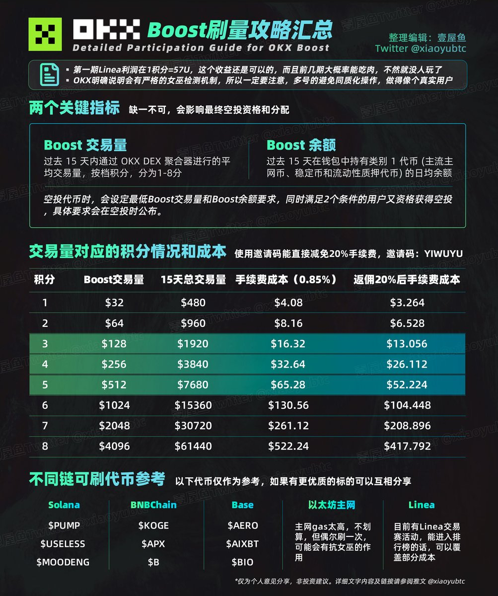

# OKX Boost 刷量攻略：交易對選擇、手續費折扣與風險提示

> **來源**: [@xiaoyubtc](https://x.com/xiaoyubtc/status/1966782690977604020) | [原文連結](https://x.com/xiaoyubtc/status/1960161525743628667)
>
> **日期**: Sat Sep 13 08:35:09 +0000 2025
>
> **標籤**: `OKX Boost` `刷量策略` `空投套利`

---

> **來源**: [@xiaoyubtc (壹屋鱼 | ETHGas ⛽)](https://twitter.com/xiaoyubtc)
> **日期**: 2026-02-18
> **標籤**: `OKX` `Boost` `刷量` `DEX` `空投` `手續費折扣`

---

## 概述

OKX Boost 刷量攻略彙總。第一期 Linea 利潤是 1 積分 = 57U，收益可觀，前幾期大概率能吃肉。Boost 統計的是 15 天平均交易量，只要前幾天多刷一點，也能追上早刷的人。

## OKX Boost 規則

Boost 有兩個關鍵指標，缺一不可，會影響最終空投資格和分配：

### Boost 交易量

過去 15 天內通過 OKX DEX 聚合器進行的平均交易量，分為 1-8 分八個檔次。

### Boost 餘額

過去 15 天在錢包中持有類別 1 代幣（主流主網幣、穩定幣和流動性質押代幣）的日均餘額。

### 空投資格

空投代幣時，會設定最低 Boost 交易量和 Boost 餘額要求，同時滿足 2 個條件的用戶有資格獲得空投，具體要求會在空投時公布。

不同類別的代幣之間交換，手續費和積分加成均不同（交易量對應的積分情況和成本見圖片）。

## 刷量攻略彙總

### 交易量區間選擇

按照第一期 Linea 的分配情況來看，128U/256U/512U 三個檔位的性價比最高。

### 合理選擇交易對

使用 ETH、USDC、USDT 等主流代幣與小幣種交易，成本和積分最優。以下是一些不同鏈上的交易對，流動性還不錯，可以參考（見圖片）。

### 手續費折扣

使用邀請碼：**YIWUYU**，直接減免 20% 手續費。

**重要**：同一個地址，手機 APP 和網頁端都要綁定。詳細綁定教程：https://t.co/PAdXV5kMNA

### 分批次交易

盡量不要單次 Swap 太多量，每次 100U-200U，可以減少滑點損失。

## 風險提示

### 女巫檢測

OKX 明確說明會有嚴格的女巫檢測機制，一定要注意：
- 多號避免同質化操作
- 做得像個真實用戶

### 最低要求

領取有兩個最低要求：
1. **積分要求**：很容易達到
2. **餘額要求**：參與刷量的人數增多後，可能會通過 Boost 餘額作為篩選條件，建議錢包餘額盡量大於 100U

### 理性刷量

- 第一期 Linea 收益高有一部分原因是當時人少，所以分的多
- 後面很有可能沒有這麼高的收益
- OKX 肯定會嚴厲打擊多號刷的行為，女巫標準會很嚴格
