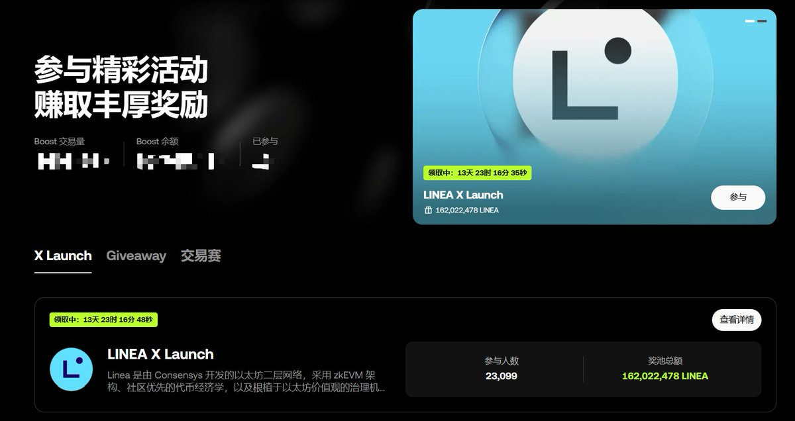

# OKX Boost 第二季交易賽教學與多開策略指南

> **來源**: [@WY_mask](https://x.com/WY_mask/status/1966554907684532396) | [原文連結](https://paragraph.com/@qiujunyu/W8ZPcjwNK8k0SIR9D5qG)
>
> **日期**: Fri Sep 12 17:30:01 +0000 2025
>
> **標籤**: `OKX Boost` `交易賽` `多開技巧`

---

> **來源**: [@WY_mask (无颜 (❖,❖) | MemeMax⚡️)](https://twitter.com/WY_mask)
> **日期**: 2025
> **標籤**: `OKX` `交易賽` `多開策略` `量化工具` `Boost`

---

## 教學資源彙整

關於 OKX #Boost 交易賽，以下文章和教學對參與者可能有幫助：

### 1. 瀏覽器多開技術
- **Google 瀏覽器多開教程**：批量多開 Google 瀏覽器並相互獨立的詳細教學
- **YouTube 影片教學**：視覺化教學影片，適合初學者
- **Windows 多窗口管理教程**：Windows 系統下的窗口管理技巧
- **Mac 多窗口管理**：macOS 系統下的窗口管理方法

### 2. 獨立 IP 配置
- **Google 多開配置獨立 IP 教程**（使用插件，注意：插件不保證絕對安全）

### 3. OKX Boost 操作教學
- **超詳細的 OKX #Boost 教程**：手把手教學，小白也能輕易上手刷分賺錢
- **OKX #Boost 刷什麼幣**：分享小技巧和小策略

## Google 瀏覽器批量多開教學

### 前言
按照此教程多開後的 Google 瀏覽器可以實現相互的獨立性，每個瀏覽器上收藏的書籤、增加的擴展程序都可以實現獨立性並可實現獨立記憶性，完全可以實現同時操作幾十個帳戶。

### 一、安裝正版 Google 瀏覽器
1. 安裝位置最好選擇非 C 盤，以 D 盤示例
2. 下載地址：www.google.com/chrome

### 二、分身製作

#### 步驟 1：創建快捷方式
1. 找到你安裝 Google 瀏覽器的所在目錄
2. 選擇 chrome，單擊滑鼠右鍵創建為快捷方式

#### 步驟 2：批量複製快捷方式
1. 在 D 盤單獨創建一個文件夾，命名為「擼毛瀏覽器」（命名是你的自由）
2. 複製 chrome 快捷方式粘貼到「擼毛瀏覽器」所在文件夾內
3. 你需要多少個瀏覽器就粘貼多少個
4. 把每個瀏覽器都以編號命名

#### 步驟 3：配置獨立數據目錄
1. 滑鼠右鍵點擊「1-1」，選擇屬性
2. 在**目標（T）**的數值後面輸入：`--user-data-dir=D:\gugeduokai\1`
   - 意思就是用戶的數據新建一個在 D 盤上
   - 後面的文件夾可以是真實存在也可以是沒有的
3. 點擊確定

**注意**：`--user-d...`（注意語法格式）

## 輔助工具推薦

### 接碼平台
- **5sim.net**：在線短信驗證服務，在線接收短信
- 價格：從 0.014 美元起購買用於 SMS 驗證的虛擬號碼
- 支持平台：Amazon、Discord、Naver、Instagram、WhatsApp、Google 等
- 充值方式：
  1. 登錄後直接點擊餘額彈出充值方式
  2. 最方便的是用虛擬貨幣或者支付寶充值
  3. 注意：輸入金額是按照實際付款金額來算的，到帳的為盧布

### Google 帳戶批量註冊
1. 打開 Google 瀏覽器，登錄上自己的 Google 點擊添加其他帳號
2. 直接跳轉到登錄帳號，然後點擊創建帳號，為我自己創建
3. 輸入姓和名然後輸入...（使用接碼平台接收驗證碼）

## 2022 年建議（資產配置參考）

### 之前有盈利的資產配置
- **30%**：未來幾年的生活費（如支付寶、微信、現金、現金、現金）
- **20%**：擇機投基金（如債券、科技、消費、新能源）
- **20%**：穩定幣（如 USDT、USDC、DAI）
- **20%**：價值幣 LP
- **10%**：主流幣底倉（如 BTC、ETH）

### 之前無盈利的建議
- 趕緊賺點現金，別被餓死
- 不要投資，堅持空閒 0 擼

### 其他建議
找到一個場外賺錢的事情做，盡量不上班，不然會在長久的無腦工作中喪失你對市場的洞察和敏銳度。

---

## 作者背景

@WY_mask 在 OKX #Boost 第一期單號純利潤 200U，持續分享交易賽方法和策略。
