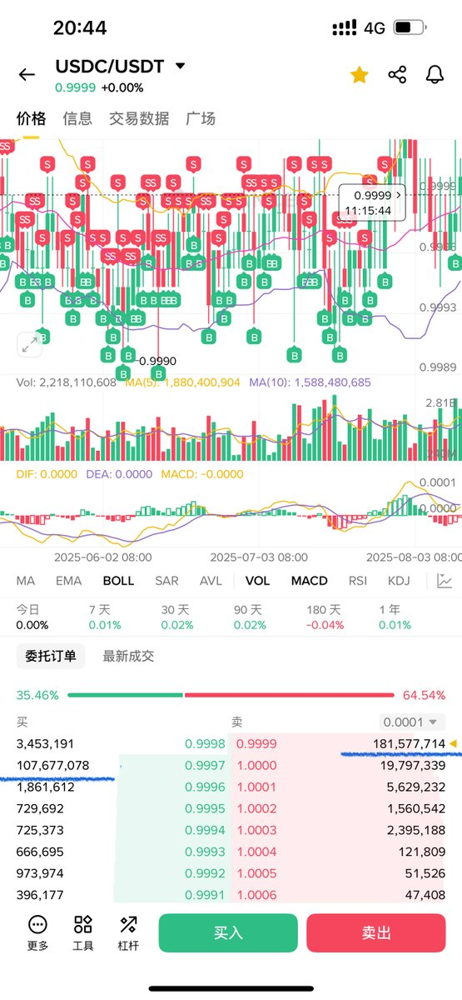
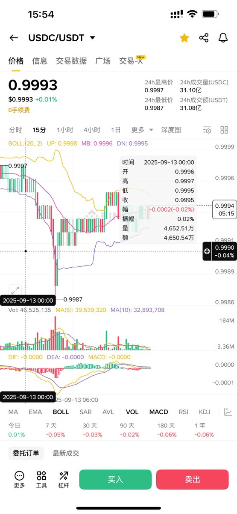
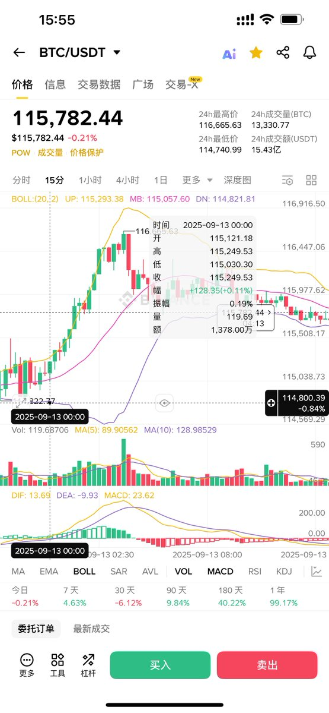
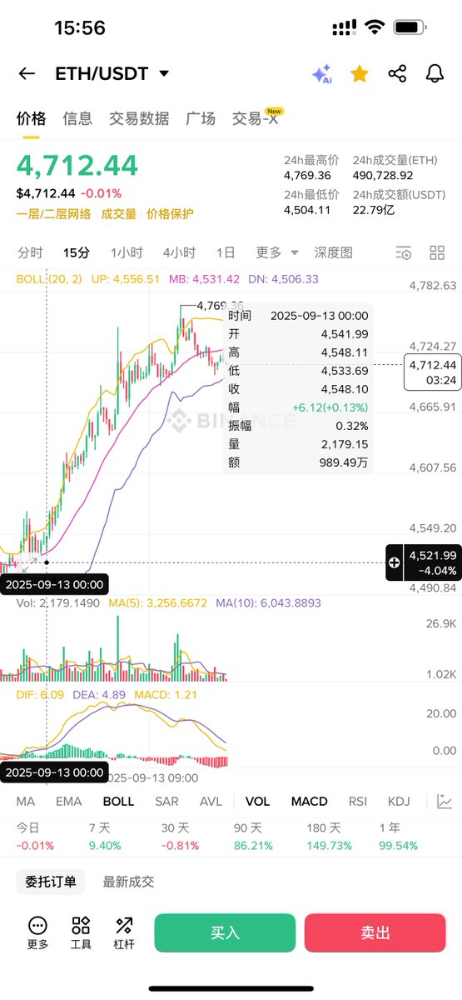
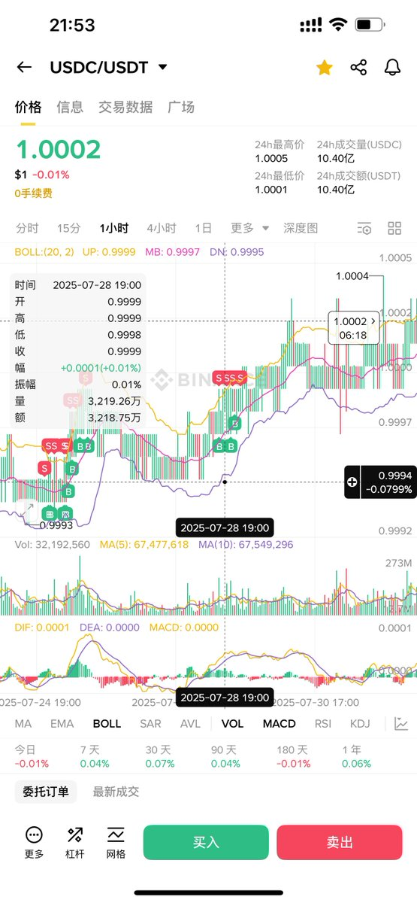
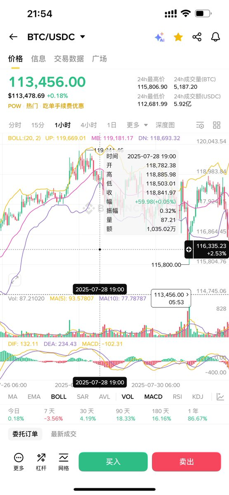
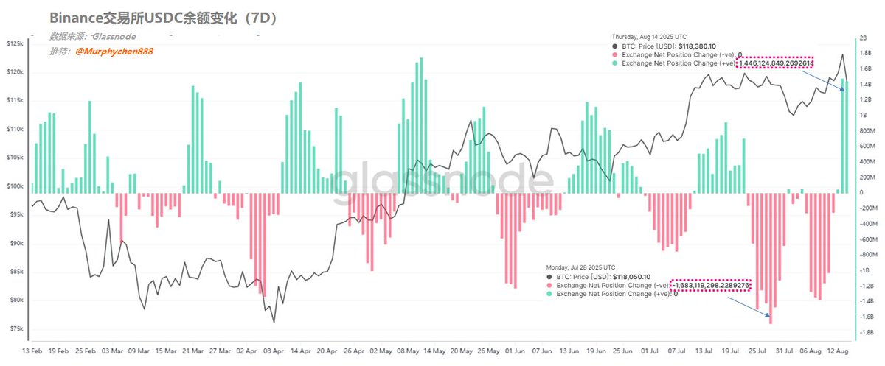

# USDC/USDT 匯率作為市場資金流向信號的套利分析

> **來源**: [@Murphychen888](https://x.com/Murphychen888/status/1966775483313647794)
>
> **日期**: Sat Sep 13 08:06:30 +0000 2025
>
> **標籤**: `穩定幣套利` `資金流向` `市場微觀結構`

---

> **來源**: [@Murphychen888 (Murphy)](https://twitter.com/Murphychen888)
> **日期**: 2024-08-15
> **標籤**: `套利` `穩定幣` `市場信號` `資金流向` `USDC/USDT`

---

## 活動後的穩定幣流動觀察

由於 8 月推出的 Plasma USDT 鎖倉和 USDC Flexible 高息理財活動使大量的穩定幣流入 Binance。現在活動結束，這些穩定幣也「空閒」了出來；因此這幾天經常看到 USDC/USDT 的買/賣盤有上億美元的資金在掛單。

由於平時也經常把閒置的 USDT 做穩定幣套利，所以對 USDC/USDT 的日常交易深度比較熟悉。通常會設置為「當買1/賣1的金額小於 2000 萬 U 時，就自動掛買2/賣2」；也就是說，正常情況買1/賣1的深度會大於 2000 萬 U，但小於 5000 萬 U；如果偶爾大於 5000 萬 U，那掛單的成交頻率就會變得很低。

所以當賣 1 檔竟然有 1.8 億 U，這是極其誇張又罕見的事情。說明前期充進 Binance 擼活動羊毛的資金在活動結束後可能並沒有撤走,而是選擇暫時做穩定幣套利，保證無風險收益。

資金既然不走，也許是在等下次活動，但更有可能是在等待入場時機。

## USDC/USDT 匯率與市場價格的關聯

### 凌晨的入場信號

今天凌晨 00:00 開始，USDC/USDT 匯率突然下跌，從 0.9997 最低跌至 0.9987；說明這一刻有大量的 USDC 被主動賣出換成了 USDT，於此同時：
- BTC/USDT 價格從 $115,030 上漲到 $116,665
- ETH/USDT 價格從 $4,533 上漲到 $4,769

當前，只要場內資金沒有大量撤退，這種時不時的「托舉」作用就會一直存在；有時主動，有時被動；當市場情緒瀕臨牛熊臨界點時，雖然顫顫巍巍，但依然屹立不倒。有興趣的小夥伴可以多關注 USDC/USDT 匯率和 BTC 價格的變化關係，會有不一樣的發現。

## USDC/USDT 匯率的深度分析

### 匯率的正常區間與異常信號

由於平時會把閒置的資金放在 Binance 做 USDC/USDT 的套利，因此對 USDC/USDT 的匯率變化比較敏感。正常情況下，匯率會維持在 0.9995-0.9996 左右，說明即便 USDC 是可以按 1:1 兌換成美元，但至少在 Binance 交易所內 USDT 的需求還是會大於 USDC（對各個幣種的交易深度更好），所以也更「貴」一點。

而且，該匯率的變化通常會與 BTC 的價格成反比。

### 案例 1：7/28 離場信號

在 7/28 19:00，USDC/USDT 匯率一路從 0.9994 漲到了 1.0002，這是一個明顯偏高的匯率值。說明有大量的 USDT 賣出並買入 USDC，導致匯率快速上升。

由於 USDC 在 Binance 的應用和深度都不如 USDT，所以可以推測這是一種帶有「離場意圖」的行為（比如轉出到 Coinbase）。當時 BTC 的價格為 $118,800 左右，而在匯率飆升的幾個小時後 BTC 開始下跌。

### 案例 2：8/14 入場信號

反之，如果匯率突然大幅下降，說明有大量 USDC 賣出並換成 USDT，那大概率是資金有了「進場意圖」。比如當時觀察到 USDC/USDT 的匯率是 0.9991，這就是一個明顯偏低的匯率值。

目前 Binance 在 USDC 活期理財上給了 12% 的年化收益,每個人有 10 萬 U 的額度，照理說閒置的 USDC 都會放進去，因此 USDC 的需求不至於弱到這個程度。那為什麼還有大量的 USDC 被賣出呢？

### 鏈上數據驗證

查看 Binance 的 USDC 餘額 7 日的變化，數據顯示：
- 截止到 8/14，USDC 餘額近 7 日淨增加了 14.4 億，側面印證確實有大量的 USDC 進入 Binance
- 在 7/28 前後，USDC 餘額近 7 日是淨減少了 16.8 億，也驗證了當時匯率大漲是有資金離場的推測

## 總結與觀察重點

即便是進場，也只能視為是「意圖」，未必馬上轉為購買力。所以在 BTC 出現回調後，匯率也同時大跌（成正比）。對後續 BTC 或其他主流資產的價格是否有所幫助，可以持續關注：

| 匯率變化 | 資金行為 | 對 BTC 影響 |
|---------|---------|------------|
| 匯率上升（接近或超過 1.0000） | USDT → USDC（離場意圖） | 通常預示下跌 |
| 匯率下降（低於 0.9995） | USDC → USDT（進場意圖） | 可能形成支撐 |

---

**⚠️ 以上分享僅用於學習交流，不作為投資建議**
