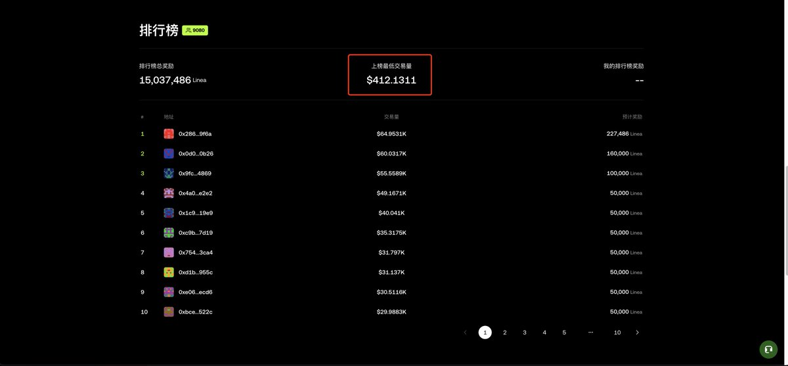
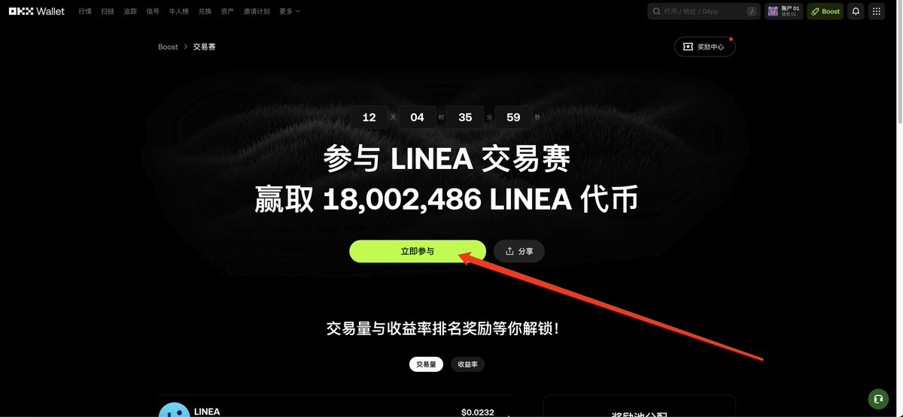
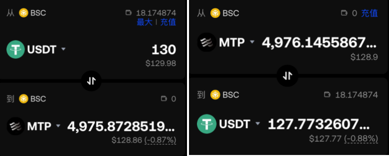
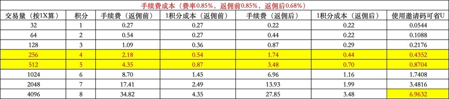
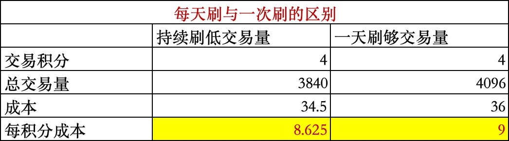

# OKX Boost LINEA X Launch 交易策略實測指南

> **來源**: [@Ron521520](https://x.com/Ron521520/status/1966459080584970285) | [原文連結](https://web3.okx.com/zh-hans/boost/trading-competition/linea)
>
> **日期**: Fri Sep 12 11:09:14 +0000 2025
>
> **標籤**: `OKX Boost` `量化交易` `空投農耕`

---

> **來源**: [@Ron521520 (Ron)](https://twitter.com/Ron521520)
> **日期**: 2025-01-XX
> **標籤**: `OKX` `Boost` `LINEA` `X-Launch` `交易策略` `積分挖礦`

---

## 概述

OKX Boost LINEA X Launch 第一期收益：1 積分 64U，收益非常高。本文分享實測的兩種低成本、高效率刷積分策略，最大優勢是**成本更低且不用防女巫**。

## 核心策略

### 刷哪個交易對？

刷 `$LINEA / $USDT` 和 `$LINEA / $ETH` 這兩個交易對。

### 為什麼刷這個交易對？

1. **一魚兩吃**：既可以吃積分收益，也可以獲得 LINEA 交易獎勵
2. **交易成本更低**：實測刷 `$LINEA` 的虧損有時比刷 `$KOGE / $MTP` 要低（平常基本差不多）
3. **不用防女巫**：可以隨意刷，無論一天刷夠還是每天刷一次都不用擔心女巫

### 為什麼不用擔心女巫？

刷 LINEA 就是參與 OKX 官方舉辦的 LINEA 交易大賽，相當於拿到 OKX 官方給的「免女巫金牌」。交易大賽本質就是官方主動鼓勵用戶刷交易量，參與官方活動基本不用擔心被女巫。

## LINEA 交易大賽獎勵

### 如何拿到獎勵？

官方活動有排行榜最小交易量門檻，只需要比最小交易量大，就能拿到獎勵。

**目前成本**：3.52U，刷 400U 的交易量即可衝入排行榜（競爭激烈，昨天最低交易量還是 100 多 U，今天已衝到 400U）。

### 如果卷不上排行榜怎麼辦？

主要還是為參加 OKX Boost 活動，LINEA 交易大賽只是添頭和降低成本的方式。如果後續真的卷不上排行榜，也可以拿到積分收益。

⚠️ **建議**：如果排行榜不卷，一定要衝排行榜，因為上榜就能拿到 2000 `$LINEA`（價值 46U），能降低刷積分成本。如果活動最後排行榜很卷，就不值得參與。

## 刷之前的準備

### 1. 參與活動

必須點擊參與活動，不點擊就埋頭刷是參與不了 LINEA 交易大賽的。

**LINEA 交易大賽參與連結**：https://t.co/ezxhYlcOjO

### 2. 綁定邀請碼

享受 20% 的手續費返佣。

- 邀請碼：`RON521`
- 綁定連結：https://t.co/Ge9vhYCGAz

綁定邀請碼的小夥伴可私訊或加 V（V 號與推特號相同），可享受後續活動的最新交易策略、大額交易返佣等。

## 刷積分策略選擇

### 一天刷夠 vs 每天刷

#### 一天刷夠

**優點**：省時省力

**缺點**：
1. 如果現在一天刷夠，15 天後沒有更新 X Launch 活動就是白刷
2. 如果 X Launch 活動公布之後刷，容易被 OKX 女巫

#### 每天刷

**優點**：
1. 基本上出現 X Launch 活動就有資格參與
2. 增加 OKX 帳戶的活躍性和權重

**缺點**：
1. 如果後續一個月都不出現新活動，會虧手續費
2. 費時費力

## 實測數據參考（第一期）

### LINEA X Launch 已結束

最終收益：**1 積分 64U**

### 推薦策略（針對後續活動）

每天拿 130 `$USDT`，購買 `$KOGE / $MTP`，然後立刻賣掉。

- **成本（15 天）**：34.5U
- **收益**：4 積分
- **實際成本**：8.625U / 積分

會刷的，每積分成本 8.62U；不會刷的，每積分成本 11.25U，1 積分最低節省 2.63U。

### 為什麼建議刷 $KOGE / $USDT 和 $MTP / $USDT？

1. **成本最低**：最省錢（一次成本 2.3U）
2. **交易量大、流動性好**：池子崩盤可能性小
3. **價格穩定**：價格變動小

### 為什麼要堅持每天刷？

坚持每天刷比一次刷夠的成本更低。

## 值得參加嗎？

目前來看，第一季 1 積分 64U 的收益，而 1 積分成本在 10U 左右，**第一季收益 6X**（第一季成本高是因為大家沒注重策略，隨意刷）。

接下來大家肯定會卷 OKX Boost，收益肯定沒那麼高，而且參與需要注重活動時間，有可能一個月才出下一個活動。但如此高的收益，還是值得參與。

## LINEA 交易大賽規則細節

### 排名規則

- 交易量排行榜前 5,000 名交易者將獲得對應排行榜獎勵
- 最終獎勵名單將在活動結束後 3 個工作日內公布
- 獎勵公佈後可前往「獎勵中心」領取
- 獎勵申領期為獎勵公佈後 14 天內，過期不可領取

### 參與條件

- 點擊「立即參與」完成活動參與流程
- 交易額需達 100 美元方可參與交易量排行榜活動
- 僅計算 LINEA 鏈上 LINEA 與 USDT、USDC、WETH、ETH 之間的交易量

### 獎勵池分配

| 排名 | 獎勵 |
|------|------|
| 第 1 名 | 160,000 LINEA |
| 第 2 名 | 227,486 LINEA |
| 第 3 名 | 100,000 LINEA |
| 第 4-10 名 | 50,000 LINEA |
| 第 11-50 名 | 20,000 LINEA |
| 第 51-100 名 | 10,000 LINEA |
| 第 101-500 名 | 6,000 LINEA |
| 第 501-2000 名 | 3,000 LINEA |
| 第 2001-5000 名 | 2,000 LINEA |

### 交易量計算規則

點擊「立即參與」後，系統將記錄交易賽期間通過 OKX DEX 聚合器進行的指定代幣及交易對的交易。

**不計入統計的情況**：
- 單筆價值較低的交易
- OKX DEX API 訂單
- 第三方 DEX 交易（如在 OKX DEX 選擇 Uniswap 路徑）

### 收益計算規則

**收益額排行榜**：根據總已實現收益金額排名

**收益率排行榜**：根據總已實現與未實現收益百分比排名

**不計入統計的情況**：
- 空投收益
- 單筆交易金額低於 $0.01
- OKX DEX API 訂單
- 第三方 DEX 交易
- 經平台風控系統判定為非正常交易、操縱收益或規避規則的交易行為（例如通過外部交易平台進行反向或對沖交易，形成無實際風險暴露的收益）

### 獎勵發放

交易賽結束後需前往獎勵領取頁面手動領取。若獎勵以代幣數量計，則按數量發放；若以美元價值計,則按交易賽結束時的代幣價格換算發放。

## 風險提示

1. 數字資產具有投機性和高度不穩定性，隨時可能變得缺乏流動性，具有高風險
2. 數字資產（包括穩定幣）的價值可能大幅波動
3. 獎勵在有資格獲得時的價值可能不等於分配時的價值
4. 參與者負責所有相關的稅費、費用、成本和支出
