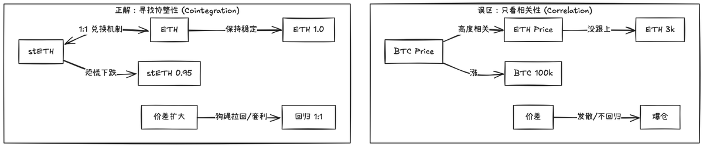
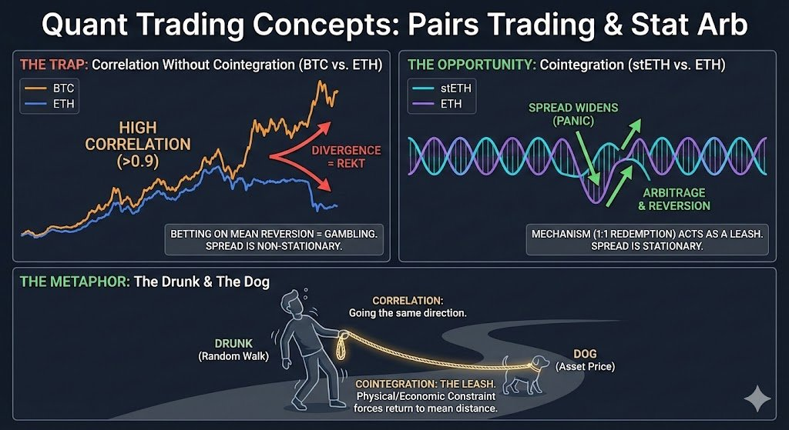
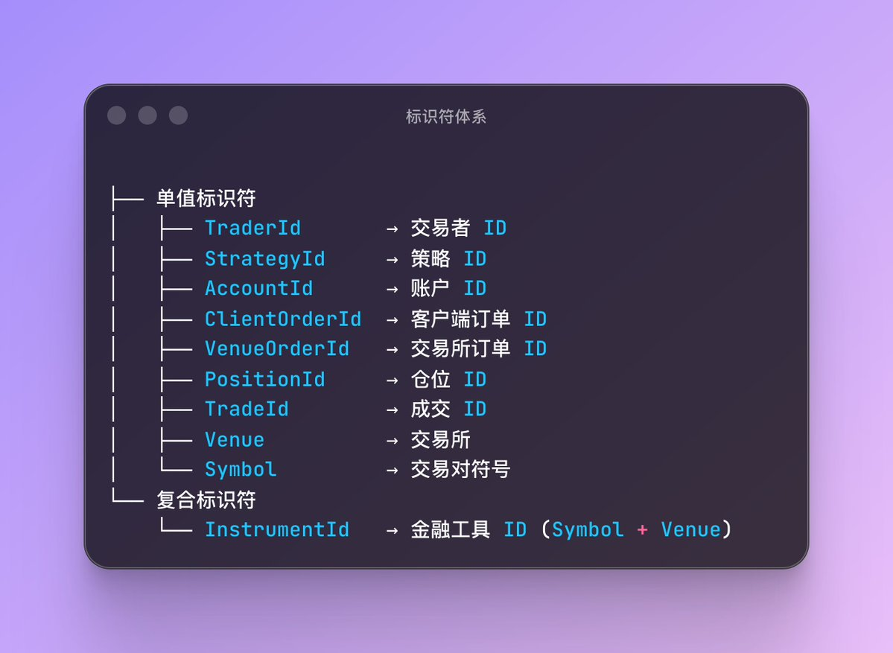
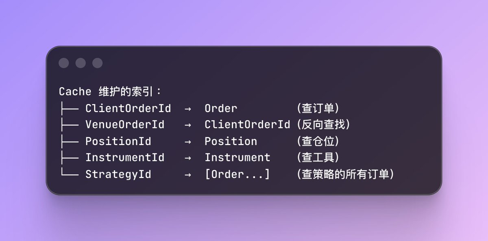
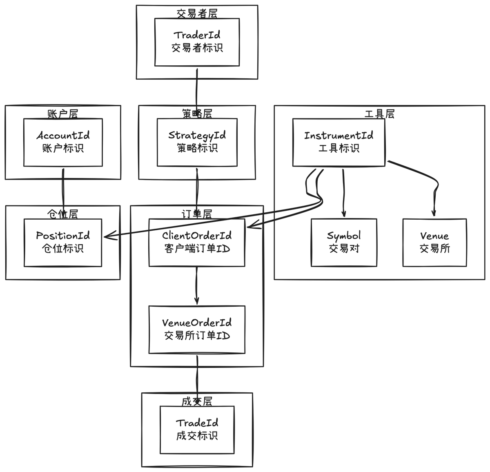

# 配對交易與統計套利：相關性 vs 協整性

> **來源**: [@0xLogicLog](https://x.com/0xLogicLog/status/2023779412395938028)
>
> **日期**: 
>
> **標籤**: `配對交易` `協整性` `統計套利`

---

> **來源**: [@0xLogicLog (羅格 | Web3安全 & 套利)](https://x.com/0xLogicLog)  
> **日期**: 2024-03-15  
> **標籤**: `配對交易` `統計套利` `協整性` `相關性` `量化交易`

---

## 相關性 vs 協整性

配對交易（Pairs Trading）和統計套利（Stat Arb）中，大多數人會嘗試相關性分析，但往往誤解了其真正意義。

**常見誤區**：
- BTC 和 ETH 相關係數高
- → 如果兩者走勢背離，一定會回歸
- → 做空漲的，做多跌的

**核心問題**：相關係數高不代表價差會回歸，更關鍵的是「**協整性**」——價格線性組合的序列必須是平穩的。

## 形象化理解

- **相關性**：如果你看到醉漢往東走，狗也往東走，他們的方向大體一致，這就是高度相關
- **協整性**：醉漢手裡緊緊攥著那根狗繩，機制約束狗會被拉回來

## 實戰應用

**不具備對沖功能的例子**：
- 做多 ETH / 做空山寨幣
- 這是在賭方向和趨勢，靠交易者對週期發展的認識
- 不具備直接的對沖功能

**具備協整性的例子**：
- stETH 和 ETH 具備協整性
- 可以在擠兌時大膽買入 stETH，並且做空 ETH

---

## 補充：量化交易標識符體系

### Ustr（駐留字符串）設計

在量化交易中需要為實體設計標識符類型。使用 Ustr（駐留字符串）而非 String，比較效率 O(1) 指針比較。

### ClientOrderId 設計

ClientOrderId 是自定義的訂單編號，建議使用 `(timestamp, strategy_id, counter)` 格式：
- 時間可以毫秒單位
- 方便快速遍歷時間段內可能的交易
- 短線重連方便

相對的，VenueOrderId 是交易所控制，不好遍歷。

### InstrumentId（交易標的）命名規範

使用 `Symbol.Venue` 格式：

| 類型 | 格式範例 |
|------|----------|
| 現貨 | `BTCUSDT.BINANCE` |
| 期貨 | `BTCUSDT-PERP.BINANCE` |
| 期權 | `BTC-20240315-50000-C.DERIBIT` |
| 外匯 | `EUR/USD.OANDA` |
| 股票 | `AAPL.NASDAQ` |

這樣就可以做一個集中的 Cache，維護索引，集中訪問。
