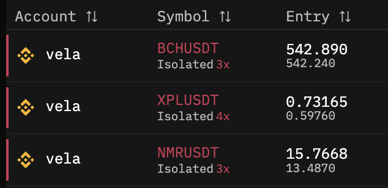
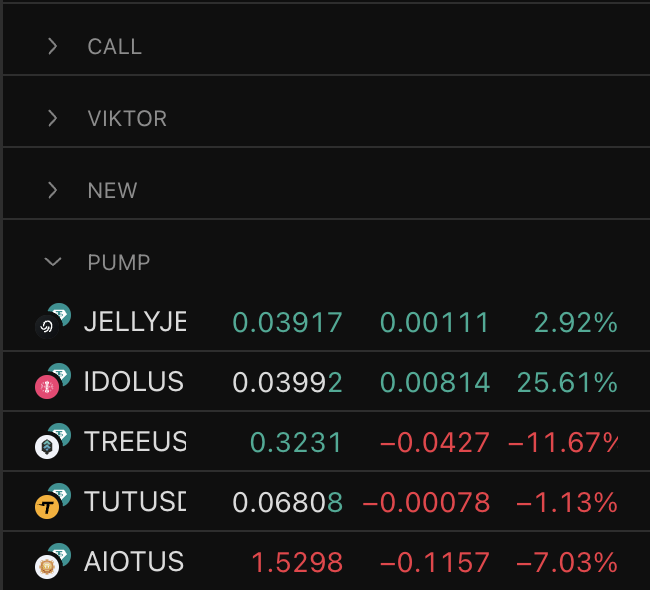
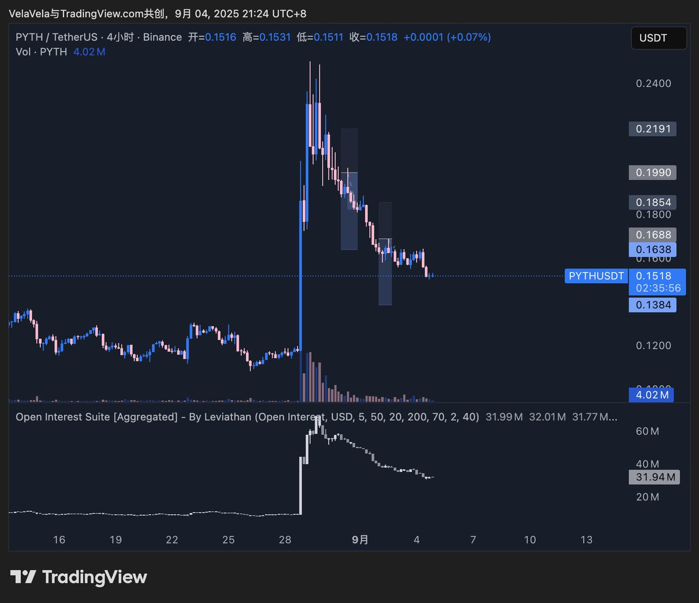

# 做空策略與風險管理：標的選擇、工具運用與分段止盈

> **來源**: [@QuantVela](https://x.com/QuantVela/status/1963596831847559250)
>
> **日期**: 
>
> **標籤**: `做空策略` `風險管理` `資金費率`

---

> **來源**: [@QuantVela (Vela)](https://x.com/QuantVela)
> **日期**: 2026-02-18
> **標籤**: `做空策略` `風險管理` `倉位管理` `標的選擇`

---

## 做空的時機

在週期的這個階段，做空比做多在概率上更容易盈利。但公開談論如何做空的人挺少的，畢竟做空的第一條規則，就是不許談論做空。

## 標的選擇維度

做空最重要的就是標的選擇，可以從這幾個維度來找標的：

- **主力資金正在流出的**
- **新上所的**
- **KOL 集體賣力喊單的**
- **近期大幅上漲但跌破支撐的**
- **大市值且虛高的**

在 TradingView 裡建不同的列表去觀察這些標的。需要注意的是：
- 不要頂著負資金費率做空
- 不要直接去空今日漲幅榜的正在垂直上漲的幣

## 做空必備工具

| 工具 | 用途 |
|------|------|
| **Coinglass** | 做鏈上掃描和看清算地圖的點位 |
| **Velo** | 查看 Open Interest（持倉量） |
| **Valuescan** | 查看資金流動數據 |
| **UnifAI 等 AI 工具** | 接了幣圈數據源，輔助做投研功課 |

對於新幣，最基本的要調研清楚：
- 項目賽道
- 項目是否有真實收入
- 代幣經濟學和解鎖方式
- 投資方都有哪些

建議列個表格整理。

## 風險管理：分段止盈策略

### 數學原理

對於 45 度下跌的標的，**分段做空比一路拿到底的盈利更高**。

- 一路拿到底：最多只會跌到近似於 0，空頭盈利 100%
- 分段止盈：分 5 次，每次 20% 就止盈
  - 計算：1.2⁵ = 2.48，理論上可以吃到 2 倍多的利潤

### 對沖策略

對於中途反彈的幣，其實可以忍著噁心開一個對沖多頭倉位。這樣等於是暫時平倉，等繼續開始跌的時候再平掉多頭。

---

*想到哪就寫到哪了，也許之後寫一個系列教程吧。*
