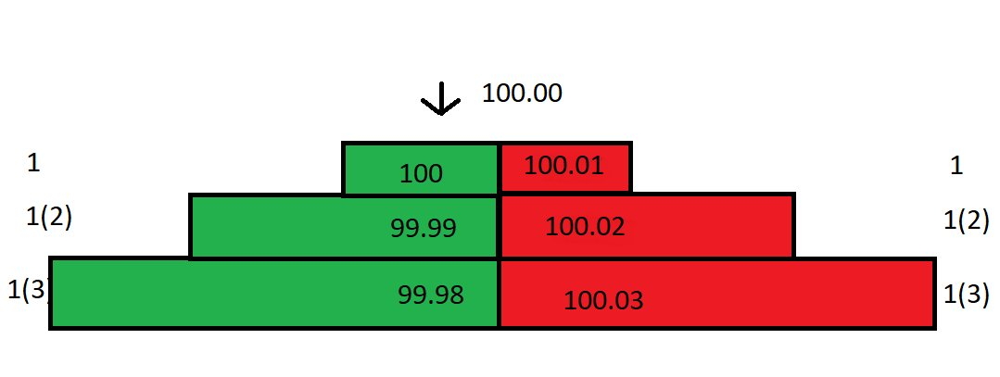
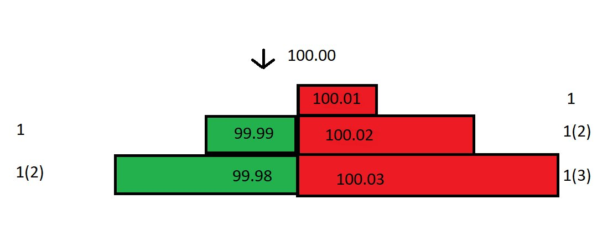
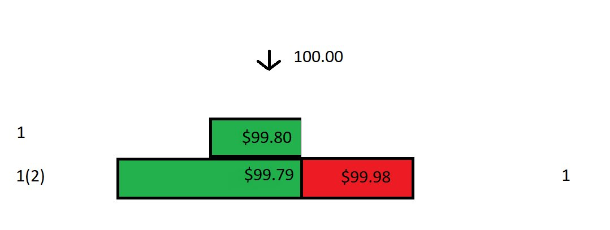
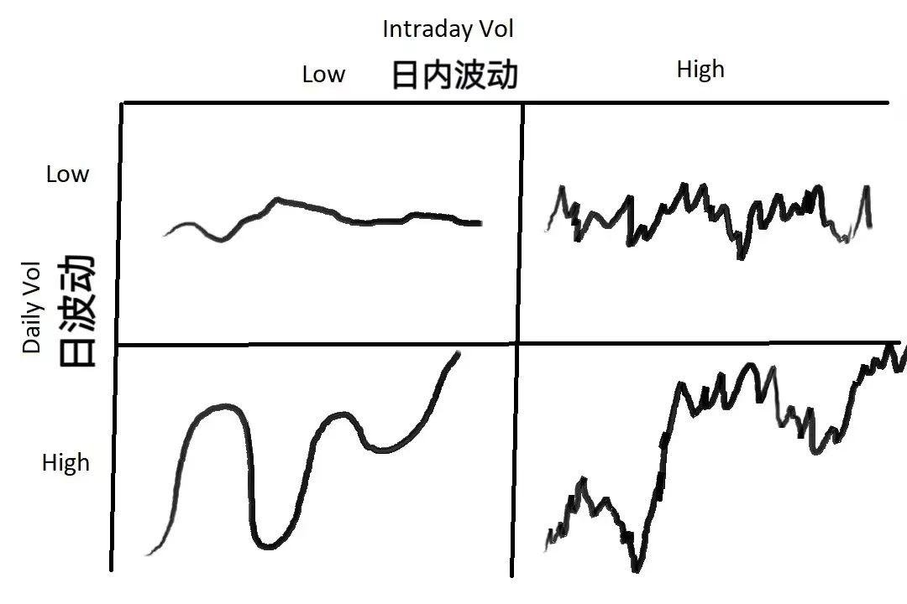

# 做市商交易策略：如何透過訂單簿控制市場

> **來源**: [@0xLogicLog](https://x.com/0xLogicLog/status/1961954842508980432)
>
> **日期**: Sun Aug 31 00:51:00 +0000 2025
>
> **標籤**: `做市商` `價差管理` `市場微觀結構`

---

我來整理這篇關於做市商策略的文章。

## 做市商為什麼總是賺錢

做市商不是預測市場，而是創造、跟隨和控制市場。根據不同的市場狀態採取不同策略：

### 四種市場狀態與對應策略

**1. 溫和市場（無趨勢無波動）**
- 設置非常小的價差（spread）
- 薄利多銷策略

**2. 震盪市場（無趨勢，高波動）**
- 擴大價差
- 不斷買入壓低成本
- 控制市場價格

**3. 趨勢市場（波動小趨勢強）**
- 保持非常緊的價差
- 快速調整掛單位置
- 跟隨趨勢

**4. 混亂市場（劇烈波動）**
- 無法預測，極高風險
- 大幅擴大價差
- 減少訂單量
- 防禦風險和減少庫存

趨勢下根據行情操控價差，控制心理預期。混亂下利用散戶恐慌情緒，減少訂單量，吃波動利潤。

## 做市商的運作方式

做市商（Market Maker）的英文原意就是在沒有市場的地方創造一個市場出來。他們透過以下方式獲利：

1. **手續費返還**
2. **雙向掛單**：二者均成交後賺取微小的價差利潤，本質在於利用時間及資訊延遲捕獲流動性
3. **價格發現**：幫助市場高效定價，提供流動性
4. **坐莊**：操縱市場，配合消息拋售流動性給散戶

## 做市商實戰案例分析

### 基本設定

假設你是市場唯一的做市商，訂單簿如下：
- 最優買價（best bid）：100
- 最優賣價（best offer）：100.01
- 價差（spread）：0.01
- 最小價格變動單位：0.01
- 吃單（taker）手續費：0.025%
- 掛單（maker）返利：0.01%

### 盈利機制

當市價賣單進來，以 100 成交：
- 你付出 100
- 對方實際收到：100 - 0.025 = 99.975
- 你獲得返利後實際付出：99.99

如果此時買單進來，以 100.01 成交：
- 買入成本：99.99
- 賣出價格：100.01
- 價差利潤：0.02
- 加上返利總利潤：約 0.03

儘管買一和賣一的 spread 只有 0.01，但實際利潤高達 0.03！

### 應對價格下跌

如果以 99.99 接貨後，市場價格跌到 99.80：

1. 立刻撤掉 99.99 和 99.98 的買單，避免被套利
2. 計算保本價：需要在 99.98 賣出（加返利後實際到手 99.99，剛好保本）
3. 調整訂單簿：
   - 買一：99.80
   - 買二：99.79
   - 賣一：99.98

### 攤低成本策略

如果市價買單以 99.80 成交：
- 持有 2 份合約
- 平均成本：(99.79 + 99.99) / 2 = 99.89

接著調低賣一價從 99.98 到 99.89，價差縮小。透過不斷這樣操作，逐步減少成本，縮小價差。

## 做市商的核心問題

### 1. 波動性分析

在不同時間窗口下，價格的波動性大小不同：
- 波動性：價格離均值的偏離程度
- 一個品種可能在 1 分鐘級別劇烈波動，但在日線圖上平穩

### 2. 成交量分析

成交量反映流動性，會影響：
- 掛單的價差大小
- 成交頻率

### 四種波動情況與應對

| 每日波動率 | 日內波動率 | 策略 |
|-----------|-----------|------|
| 低 | 低 | 選擇較小的價差，最大化交易量 |
| 低 | 高 | 擴大價差，使用更大訂單量，透過攤低成本減少虧損 |
| 高 | 低 | 使用更小、緊密的價差 |
| 高 | 高 | ⚠️ 最危險情況，擴大價差且使用更小訂單量 |

## 定價與價差策略

### 定價方法

**第一步：確定公允價格（fair price）**

1. **參考其他市場價格**：如參考紐約市場定價倫敦市場的美元/日元
2. **中間價定價**：mid price = (買一價 + 賣一價) / 2
   - 看似簡單但非常奏效
   - 中間價是市場博弈的結果
   - "Quote around mid, the market is probably right"

**第二步：確定價差（spread）**

需要考慮：
- 市場平均成交量及變化（方差）
- 主動買單（take）的平均大小和變化
- fair price 附近的掛單量情況
- 小時間窗口內價格的波動和方差
- 手續費
- 介面速度、下單撤單速度等

### 掛單位置選擇

**挂在買一/賣一的利弊**

優點：
- 能吃到最大價差
- 價格一變動就能成交

缺點：
- 頻繁價格變動風險大（剛接貨價格就變）
- 其他做市商會以更小價差搶在前面（tighten the spread）
- 大家會競爭縮小價差直到沒有利潤

## 數學模型：如何確定最優價差

### 基本假設

- 採樣週期：1 秒
- 樣本時間：過去 60 秒
- 假設價格活動服從正態分佈
- 當前中間價的均值與 60 秒前一樣
- 標準差：0.04

### 正態分佈特性

- 68% 的時間：價格在均值 ± 1 個標準差（-0.04 ~ +0.04）內波動
- 99.7% 的時間：價格在均值 ± 3 個標準差（-0.12 ~ +0.12）內波動

### 不同價差的預期收益

**價差 0.08（離中間價 ±0.04，1 個標準差）**
- 成交概率：32%（1 - 68%）
- 預估單位時間利潤：32% × $0.04 = $0.0128

**價差 0.06（離中間價 ±0.03，0.75 個標準差）**
- 成交概率：45%
- 預估單位時間利潤：45% × $0.03 = **$0.0135**

**價差 0.04（離中間價 ±0.02，0.5 個標準差）**
- 成交概率：61%
- 預估單位時間利潤：61% × $0.02 = $0.0122

### 最優價差結論

在 **0.75 個標準差**的位置掛單能獲得最大利潤（$0.0135）。

透過 Excel 推導不同標準差下的預期收益，發現預期收益是一個凸函數，在 0.75 個標準差附近取到最大值。

## 庫存成本管理

以上假設價格波動服從均值為 0 的正態分佈（市場平均回報率為 0），但實際情況中：

- 價格均值會變化
- 均值偏移會讓一側的單子更難成交
- 有庫存時不僅會虧錢，預期利潤率也會降低

### 做市商期望收益組成

1. **掛單能成交的概率**：如以 1 個標準差掛單，有 32% 的時間會成交
2. **掛單不成交的概率**：如以 1 個標準差掛單，有 68% 的時間價格在 spread 中間運動

在掛單無法成交的情況下：
- 價格均值很可能改變
- 「庫存成本」如同要支付利息的借款
- 時間推移導致波動率增加，借款利息升高

**解決方案**：透過各個週期的平均波動率制定回歸策略，限制持倉成本。

## 為什麼散戶一買就跌、一賣就漲

這並不是沒根據的！

做市商透過控制訂單簿、調整價差、管理庫存成本，實際上在創造和控制市場。散戶的市價單往往在做市商有利的價格成交，這正是做市商盈利的來源。

在非常短的時間段裡，做市商的盈利期望其實是負的，因為每一筆主動買單（taker order）都想在自身價格有優勢的情況下和你成交。但透過精密的數學模型和風險管理，做市商能夠在長期獲得穩定收益。
