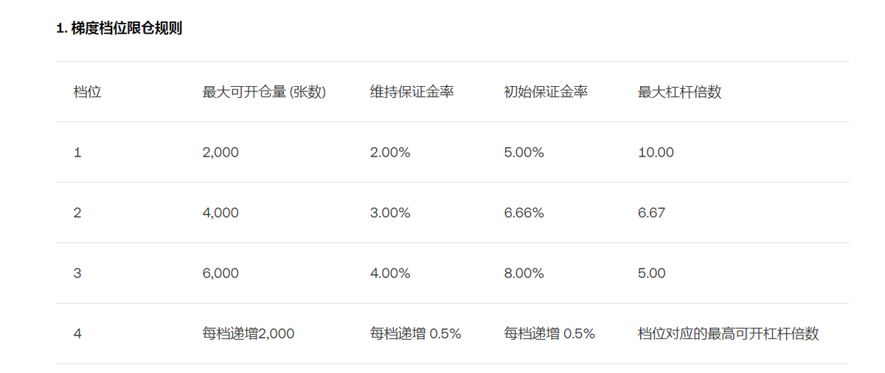
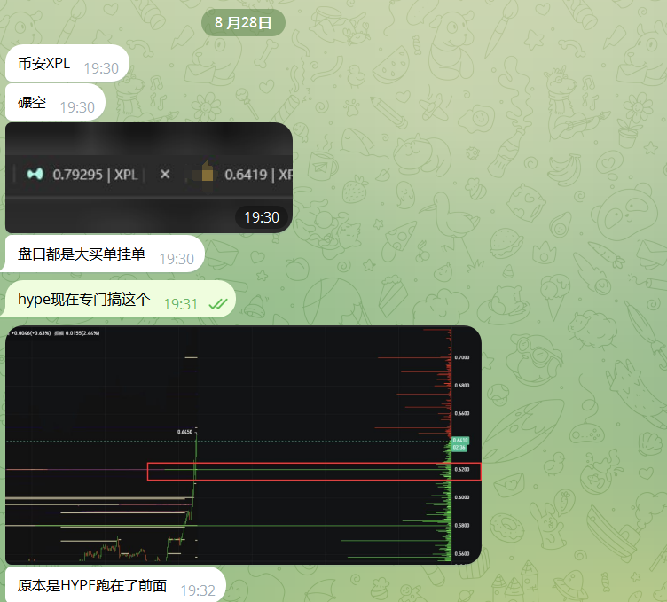
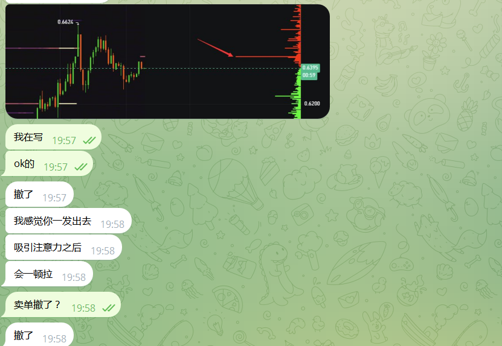

# OKX 集合競價盤前永續套利實戰：$XPL 二段交易策略

> **來源**: [@BTC_Alert_](https://x.com/BTC_Alert_/status/1961634376166580502)
>
> **日期**: Sat Aug 30 03:37:35 +0000 2025
>
> **標籤**: `集合競價` `盤前永續` `套利狙擊`

---

## 背景與交易機會

OKX 推出的盤前永續合約為 $XPL 提供了獨特的套利機會。由於 $XPL 在 Hyperliquid 上遭遇狙擊狙殺套保事件，導致 Hyperliquid 與 OKX 之間存在巨大價差，為二段交易創造了條件。

## 為何 Hyperliquid 可以狙殺套保，OKX 不行？

OKX、Hyperliquid、幣安的定價規則基本相同，都是根據盤口買賣決定：

**標記價格 = CLAMP(移動平均值((合約買一價 + 合約賣一價)/2), 最高價格限制, 最低價格限制)**

但 OKX 的倉位限制決定了狙擊的難度，加上 OKX 的風控體系，即使 Hyperliquid 引入外部預言機去穩定標記價格也沒什麼用處（預言機 1 小時一次，不限制倉位，很容易被操控）。

綜上，在 OKX 進行盤前交易會相對安全。

## 集合競價與盤前永續的特性

**集合競價**：為市場提供價格發現機制，幫助投資者在正式開盤前了解市場情緒和供需情況，中途會有鎖訂單的機制。由於加密資產新幣開盤 TGE 往往有巨大拋壓，集合競價適合採用高賣策略。

**盤前永續**：雖然價格波動較大，但因為有合約對沖，開盤的相對估值會穩定。純對手盤思維做盤前，投研思路做盤後。

## 0.63 做多 $XPL 的依據

### 價差觀察

Hyperliquid 上和 OKX 上存在巨大的價差，這在狙擊套保時就已經存在，但未反應到 CEX 的訂單簿中。

### 托單信號

8 月 28 日 7 點半，0.62 附近出現巨額托單，且出現在巨大價差和社群媒體發酵後。判斷是 Hyperliquid 和 CEX 出現了套利機器人，同時 CEX 上也有大量散戶的套保單。

### 莊家行為推斷

若是莊家，會等這些積累去用機器人吃掉流動性，同時觀察 Hyperliquid 上訂單和 OKX 開盤匹配。

### 實際驗證

OKX 上的空單很快被吃掉，且同步 Hyperliquid 出現了拉升行為。在 0.63 的區域也出現了多次需求和 Hyperliquid 匹配。同步驗證幣安也出現同類結果。

## 交易策略解析

綜合以上觀察，可判斷 Hyperliquid 和 CEX 出現了套利機器人，且：

1. 狙擊手在 Hyperliquid 上拉升吃單，狙殺套保巨鯨
2. 利用機器人進行 CEX 和 Hyperliquid 帶套，防止 Hyperliquid 事件影響
3. 掛冰山單擠壓空頭生存空間
4. 導致空投擠壓平倉，觸動價格上漲

## 交易結果

本次二段交易 0.63-0.72，盈利 1.1 萬。

## 項目方如何利用集合競價做好開盤

### 開盤困境

很多項目方上所之後就是一路下跌，即使價格低了出手護盤，後續因為失去信心沒有成交量。實際若做不好盤前，盤口也不活躍，出貨也不多，還挨罵。

### 集合競價規則

**在成交量最大地方，與預計開盤價格相同的買賣雙方中有一方申報需全部成交。**

### 實戰案例

以估值 1 億進行募資的項目為例，TGE 解鎖 10%。10 億開盤價格配合流動性是理論回本空間。

**計算集合競價開盤方式**：

集合競價作為提前搶籌，散戶是沒有定價能力的。若在 10 億買賣雙方掛大量買賣單成交，則開盤有 10 秒的時間是定在 10 億的，計算對手盤可得平出空間。

若空投的較多，則可以低價的方式洗掉砸盤力量，對後期的市值維護花費較少。

### 策略考量

做 TGE 的宣發和開盤市值管理所考慮的因素極其複雜，同時要配合一定程度的宣發，且 Meme 幣和 VC 幣、非首發的控籌方式也會有不同策略。

項目方往往忽略集合競價的方式，這兩個簡單的思路也為市值管理提出新的思考方式。
