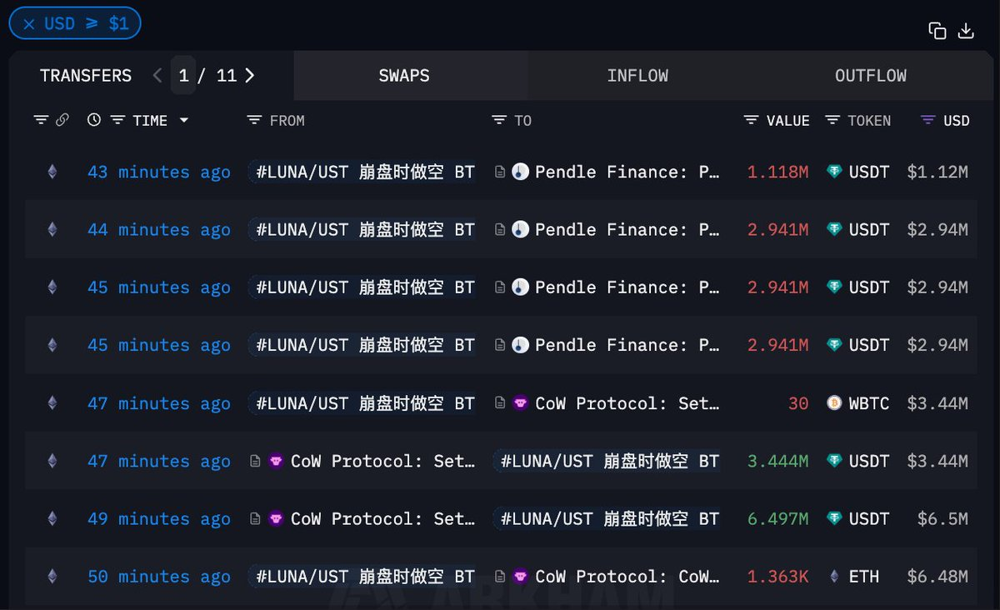
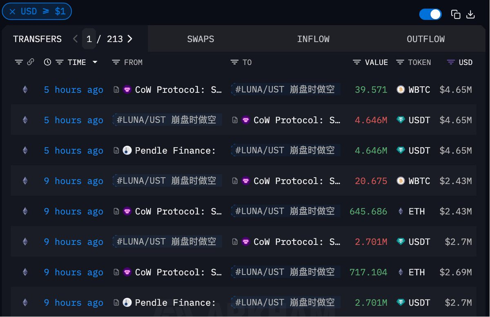

# 聰明錢 ETH 和 WBTC 大幅減倉──牛市進度條告急信號

> **來源**: [@ai_9684xtpa](https://x.com/ai_9684xtpa/status/1959627248715399184) | [原文連結](https://intel.arkm.com/explorer/address/0xdfcaf20a17521a761036af8a3a758fcdd91dfc07)
>
> **日期**: Sun Aug 24 14:41:58 +0000 2025
>
> **標籤**: `聰明錢追蹤` `鏈上數據分析` `市場頂部信號`

---

> **來源**: [@ai_9684xtpa (Ai 姨)](https://twitter.com/ai_9684xtpa)
> **標籤**: `聰明錢` `ETH` `WBTC` `清倉信號` `市場情緒`

---

## 概述

繼交易員 Eugene 和方程式新聞創始人 Vida 之後，又一個「牛市進度條告急」的信號出現了。

**「LUNA/UST 崩盤時做空 $BTC 賺取 516 萬美元的聰明錢」**在 1 小時前清倉了 $ETH 並減倉 $WBTC——賣出 1363 ETH 和 30 WBTC（約 979 萬美元），本次高拋低吸獲利 109.3 萬美元。

## 歷史戰績

這位聰明錢過往操作記錄：
- 透過 $BTC 和 WBTC 抄底賺 729.3 萬美金
- $ETH 抄底賺 490.7 萬美金

## 此前加倉操作

在大盤回調時，該聰明錢曾選擇加倉：
- 過去 9 小時內買入 39.57 $WBTC 和 1362.8 ETH（643.19 $ETH 還是 WBTC 換倉來的）
- 總價值 976.5 萬美元
- WBTC 成本 $117,993，ETH 成本 $3757.25

如今在 1 小時前選擇清倉/減倉，獲利了結。

## 錢包地址

0xdfcAF20A17521A761036af8a3a758FcDD91dfC07
