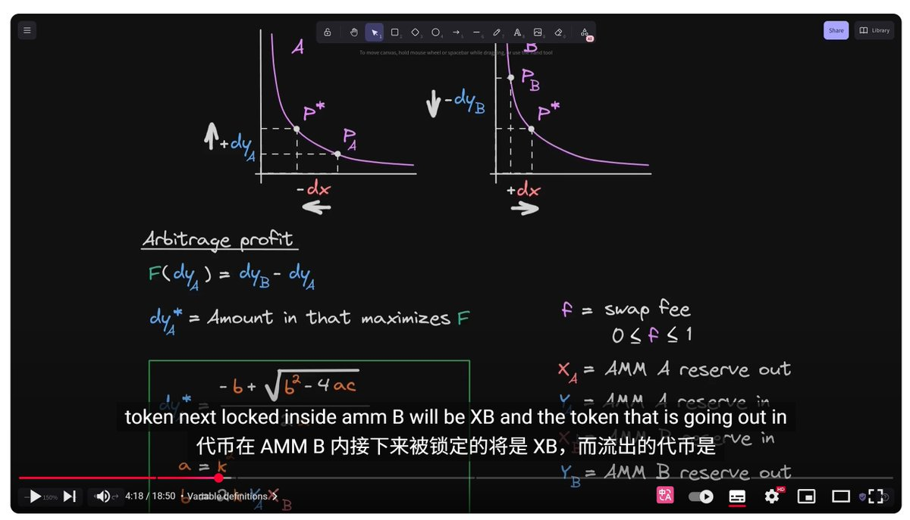

# Uniswap V2 套利最佳利潤公式計算教學

> **來源**: [@0xKaKa03](https://x.com/0xKaKa03/status/1958221969029316862) | [原文連結](https://www.youtube.com/watch?v=9EKksG-fF1k)
>
> **日期**: Wed Aug 20 17:37:54 +0000 2025
>
> **標籤**: `Uniswap` `套利` `公式計算`

---

> **來源**: [@0xKaKa03 (Sliipy⚡)](https://twitter.com/0xKaKa03)
> **日期**: 2026-02-18
> **標籤**: `Uniswap` `套利` `AMM` `DeFi` `數學公式`

---

## 概述

這是一個關於 Uniswap V2 套利最佳利潤公式計算的手把手教學影片。內容涵蓋如何計算在 Uniswap V2 上進行套利時的最佳投入金額（Optimal Amount In），以獲得最大利潤。

## 教學資源

- **影片連結**: [Uniswap V2 Arbitrage Optimal Amount In - YouTube](https://t.co/fJ7SWKtnXL)
- **內容形式**: 影片教學

## 核心概念

在 Uniswap V2 這類 AMM（自動做市商）協議上進行套利時，關鍵在於計算出最佳的投入金額。投入太少會錯失利潤，投入太多則可能因為價格滑點而降低收益。透過數學公式可以精確計算出能夠獲得最大利潤的投入量。

## 適用場景

- Uniswap V2 及其他基於 x*y=k 公式的 AMM 協議套利
- 跨池套利策略開發
- MEV（最大可提取價值）機器人開發
