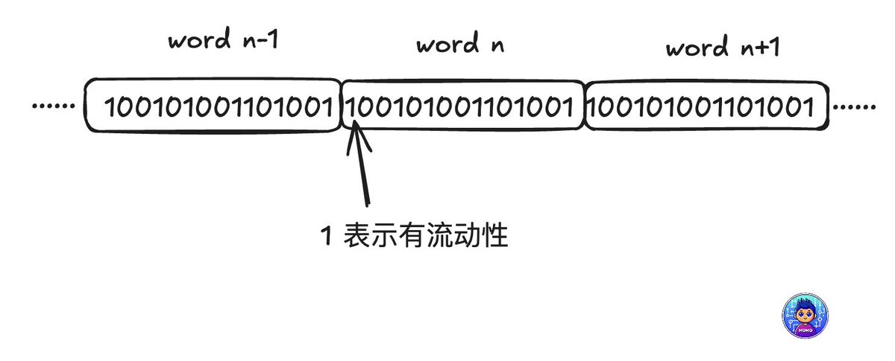
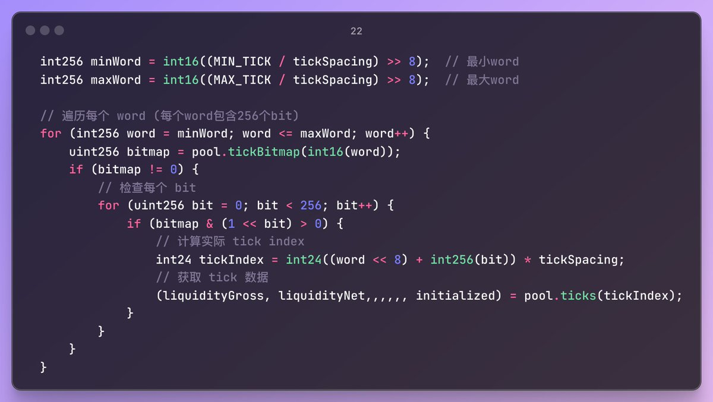

# Uniswap V3 Tick 資料快速獲取與套利最佳化

> **來源**: [@0xmomonifty](https://x.com/0xmomonifty/status/1958100154839691687)
>
> **日期**: Wed Aug 20 09:33:51 +0000 2025
>
> **標籤**: `Uniswap V3` `Tick 資料` `套利優化`

---

> **來源**: [@0xmomonifty (0xMomo🕊️)](https://x.com/0xmomonifty)
> **日期**: 2026-02-18
> **標籤**: `Uniswap V3` `套利` `Tick` `流動性` `智能合約`

---

## 背景

在進行 V3 pool 的代幣交換計算時，需要考慮池子的 tick 資料以及當前 tick 的流動性狀態。過去參照大佬 Zacholme7/PoolSync 使用從歷史區塊同步的方法來獲取池子的 ticks 狀態，但實際使用中只需要當前池子的 ticks 資料，並不需要知道歷史的變化。查閱文檔和資料後發現有更好的方法。

## Uni V3 Tick tickBitmap 機制

在 V3 中使用 Bitmap 來存儲 tick 的狀態，例如：`100101001101001`，其中：
- `1` 表示有流動性
- `0` 表示沒有被初始化

使用兩個字節來存儲（例如 `0x4a69`），用 word n 來劃分子數組，word 中有 256 個位置。

## 使用合約獲取 Ticks 資訊

V3 的 pool 提供了兩個函數：
- `tickBitmap()`：獲取位置資訊
- `ticks()`：獲取具體 ticks 資訊

### 優化步驟

1. **第一遍遍歷**：計算 Bitmap word 數組大小，如果 `bitmap == 0` 就跳過
2. **第二遍獲取**：獲取有效的 word 中的 tick 資料

### 進階優化：使用鏈上合約

直接調用 RPC 仍需發送大量查詢。更好的做法是使用鏈上合約一次性獲取所需資訊，讓節點完成這些步驟。也可以額外加上 `tokenName`、`decimals` 等資訊。
