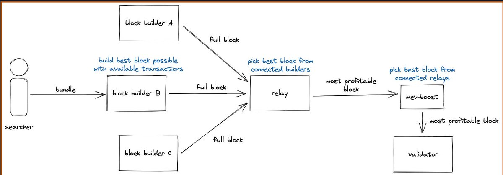

# MEV 入門完全指南：術語、策略與 Bot 開發

> **來源**: [@0xKaKa03](https://x.com/0xKaKa03/status/1957849403907272936) | [原文連結](https://mteam.space/posts/im-new-to-mev/)
>
> **日期**: 
>
> **標籤**: `MEV` `套利機制` `區塊鏈交易`

---

> **來源**: [@0xKaKa03 (Sliipy⚡)](https://twitter.com/0xKaKa03)  
> **日期**: 2025-02  
> **標籤**: `MEV` `Flashbots` `DeFi` `套利` `量化交易`

---

## 文章簡介

這是 Flashbots 社群大佬撰寫的 MEV 入門完全指南《I'm new to MEV》，涵蓋 MEV 介紹、術語解釋、常見策略區別、如何開始寫 MEV Bot、推薦工具和學習資源等內容。適合初學者了解 MEV 領域的基礎知識和社群文化。

原文：https://frontier.tech/i-m-new-to-mev

---

## 引言（Introduction）

如果你正在閱讀這篇文章,你很可能剛進入 MEV 領域。本文旨在為任何新入場的人提供指南。

本文會覆蓋你需要知道的術語、該領域的社交規範，以及運行 bot 的一些更技術性的細節。你很可能是為了盈利而被 MEV 吸引——也許你聽說過 jaredfromsubway 透過 sandwiching bot 賺了數百萬。

本文是對 Flashbots 和 Ethereum Foundation MEV 文章的擴展。建議把那兩篇文章和本文一起閱讀。前兩篇將更聚焦於 MEV 本身，而本文更關注 MEV 社群的文化與術語。

---

## 什麼是 MEV？（What is MEV?）

**MEV 是 Maximum Extractable Value**，指可從任何系統中的特權角色提取的任何價值（經濟或其他）。

在區塊鏈中，MEV 變得突出，是因為對區塊內交易排序的特權（屬於網路 validators）所能提取的價值。

推薦閱讀：
- Ethereum Foundation 關於 MEV 的文章
- Paradigm 的《Ethereum is a Dark Forest》

---

## MEV 供應鏈

MEV 供應鏈是提取 MEV 的流程，包括：

| 角色 | 說明 |
|------|------|
| **Searchers** | 發現以 bundles 形式存在的 MEV |
| **Bundles** | 包含提取 MEV 的交易 |
| **Builders** | 從 bundles 建構區塊 |
| **Relays** | 將 builders 的區塊提交給 validators |
| **Validators/Proposers** | 向區塊鏈提議區塊 |

**MEV bot** 是一種試圖提取 MEV 的自動化程式。運行這些 bot 的人我們稱為 **searchers**。

---

## 術語（The "lingo"）

### Searchers（搜尋者）

Searchers 是 MEV 領域的關鍵角色。他們負責建構和運行 MEV bots 以盈利地提取 MEV。

> "相當大一部分 MEV 是由被稱為'搜尋者'的獨立網路參與者提取的。搜尋者在區塊鏈資料上運行複雜演算法以檢測有利可圖的 MEV 機會，並透過機器人自動將這些有利交易提交到網路。" — The Ethereum Foundation

Bell Curve 播客的估計將活躍 searchers 的數量僅定在 **500 名左右**。

### Ops（機會）

**Ops（opportunities）** 指任何可被利用來提取 MEV 的情形或事件。

當 searcher 成功從其中獲利時，稱為 **"hit"** 一個 op。

### Alpha（阿爾法）

**Alpha 是能夠創造競爭優勢的獨家知識或信息**。

在此語境下，Alpha 指一種讓 searcher 能發現新 ops 的技術或策略。

想理解該詞的來源，建議閱讀 Scott Patterson 的《The Quants》。

### Sandwiching（夾子攻擊）

Sandwiching 是 searchers（如 jaredfromsubway.eth）常用的一種 MEV 策略。

> "夾擊攻擊涉及將受害者的交易'夾'在由 searchers/攻擊者發起的兩筆交易之間，攻擊者透過重新排序這些交易對受害使用者造成隱性損失，並可能為攻擊者帶來收益。" — EigenPhi Classroom

### Arbitrage（套利）

Arbitrage（套利）是許多 searchers 採用的另一種常見 MEV 策略。

> "在經濟學和金融學中，套利是利用兩個或多個市場之間價格差異的做法；透過促成一組相互匹配的交易來利用差價，利潤即為單位交易所對應的市場價格差額。" — Wikipedia: Arbitrage

> "去中心化交易所（DEX）套利是最簡單且最知名的 MEV 機會。因此，它也是競爭最激烈的。其工作原理如下：如果兩個 DEX 對同一代幣報價不同，就可以在價格較低的 DEX 購買該代幣，然後在價格較高的 DEX 出售，且在單個原子交易中完成。得益於區塊鏈的機制，這種套利是真實的、無風險的套利。" — The Ethereum Foundation

### Liquidations（清算）

Liquidations（清算）是 searchers 常用的另一類 MEV 策略。

> "隨著借款人在 DeFi 應用中抵押物價值的波動，他們的借貸能力也會隨之變化。如果因為市場波動，借出資產的價值超過了抵押物價值的某個比例（例如 30%，具體百分比由協議決定），協議通常允許任何人發起清算，立即償還出借方（這類似於傳統金融中的追加保證金）。被清算時，借款人通常需要支付高額的清算費用，其中一部分歸清算者所有——這就產生了 MEV 機會。" — The Ethereum Foundation

### Long vs Short Tail MEV

Ethereum Foundation 給出了對不同類型 MEV 的出色分類：

> "DEX 套利、清算和夾心交易都是眾所周知的 MEV 機會，對於新進入的搜尋者而言不太可能盈利。然而，還存在大量較少為人知的 MEV 機會（可以說 NFT MEV 就是其中之一）" — The Ethereum Foundation

當 searchers 提到 **long tail MEV** 時，他們通常指較少人知、觸發不那麼頻繁的 MEV 策略。

### Flashbots

Flashbots 是一個在以太坊上對 MEV 產生廣泛影響的研發組織。

他們推出了：
- Flashbots Auction
- MEV Explore
- Flashbots Protect
- MEV-Boost
- MEV-Share
- Flashbots Discord
- Flashbots Forum
- Realized Extractable Value Dashboard

### Bundle（捆綁包）

**Bundle 是提交到 Flashbots Auction 的一組交易**。

Bundles 由 searchers 提交，並按礦工接收到的順序執行。Bundles 是 searchers 提取 MEV、命中 ops 的主要方式。

---

## 社交規範（Social Norms）

以下社交規則與期望的行為來自 Flashbots Discord（MEV searchers 與其他感興趣者常聚之地）的個人經驗。

### 不要索要 MEV bot

⛔ **請不要索要 MEV bot**。

擁有盈利 bot 的 searcher 不會願意把 bot 賣給你。如果你想運行 bot，你很可能需要自己建構。

這樣問通常只會讓你被忽略，或被騙子聯絡。

### 不要詐騙他人

看似顯而易見？確實會發生。不要嘗試詐騙。不要就詐騙尋求幫助。就……別這樣。

### 不要 dox 他人

大多數 searchers 是匿名的，並希望保持匿名。

- 不要索要個人資訊
- 不要分享個人資訊
- 不要試圖查找個人資訊

### 不要炫耀你的 bot

更像是一種社交慣例而非硬性規則，但炫耀你的 bot 通常會被反感。

分享 bot 的表現可以，但別當個混蛋。我也不建議發布任何可識別你 bot 的資訊。

### 不要隨便 DM

除非對方讓你這麼做，否則別 DM。

- 有問題，請在相應頻道提問
- 若要問特定的人，也在相應頻道提問並 @ 對方
- 如果你不想公開問，先問對方能否 DM；若對方說不行，就別 DM

### 保持尊重與感恩

這是一個聚集了通常極其聰明、且往往很忙的人們的社群。

- 有人未回覆你，不要往心裡去
- 有人對你無禮，不要以牙還牙
- 有人幫助了你,記得感謝
- 有人求助，如果你能，幫一把

通用的社交準則在這裡也適用。

---

## 我想做一個 MEV bot。從哪裡開始？

⚠️ **首先要說，建構並維護一個有競爭力的 MEV bot 極其困難**。

需要大量時間、精力與技能。

⛔ **大多數 searchers 會被 "rekt" 並虧錢**。MEV 是強者贏多數的遊戲。若你不是最強，就不會盈利。

如果你仍然感興趣，請繼續。讀完本文後，查看文章：How to use the Artemis MEV framework。

### 程式設計（Programming）

要做出有競爭力的 MEV bot，你需要非常紮實的程式設計能力。

選擇一門語言是第一步。你應當熟悉以下之一：
- **Rust**
- **Go**
- **JavaScript / TypeScript**

推薦資源：
- The Go Ethereum Book（用於 Go）
- Rust 與 JavaScript/TypeScript 暫無相當資源，找到會更新

一些有用的開源 Rust bots：
- Rusty-sando
- Subway-rs
- Opensea-sudo-arb

流行的開源 JavaScript bot：
- Subway

理解 **Solidity** 對於許多類型的 MEV bot 是必要的。

### 工具（Tools）

有不少工具對 MEV searchers 很有用：

| 工具 | 用途 |
|------|------|
| **EigenPhi** | MEV 分析 |
| **Flashbots Transparency Dashboard** | MEV 分析 |
| **Tenderly** | Bundle 模擬 |
| **Flashbots** | 在以太坊上提交 bundle |

---

## Bot 最佳實踐（Bot Best Practices）

在從零寫 bot 之前，你需要知道一些事情。這裡概述一些常見陷阱與最佳實踐。

### Bot 架構（Bot Architecture）

MEV bot 的架構通常類似 Artemis 文件中的下述結構：

| 元件 | 功能 |
|------|------|
| **Collectors** | 接收外部事件（如 pending txs、新區塊、市場掛單等），並將其轉換為內部事件表示 |
| **Strategies** | 包含每類 MEV 機會所需的核心邏輯。它們以事件為輸入，計算是否存在機會（例如，某策略監聽市場掛單流來尋找跨市場套利）。Strategies 產出 actions |
| **Executors** | 處理 actions，負責在不同域中執行（例如，提交 txs、發布鏈下訂單等） |

### Gas 與 Bribing（Gas & Bribing）

在被稱為 **MEV Auction** 的系統中，searchers 透過**支付賄賂（bribe）**來激勵 validators 將他們的 bundles 包含進區塊。

這些 bribes 通常佔到 bundle 中 **>99% 的 MEV 利潤**。這意味著 searchers 通常最終只能拿到每次命中機會利潤的 **<5%**。

你可能聽過 **gas wars** 或 **bribe wars**。當多個 searchers 競爭同一機會時，就會出現這種情況。

此時 searchers 會不斷提高 bribe，bribe 可能非常高。為擊敗競爭對手，bot 支付 >100% bribe 也並不罕見。

### Salmonella Poisoning（沙門氏菌攻擊）

**Salmonella attack** 是專門為"爆錘"設計不良的 MEV bots 的攻擊。

強烈建議閱讀相關文章以了解更多資訊。

### Smart Contracts（智能合約）

從技術上講，不用自訂智能合約也能做出盈利的 MEV bot，但這樣做的人很少。

大多數 searchers 使用自訂智能合約與區塊鏈互動。這使他們能夠：

- 在一筆交易中與多個合約互動
- 在一筆交易中批次抓取鏈上資訊
- 透過批次化節省 gas
- 回滾無利可圖的交易以避免資產負債表風險

### 鏈重組與重組保護（Reorgs and Reorg Protection）

**Reorgs** 是以太坊上涉及改變區塊鏈的事件。

對 MEV searchers 來說，reorg 可能帶來風險：被 reorg 的區塊不再對 bundle 隱私與排序提供保證。這意味著 validators 可能"拆包（unbundle）"searcher 的 bundle，並從 bot 中偷走資金。這被稱為 **reorg attack**。

MEV bots 透過在智能合約中使用**運行時檢查（runtime checks）**來防護 reorgs。這些檢查包括：
- 校驗區塊號
- 校驗上一個區塊的 block hash

建議閱讀 Flashbots 的相關文章以了解更多關於 reorgs 與其防護的資訊。

---

## 延伸閱讀（Further Reading）

推薦的 MEV 相關文章與資源：

- Flash Boys: A Wall Street Revolt
- Flash Boys 2.0
- Flashbots — Frontrunning the MEV crisis
- MEV for the next trillion
- Bell Curve Podcast
- Bell Curve: Interview with a Searcher 2.0
- 0xResearch Podcast
- Anish Agnihotri
- The Flashbots Forum

---

## 總結

在 MEV 社群中請保持常識；也歡迎把這篇文章分享給任何新入場的人。
