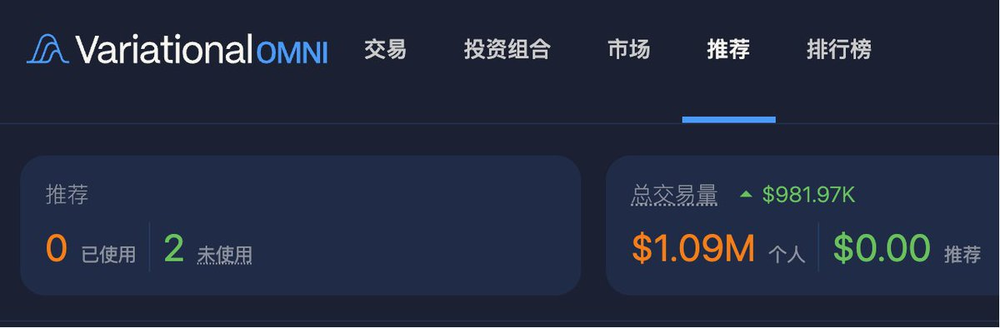
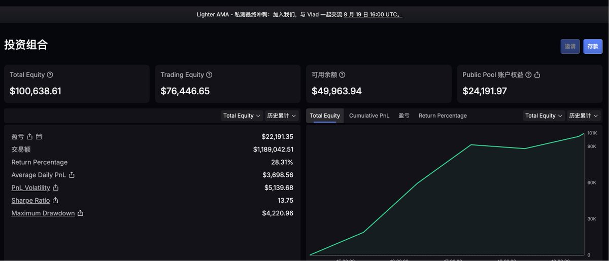

# CEX/DEX 流動性與套利對比評測：Lighter、edgeX、Variational

> **來源**: [@0Xlynn03](https://x.com/0Xlynn03/status/1957640590935609399)
>
> **日期**: 
>
> **標籤**: `套利` `交易所比較` `流動性提供`

---

> **來源**: [@0Xlynn03 (邻山Lynn)](https://x.com/0Xlynn03)
> **標籤**: `Lighter` `edgeX` `Variational` `DEX` `流動性` `套利` `金庫收益`

---

## 綜合評測

本文對比三個去中心化交易所（Lighter、edgeX、Variational）的實際使用體驗，從套利交易者視角評估流動性、手續費、金庫收益、資金管理等關鍵面向。

## Lighter (@Lighter_xyz)

### 優勢
- **深度好**：流動性充足
- **零手續費**：無交易手續費
- **高金庫收益**：LLP 收益表現優異
- **實時存取**：零費用即時出入金，資金靈活度極高
- **資金費率友好**：一小時結算一次，對套利玩家有利
- **積分擴容**：積分下發後可買入更多 LLP 額度

### 劣勢
- **無手機版**：目前僅支援網頁端
- **手機體驗差**：網頁版在手機上顯示不直觀，操作不便

### 適用場景
適合將較大資金投入 LLP 金庫躺平收益，搭配一小時資費週期進行跨所套利。

---

## edgeX (@edgeX_exchange)

### 優勢
- **深度優秀**：流動性表現良好
- **eLP 收益佳**：金庫收益具競爭力
- **精緻介面**：UI/UX 打磨完善，操作體驗接近中心化交易所（類似小型 OKX）
- **手機 APP**：原生移動端應用，使用便利
- **穩定性強**：從未宕機，插針事件罕見
- **手續費優惠**：使用大使連結可直接獲得 V1 等級（降低手續費）

### 劣勢
- **金庫延遲**：資金投入後次日才有淨值變動，與 Lighter 的實時性有差距
- **贖回週期長**：金庫贖回需 7 天到帳
- **資金費率顯示不便**：無年化顯示，跨所套利時需手動計算
- **提款手續費**：數千 U 級別收取約 2U 手續費

### 適用場景
適合重視穩定性和移動端體驗的使用者，可搭配大使連結降低交易成本。

---

## Variational (@variational_io)

### 獨特機制
- **無傳統訂單簿**：交易所直接與玩家對價交易
- **點差模式**：零手續費，但市價單約有 0.03% 點差（相當於做市商利潤）
- **限價單優勢**：使用限價單可避免點差成本
- **低資金費率**：資費水準較低，適合作為跨所套利的多單方

### 亮點
- **虧損補償機制**：虧損玩家有機率獲得補償，為套利增加額外收益可能性
- **金庫潛力**：基於其盈利模式，預期未來金庫 APR 可能超越 Lighter

### 劣勢
- **操作習慣差異**：對習慣訂單簿交易的使用者需要適應期

### 適用場景
適合願意適應新交易模式的套利者，期待高收益金庫額度開放。

---

## 個人使用排序

**Lighter > edgeX > Variational**

### 實際策略
1. **主力**：Lighter（大資金躺平 LLP）
2. **輔助**：Variational 和 edgeX（刷交易量，等待高收益金庫額度）

### 評估基準
純粹從套利交易者視角評估，**不考慮積分價值**（對積分已祛魅），著重實際交易體驗與資金效率。

---

## 關鍵差異對比

| 項目 | Lighter | edgeX | Variational |
|------|---------|-------|-------------|
| 流動性 | 優秀 | 優秀 | 無傳統深度 |
| 手續費 | 0 | 有（可降至 V1） | 0（市價單 0.03% 點差） |
| 金庫收益 | 高 | 中上 | 未開放（預期高） |
| 出入金 | 實時零費用 | 次日生效，7天贖回 | 未詳述 |
| 提款費 | 未提及 | ~2U/數千U | 未提及 |
| 資金費率 | 1 小時/次 | 顯示不便 | 低 |
| 穩定性 | 未提及 | 極高（無宕機） | 未提及 |
| 移動端 | 無 APP | 原生 APP | 未提及 |
| 特殊機制 | - | - | 虧損補償 |
