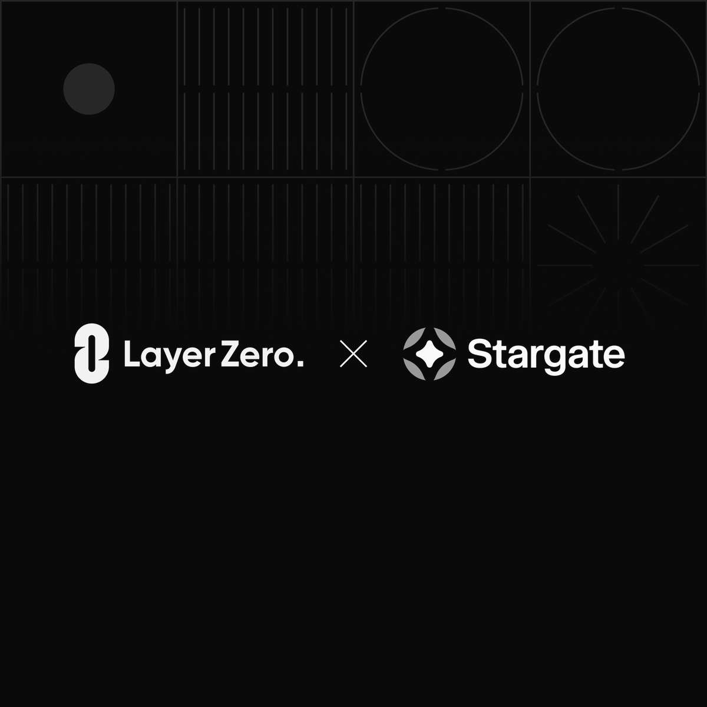

# LayerZero 併購 Stargate：併購細節與套利機會分析

> **來源**: [@cryptogator1121](https://x.com/cryptogator1121/status/1955210886668489001)
>
> **日期**: 
>
> **標籤**: `併購事件` `套利機會` `籌碼分析`

---

> **來源**: [@cryptogator1121 (CryptoGator 小鱷魚🐊)](https://twitter.com/cryptogator1121)
> **標籤**: `LayerZero` `Stargate` `STG` `併購` `套利機會`

---

## 併購事件概述

昨天 LayerZero 宣布要併購 Stargate，消息一出帶動高達 30% 幣價波動。這個併購案從籌碼面到基本面都出現了交易和套利機會。

LayerZero Foundation 正式提出收購 Stargate (STG) 的提案，主題為「Bring the Bridge Home」。

## 併購細節分析

本次併購案涉及多個層面的影響：

- **價格波動**：STG 幣價出現 30% 的劇烈波動
- **籌碼面機會**：併購過程中出現的籌碼重新分配
- **基本面變化**：LayerZero 生態系統的整合效應

## Alpha 與套利機會

震盪過程中浮現的交易機會包括：

1. 價格波動帶來的短期套利空間
2. 籌碼面重組帶來的結構性機會
3. 基本面整合預期帶來的長期價值重估

---

**相關連結**: [LayerZero 官方推文](https://t.co/OfB4eV2r96)
