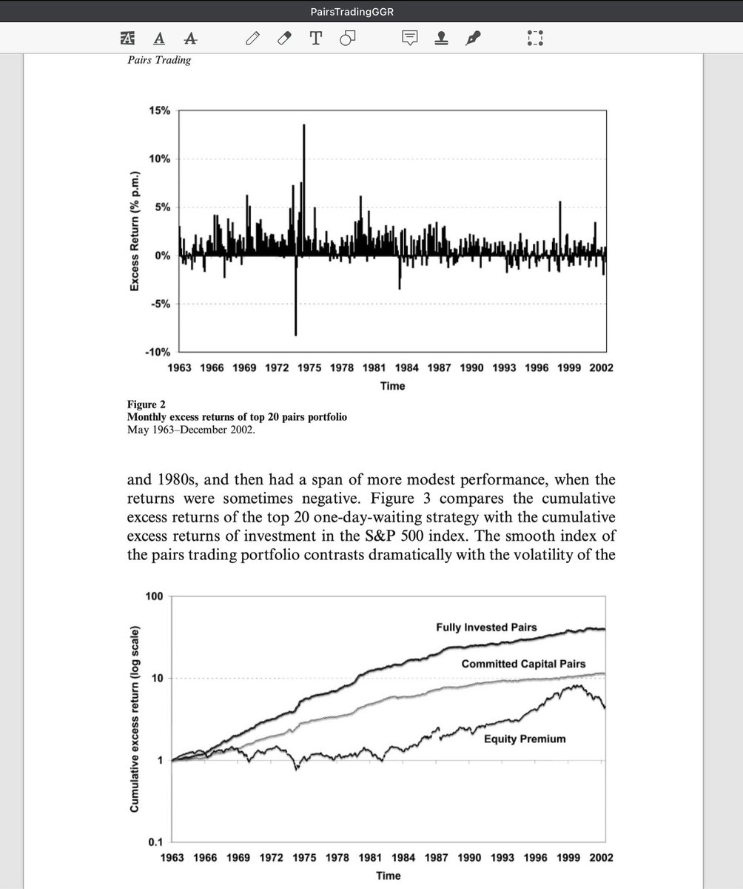

# 配對交易：相對價值套利策略研究

> **來源**: [@wquguru](https://x.com/wquguru/status/1951243101038846297)
>
> **日期**: Fri Aug 01 11:26:22 +0000 2025
>
> **標籤**: `配對交易` `統計套利` `一價定律`

---

## 套利原理

配對交易（Pairs Trading）是一種市場中性套利策略，核心是選擇歷史價格走勢高度相似的兩隻股票，當價差擴大時做多落後者、做空領先者，待價差收斂後平倉以獲取套利利潤。這實質是對「價格一價定律」（Law of One Price）的套利執行，假設兩隻高度相關的股票價差最終會恢復歷史均衡水平。

## 策略實現

作者採用兩階段法：

1. **配對形成期**：用前 12 個月的日線數據尋找歷史價格運行最接近的一組股票（以標準化歷史價格的最小距離度量）
2. **交易執行期**：在接下來的 6 個月內進行實時交易，僅當價差偏離歷史均值 2 倍標準差時觸發開倉信號，平倉點通常為價差回歸交叉點

## 套利收益情況

### 長期表現（1962-2002）

- 選取最優的前 20 對股票，每月獲得平均 1.44%（年化約 17%）的超額收益
- 採用更保守的「投入資本回報」口徑依然每月 0.81%
- 收益在經濟和統計意義上都高度顯著

### 摩擦成本調整後

- 引入一日延迟交易以規避報價（bid-ask bounce）產生的收益高估後，仍有月均 0.90% 左右的淨收益
- 顯示超額收益對現實市場摩擦具有一定的魯棒性

## 板塊與組合特徵

### 行業分布

- 最優配對多為公用事業板塊（Utilities），占比約 71%
- 匹配股票以大市值公司居多（91% 來自前五大市值分位）

### 交易特性

- 單對股票平均每半年交易約 2 輪
- 每次持倉平均 3.7 個月，屬於中線套利策略

## 風險與穩健性分析

### 風險因子調整

- 結果經過多種風險因子調整後依然顯著，包括傳統風險溢價、破產風險等
- 通過 bootstrap 方法表明配對交易並非傳統均值回復策略的簡單表現

### 行業中性測試

- 行業中性（如僅限於金融、工業領域配對）下收益仍顯著
- 最優仍在公用事業，但其他大行業（金融、工業）月收益也有 0.6%—0.8%

### 樣本外驗證

- 策略表現並未因學界與業界公開而消失
- 通過樣本外（1999-2002 年）檢驗，表現與樣本內一致
- 作者認為套利利潤源自市場參與者在維持「一價定律」（Law of One Price）過程中獲得的補償，隱含了對市場效率的動態維持機制

## 策略局限與進一步討論

1. **交易成本影響**：收益部分來源於報價價差（bid-ask spread），剔除後淨收益有所下降
2. **觸發點設定**：配對觸發點 2 倍標準差並未針對交易成本做最優校準，導致某些交易並不能完整覆蓋摩擦成本
3. **風險依賴**：策略對股票流動性及個體風險有依賴（如破產風險影響）
4. **覆蓋範圍**：並未覆蓋所有行業/板塊

## 結論

配對交易策略通過系統性挖掘歷史強相關股票對，在價差偏離時建立反向頭寸，等待價格回歸，抓取市場中暫時性失效的一價定律。該文實證表明，策略在長周期、多行業下具有統計和經濟上的顯著盈利能力，且部分生存於現實交易摩擦與行業習性的考驗，是套利策略研究的重要基石。
