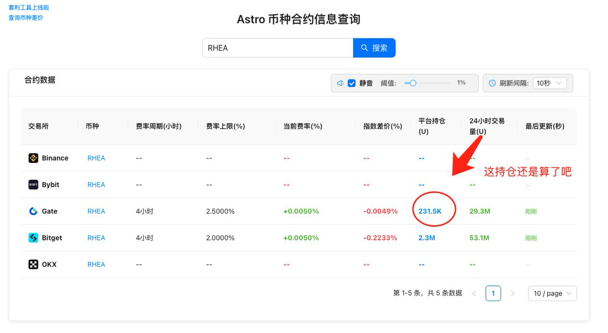

# 交易所插針風險規避策略

> **來源**: [@0xZhouXiaoQi](https://x.com/0xZhouXiaoQi/status/1951286538349977917) | [原文連結](https://astro-btc.github.io/Astro-Perps/?coin=RHEA)
>
> **日期**: Fri Aug 01 14:18:58 +0000 2025
>
> **標籤**: `套利` `風險管理` `現貨合約`

---

> **來源**: [@0xZhouXiaoQi (周小琪)](https://x.com/0xZhouXiaoQi)  
> **標籤**: `套利` `RHEA` `風險管理` `交易所` `合約交易`

---

## 交易所插針現象

今天大家都罵 GATE 插針，3 分鐘拉 8 倍，看了眼 BG 也一樣插針。

## 風險規避策略

### 1. 開單前檢查平台持倉

- 持倉太低不開單
- 1M 以下都算低持倉

### 2. 倉位管理策略

如果實在想開單，可採用以下方式：

- **逐倉模式**：將風險限制在單一倉位
- **全倉限額**：全倉只放 1 萬，即使爆倉也能接受

## 參考工具

- [Astro 幣種合約信息查詢](https://t.co/n3s5QvP5dP)：可用於查詢合約持倉數據
- Astro 費率工具已升級 pro 版本
