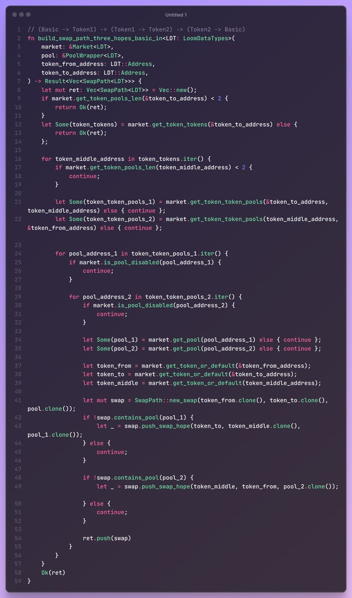
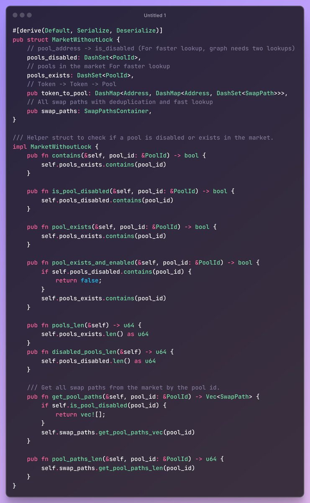

# DEX 套利學習筆記 ④ 交換路徑與路徑管理

> **來源**: [@0xmomonifty](https://x.com/0xmomonifty/status/1949292154767237250)
>
> **日期**: Sun Jul 27 02:14:00 +0000 2025
>
> **標籤**: `套利算法` `DEX交易` `圖論應用`

---

> **來源**: [@0xmomonifty (0xMomo🕊️)](https://twitter.com/0xmomonifty)
> **日期**: 2026-02-18
> **標籤**: `DEX套利` `交換路徑` `路徑管理` `DFS` `Uniswap`

---

## 套利路徑

在玩 DEX-DEX 套利的時候,計算和管理 Swap 的路徑極為複雜。我們在同步獲取到 Uniswap 各個交易對 Pool 之後,如何將池子之間路徑連接起來形成路徑,也是一門需要不斷學習探索的步驟。

套利路徑的本質是 A→B→C→…→A,使用 A 經過一系列池子之間的 Swap 之後能獲得到更多的 A,這是我們的最終套利目的。我們把每個池子看成一條邊,每條邊都有一個起點和一個終點,形成一個環狀的有向圖,尋找路徑就成了解決圖問題。跳數 hops 即為 Swap 長度,像小白階級可以先從 3 跳進行學習。

### 路徑搜索算法

目前最常見的是 **DFS(深度優先搜索)**,它從一個起始節點開始,沿著當前路徑盡可能深地搜索,直到無法繼續為止,然後回溯到上一個節點,選擇另一條路徑繼續搜索。當然也有使用二分搜索等方法先確定範圍進行求解。

參考資料: [ccyanxyz/uniswap-arbitrage-analysis](https://github.com/ccyanxyz/uniswap-arbitrage-analysis)

### 進階優化方法

更高層次的可以按照**價格 > 狀態匹配度 > 路徑條件**進行排序,或者疊加更多因素進行凸面求解,最後算出來的路徑進行交易。

參考資料: [advock/CFMM-Convex-Optimization](https://github.com/advock/CFMM-Convex-Optimization)

## 路徑管理

我們在根據自己喜好(比如前期對池子大小進行篩選)進行過濾 Pool 後形成了許多數量的路徑,但是眾多池子魚龍混雜,我們還需要一個 manager 來管理控制我們的路徑數據庫,進行黑白名單狀態控制和交易對的快速查找。

### swap-path 項目

這裡介紹一位在性能優化方面追求極致且極為出色的大佬 [@cakevm](https://twitter.com/cakevm) 的 [cakevm/swap-path](https://github.com/cakevm/swap-path) 項目。他也是 Loom 項目的重要貢獻者,在群裡非常熱情且專業地解答大家的疑問。

在這個項目中使用了 **DashMap**,採用 DFS 計算多跳路徑,可以非常方便快速地管理和查找池子和 Path。

**流程**:
1. 新池加入
2. 更新圖結構
3. DFS 查找所有可達路徑
4. 存儲路徑

---

*以上均為個人筆記,理解可能存在問題,也非常感謝能夠有大佬來指點一二*
