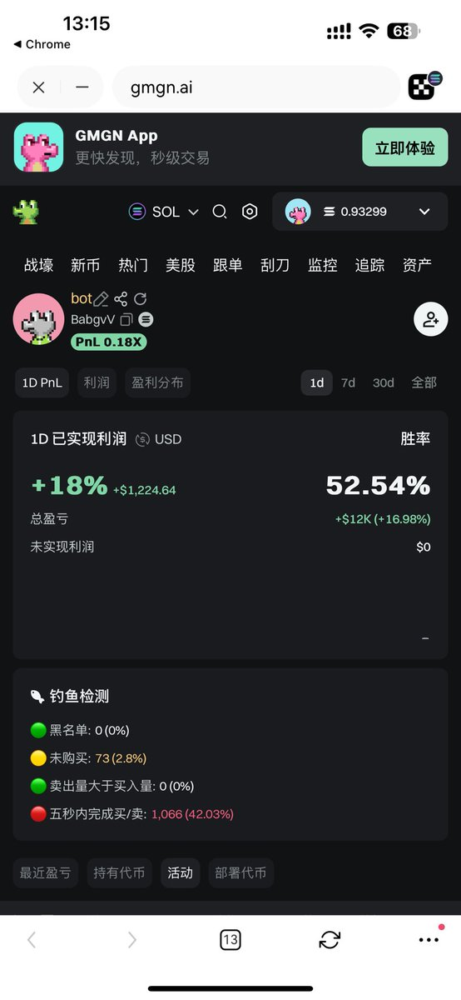

# Pump Fun AMM 流動性狙擊套利機器人策略

> **來源**: [@beiyue66](https://x.com/beiyue66/status/1948977371555791232)
>
> **日期**: Sat Jul 26 05:23:10 +0000 2025
>
> **標籤**: `套利機器人` `Pump Fun` `流動性管理`

---

> **來源**: [@beiyue66 (beiyue1)](https://x.com/beiyue66)
> **日期**: 2026-02-18
> **標籤**: `pump-fun` `套利機器人` `流動性狙擊` `AMM` `鏈上交易`

---

鏈上有很多有趣的小 bot，最近我也做了一個。

主要是擼流水莊的，以量取勝。

## 基本原理

監控狙擊所有剛注入流動性的新幣，底部塞 2u 買進去。

流水莊的特點就是你買多了他就撤池子，並且用的是 Pump AMM 池而不是在 Pump 內盤發射，因為這樣手續費會奇高（買賣各 1%）。

只需要想辦法測試一下每個流水莊的撤池子閾值，然後照著去改參數就行。這種莊的鏈上路徑還是很清晰的。

## 利潤來源

Pump AMM 買賣無手續費，所以利潤來源就是漲幅 - 手續費（記得定期去回收租金，不然帳面會永遠浮虧）。

像這個地址雖然每日盈利肯定不是圖上這樣，但是我大概計算了一下，日賺 2-3 SOL 也不是問題。我自己的 bot 也差不多是這樣。

## 風險提示

不過現在的風險在於這註定就不是一條能容納很多人的賽道。畢竟你買 2u 他買 2u，機器人多了，超過流水莊的成本他就直接撤池子了還能賺個開戶費。現在來捲來競爭的明顯多了很多，不知道還能跑多久。
