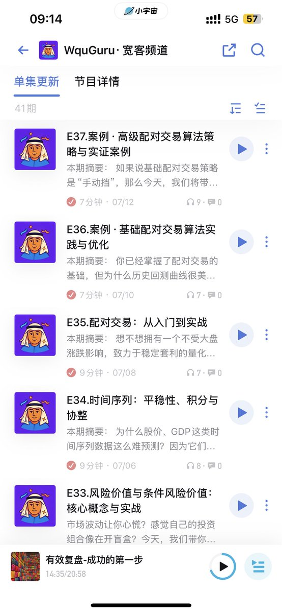
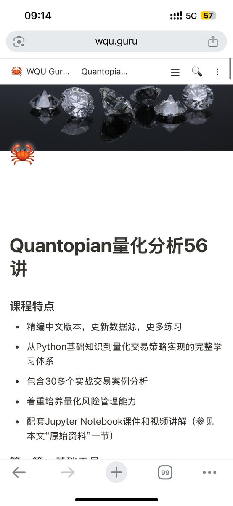
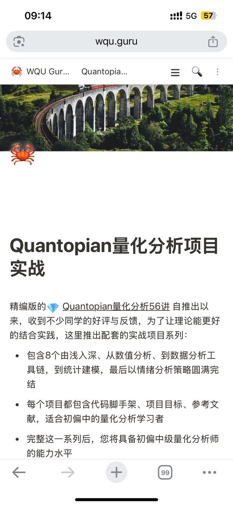

# Quantopian 量化交易系列教程合集

> **來源**: [@wquguru](https://x.com/wquguru/status/1947828384438095892) | [原文連結](https://twitter.com/wquguru/status/1947828384438095892/photo/1)
>
> **日期**: Wed Jul 23 01:17:30 +0000 2025
>
> **標籤**: `量化交易` `教育資源` `入門教程`

---

> **來源**: [@wquguru (WquGuru🦀)](https://x.com/wquguru)
> **日期**: 2026-02-18
> **標籤**: `量化交易` `Quantopian` `教學資源` `入門教程`

---

分享最近在聽、在看、在學的寶藏量化交易系列。

可以說是很全面了，對新人很友好，涵蓋：

## 三大學習資源

1. **量化金融播客**：隨時隨地學量化
2. **Quantopian 量化分析 56 講**：最專業的入門教程
3. **Quantopian 量化分析實戰**：由淺入深實踐，完成後不愁 offer
