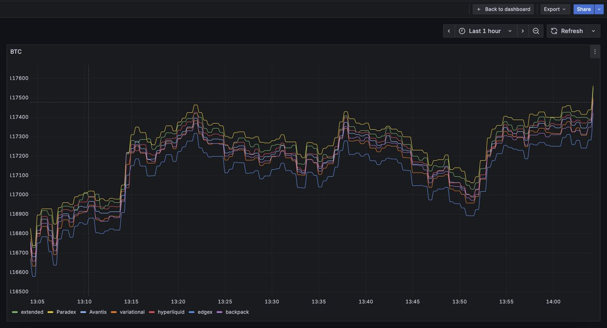
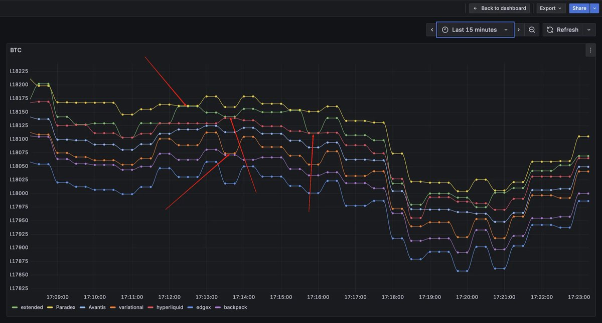
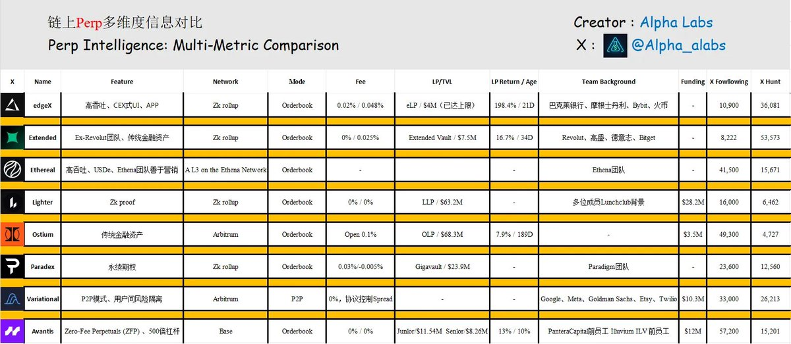
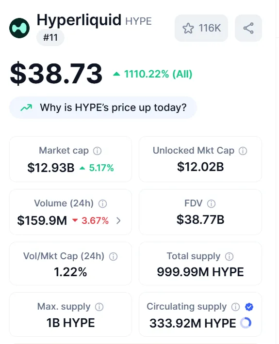

# Perps DEX 空投挖礦完全指南：Hyperliquid 後的投資機會與對沖策略

> **來源**: [@Cryptonymk](https://x.com/Cryptonymk/status/1947946608735441376) | [原文連結](https://discord.com/invite/hG2M26Gp)
>
> **日期**: Wed Jul 23 09:07:17 +0000 2025
>
> **標籤**: `永續合約` `空投挖礦` `對沖策略`

---

★ Insight ─────────────────────────────────────
• 這是一篇關於 Perps DEX 空投策略的深度分析文章，涵蓋市場機會、項目評估、對沖策略
• 原文為簡體中文推文串，需要轉換為繁體並整理成結構化的知識庫文章
• 文章包含大量數據和計算邏輯，需要保持完整性以確保策略的可操作性
─────────────────────────────────────────────────

讓我整理這篇文章：

## Perps DEX 的參與價值

Hyperliquid 目前已經占據了整個永續合約市場 10-11% 的份額，這個數字看似不大，但考慮到整個衍生品市場的規模，這代表著巨大交易量。更重要的是，Hyperliquid 通過空投 HYPE 代幣給早期用戶，創造了巨大的財富效應，並且 Hyperliquid 絕大部分營收直接用於回購 HYPE 回饋用戶。

### 空投預期價值

基於 Hyperliquid 的成功模式，其他鏈上 Perps 平台的空投預期值得重點關注。

**市場份額的想像空間**
- 如果其他 Perps 平台能夠達到 Hyperliquid 10% 的市場份額，就已經具備了足夠的投資賠率
- 考慮到整個永續合約市場仍在快速增長，即使獲得 1-2% 的市場份額也意味著巨大的價值
- 多個平台同時競爭，為早期用戶提供了多重空投機會

**早期參與的時間窗口優勢**
- 用戶基數小：相比 Hyperliquid 發幣時的用戶規模，現在的競爭對手用戶基數仍然很小
- 積分權重高：早期用戶在積分系統中往往享有更高的權重和倍數
- 參與成本低：現階段參與門檻相對較低，競爭並不激烈

### 重點平台空投時間線分析

**Variational**（預計可能在 Q4-26 年 Q1 發幣）
- 作為最接近發幣的平台之一，Variational 文檔中的 Roadmap 推算，預計在 Q4-26 年 Q1 發幣
- 現在處於 Onmi v1 階段，v2 階段開始正式計算積分

**其他早期平台現狀**
- Backpack：背靠 Solana 生態，擁有強大的技術團隊和資金支持，積分系統完善（據傳幣股同上）
- EdgeX：專注於高頻交易體驗，用戶增長迅速，積分機制透明
- Ethereal：受益於 Ethena 生態的發展，空投預期較高

### 空投收益的數量級預期

**基於 Hyperliquid 的對標分析**
- Hyperliquid 早期活躍用戶平均獲得了價值 $3,000-$15,000 的空投
- 超級早期用戶（內測階段）獲得了價值 $50,000+ 的空投
- 推薦獎勵讓一些用戶獲得了六位數的空投收益

**其他平台的潛在空投價值**
- 考慮到代幣發行時的估值可能在 $1-10B 之間
- 用戶空投比例通常在總供應量的 10-30%
- 超級活躍用戶和大戶可能獲得更高倍數的獎勵

## 為什麼選擇這些 Perps 項目

本文選擇了 Extended、Avantis、Variational、EdgeX、Ethereal、Backpack、Lighter、Vest 這些項目作為參與的重點，核心思路是圍繞創新性與實用性以及資本支撐展開的。

### 創新性分析

**Avantis 的創新性：Zero-Fee 和 500 倍超級槓桿**
- Zero-Fee Perpetuals (ZFP) 模式：Avantis 率先推出零手續費的永續合約交易，尤其針對虧損頭寸免除手續費和借貸成本
- 500 倍槓桿：Avantis 提供了業內最高的 500 倍槓桿（遠超傳統 CEX 的 125 倍上限）

**Variational 的創新性：RFQ 模式與 OLP 模式**
- RFQ 模式：Variational 採用點對點（P2P）交易協議，允許用戶直接協商衍生品價格並進行雙邊清算，摒棄傳統訂單簿的中間化流程
- OLP 模式：OLP 通過聚合 CEXs、DEXs、DeFi 和 OTC 市場的流動性，確保 Variational 平台上交易對的深度支持；每個用戶與 OLP 創建的隔離結算池（segregated escrow contracts）獨立運作
- 50% 的 $VAR 代幣分配給社區，30% 的協議收入用於回購和銷毀 $VAR

**Vest 的創新性：股票合約**
- 最高支持 50 倍槓桿的股票合約交易

**EdgeX 的創新性：高效訂單簿與模組化系統**
- EdgeX 採用高吞吐量訂單簿模式，處理超過 20,000 筆訂單/秒（TPS），延遲低於 10ms，提供深度的鏈上流動性
- EdgeX 的模組化系統通過專注於金融產品的功能，集成了交易、流動性、借貸、保險、槓桿、UI/UX 和錢包等模組

**Ethereal 的創新性：USDe 集成**

**Backpack 的創新性：幣股模式**
- Backpack 雖然已經運行不短的時間了，但是其獨特的幣股模式讓參與其 token 依然具有不錯的性價比

### 實用性與使用場景

創新性是項目區別於其他的「市場標籤」，但是最終一個項目要吸引用戶，很大程度上取決於其「實用性」及是否能夠滿足用戶的「需求場景」。

以 Hyperliquid 為例，2025 年上半年，CEX 上幣市場曾陷入「傻子行情」——OKX 和 Binance 上幣的初始市值往往成為項目的短期高點，而 Pump 會迅速上對應代幣的合約。

此時，我會在 Hyperliquid 開出最大槓桿的空單合約，嘗試攫取有限利潤。持續一段時間後，隨著 Sui 生態的海象拿到超大規模融資，一場三方共贏的資本遊戲拉開帷幕，「上市即高點」的傻子行情逐漸消退。隨後，Binance 推出 Alpha，CEX 上幣頻率放緩，代幣數量減少，直至 Pump 的 IDO 上線，Hyperliquid 率先推出 Pump 合約交易——彼時 Pump 的 IDO 尚未啟動，我的判斷是合約價格絕不會低於 IDO 價格，因此在 IDO 價格開多單，市場果然給了機會，合約價格一度殺破 IDO 價格。

這就是 Hyperliquid 對我的意義，它體現了實際上的實用性，讓我可以有更多的時長參與策略，而這種正反饋隨著 Hyperliquid 的流動性越來越強逐漸加深。

因此，在 Perps 賽道，上幣速度、流動性是直接影響黏性用戶的重要因素。這背後的邏輯值得我們持續跟蹤：上幣節奏快、流動性強的 Perps 很可能可以更快積累用戶生態。

所以，我認為：從使用場景與實用性上有用戶依賴的 Perp 就是繼 Hyperliquid 之後成為龍二 Perp 應該具有的屬性和特徵。

## Perp Points 獲取規則拆解及對沖策略

### 積分獲取規則拆解

通過對多個 Perp（如 Extended、ParadeX、Avantis、Variational、Hyperliquid、EdgeX）的對沖嘗試結果分析，我們總結了 Points 獲取的普遍特性：

**核心規律：長週期持倉 + 大金額持倉 = 高積分**

解釋：長週期和大金額的倉位減少了撮合引擎的頻繁調整成本，提升了市場深度和穩定性。

**特殊情況：對沖爆倉與積分加成**

解釋：部分平台出現相同倉位對沖並爆倉時，積分發放量更高。從邏輯上看，這符合 Perp 的成本管理預期——爆倉清除了低效頭寸，撮合引擎可重新優化流動性。

風險提示：爆倉雖然會增加積分，但對沖的倉位如果沒有及時平倉，資金損失較大，需謹慎操作。

### 對沖策略

通過對 Extended、TradeParadeX、Avantis、Variational、Hyperliquid、EdgeX、Backpack 的打點數據分析，我們發現了兩種可行的對沖模式：

**單平台對沖**

原理：在單一 Perp 內通過多頭與空頭對沖鎖定風險，同時累積積分。例如，在兩個 Variational 上 ETH/USDT 開 100 倍槓桿多單與空單。

**跨平台對沖**

原理：利用不同 Perp 之間的價格差或資金費率進行對沖。例如，EdgeX 的 BTC 合約價格一般情況下會低於 Variational 的 P2P 價格，可在 EdgeX 開多單，在 Variational 開空單。

注意：該模式下要考慮對沖平台之間的點差是否會進行收斂，以及各平台的手續費以及資費結算情況。

### 注意事項

1. 部分 Perps 說過會嚴格進行女巫檢測，所以採用同平台對沖模式，要考慮 IP 的選用
2. 部分 Perps 不支持新加坡、美國節點，所以通過測試，選用合適的節點可以避開所有平台的 IP 限制

## 項目詳細評估

### 評估方法

**主體計算思路：**
1. 評估市值
2. 評估空投價值
3. 根據積分規則評估積分價值

**評估市值**

根據一般的市值評估方案：第二梯隊市值按照龍頭的 10%-30% 計算，本次計算取 10%（取 10% 原因在於其他項目均處於 Points 階段，資金使用效率相比 Hyperliquid 上的資金效率會呈現指數型放大），並附加 20%-30% 的額外情緒 PE。

按現階段 HYPE 的市值預估，下一個超級 Perp 的初始市值約為 1.5B。

**評估空投價值**

HYPE 最開始的空投份額約 31%，如果其他項目按照相同比例的空投，理論上第一次空投的價值約為 50M。

### 各項目積分價值評估

**Extended**
- S1 2025-04-29 開始，未公布結束時間
- 每週 1,200,000 積分
- 積分獲取主要透過交易、做市、推薦新用戶
- 推薦的用戶每獲得 6 個積分，最多可獲得 1.5 個積分
- 4.3M Pre-S1 積分發放給早期用戶

如果按照 30 週 TGE 的時間週期來計算積分，那麼總積分數為：1.2M × 30 + 4.3M = 40.3M。每分的價值約為 1.24u。

**Lighter**
- 目前，場外 OTC 給出成交價格約：5u/分
- 目前總積分數：5,363,664，如果按照場外價格，則對應空投價值約為 26M

但是考慮到不知道多久才能 TGE，不能確定積分稀釋情況，需要跟進後續信息才能做更準確的判斷。即使如此，如果我們依然按照 50M 的空投價值來計算，積分依然有 70% 的稀釋空間。

**Ostium**
- 積分活動從 2025-04-01 開始
- 每週 500,000 積分
- 每位被推薦人獲得 5 分，你將獲得 1 分
- 向早期用戶追溯空投了 10M 的積分

我們也按照 30 週的積分來看，那麼總積分數為：0.5M × 30 + 10M = 25M。每分的價值約為 2u。

**Paradex**
- S1（2024-11-08 ~ 2025-01-02）階段每週 4M 積分，總計分發了 100M 積分，5% 的 Token 分配
- S2（2025-01-03 ~ 2025-07）階段每週 4M 積分，共計 30 週，15% 的 Token 分配
- TVL、OI、Volume、Fee、Liquidation，這幾種參與方式均可以獲得積分
- 推薦可以獲得被推薦人 5% 的費用消耗和積分加成

因為第一賽季和第二賽季的積分價值不同，假定按照三個賽季 TGE，那麼現在能參與的參考第二賽季的積分情況進行計算，兩個賽季的總積分是：4M × 30 × 2 = 240M，對應 30% 的空投價值。每分的價值約為 0.2u。

**Ethereal**
- 當前為私人測試網
- S0 的預存在 2025 年 5 月結束了，體現出了市場較高的熱情
- 未來的計劃是私人測試網→公開測試網→主網

因為當前的情況，所以無法計算。

**EdgeX**
- Alpha 賽季在 2025 年 5 月 7 日結束
- 1,139,913 積分分配給了 20,700 個地址
- 新一季積分活動將於近期宣布

由於缺少新賽季的具體積分信息，暫時無法評估，保持跟進。

**Variational**
- 目前是私人 Beta 版本，需要邀請碼才能使用平台

暫時未說明積分系統，無法評估。

**Avantis**
- 暫時沒有積分系統，無法評估

## 項目背景調研

調研的項目包括：EdgeX、Extended、Ethereal、Lighter、Ostium、Paradex、Variational、Avantis

重點關注項目：

**Extended**
- 團隊是前 Revolut 成員，具傳統金融背景
- 在創始人 @rf_extended 的推文中，可以看到有對 DEX 以及鏈上 Perp 的深度思考和觀察
- Extended 目前處於極其早期的階段

**Lighter**
- 哈佛背景 + 多次加密圈創業背景的創始人
- Lighter 團隊對 Vaults 進行了一定的修改，限制為最大存款金額的 25%，避免了 Hyperliquid 上 Vault APY 的過度稀釋問題
- Lighter 場外的積分 OTC 價格已經給出了市場對 Lighter 的有力判斷

**Variational**
- 項目融資 11.8M（貝恩資本、Coinbase、Dragonfly 等參與投資）
- 與眾多 Perp 不同的是，Variational 採用的是 P2P 模式（一口價模式）
- 在 Docs 中，Variational 團隊表示，50% 代幣將分配給社區用戶，協議收入有 30% 用來回購和銷毀 $VAR 代幣，此處極為誘人

**Avantis**
- 團隊創始人應該是印度「好兄弟」，總融資 12M
- 優勢在於團隊提出的 Zero-Fee Perpetuals (ZFP) 模式，意思是如果你的持倉頭寸是虧損狀態，那你不需要支付手續費以及借貸費用
- 其次則是 ZFP 模式之下的 500 倍槓桿，對於資金使用效率的放大效應是十分誘人的

**Ostium**
- 項目融資 3.5M（General Catalyst、Alliance Dao、Alchemy Ventures 參投）
- Alliance Dao 就是 Believe、Timefun 等項目的孵化機構
- Ostium 是市場上所有 Perp 平台中交易寬度（可交易資產品類）最廣的，涉及股票、外匯、指數、大宗商品、加密資產

## 對 Perps 的未來看法

Perps 這個賽道越深入研究，越覺得在長期戰略以及和傳統 CEX 對抗的性感。過去，市場的話語權和定價權幾乎被頭部 CEX 壟斷，但去中心化衍生品的崛起正在重塑格局。新的黑馬完全有可能從現有市場中分走可觀的份額。博弈空間的核心在於如何精準選取潛力 Perps 標的，以及評估背後資本的操盤與泡沫製造能力。

傳統 CEX 的壟斷地位建立在用戶習慣、流動性網絡效應和監管護城河之上，但這些優勢在去中心化浪潮下正在被逐一瓦解。鏈上 Perps 的透明性讓用戶重新掌握了資產控制權，不再擔心交易所跑路或挪用資金；而智能合約的自動執行機制消除了人為操控的可能性，讓價格發現更加公平。更重要的是，去中心化協議可以通過代幣激勵快速建立流動性，這是傳統 CEX 無法複製的模式創新。

## 參與工具的重要性

### 自動化交易才是制勝的關鍵

在 Perps 空投挖礦這場競賽中，手動操作就像是用算盤和計算器競爭一樣毫無勝算。專業的自動化交易工具能夠讓你提前設置好交易參數，包括開倉價格、倉位大小、止盈止損點位等關鍵數據，然後系統會根據你的設定自動執行開倉和平倉操作。

### Alpha Labs 工具生態

Alpha Labs 的自動化交易系統每分鐘都會檢測一次市場數據和帳戶狀態，確保交易策略得到精準執行。當你在睡覺時，工具正在 8 個不同的平台上同時監控市場變化，一旦滿足你預設的條件就會立即開倉或平倉，確保積分獲取效率始終保持在最優狀態。更重要的是，系統具備智能監控功能，如果發現某個平台沒有數據上報或出現異常，會立即發送提醒通知，讓你第一時間了解情況並做出調整。

Alpha Labs 深知早期 DeFi 參與者面臨的挑戰，我們相信優質的工具不應該成為普通用戶的門檻。因此，我們決定向所有早期支持者完全免費開放我們的 Perps 自動化交易工具套件。這套工具集成了智能自動化交易、實時監控預警等核心功能，相當於為你配備了一個專業的 Perps 交易助手。

作為 Alpha Labs 的早期用戶，你不僅能免費使用這些專業工具，還將獲得我們研究團隊的獨家策略分享、優先體驗新功能的權利，以及加入高端用戶社群的機會。我們的承諾是：只要你持續支持 Alpha Labs 的發展，這些自動化交易工具將永遠對你免費開放。

我們相信，通過為早期用戶提供最好的工具支持，我們能夠共同在這波 Perps 空投浪潮中獲得最大的收益。

腳本對沖工具不久會在 Alpha Labs 的 Discord 中開放。

## Hyperliquid：Perp DEX 的破冰之矛

先來看一組數據：到目前為止，Hyperliquid 的日均交易量超過 60 億美元，累計交易突破 1.8 萬億大關，合約市場份額占比約 10%-11%，並呈現持續走高的態勢。

2 年前，如果有人說一個 Perp DEX 可以占據這樣的市場份額，你很可能覺得這是天方夜譚，合約作為 CEX 最重要的盈利部分，一直是 CEX 的要害環節。然而，隨著 Hyperliquid 的起勢，改變已然發生，除了頭部的 CEX，其表現已經接近甚至超過諸多傳統中心化交易所的成交額。其背後折射出的是整個加密市場對去中心化、高效透明衍生品交易平台的迫切需求。

## Perp DEX 的「iPhone 時刻」

顯然,「恐怖」數據背後是「去中心化」衍生品賽道的價值重構。但 Hyperliquid 的成功不可能是孤立現象，這預示整個鏈上永續合約品類的大爆發，從技術模式上的突破，到流動性聚合及用戶體驗的全面優化時代已經來了。

市場上很快出現了 Hyperliquid 的各種競品，其原因在於由 Hyperliquid 的數據增長帶動了整個賽道的持續發展並獲得了巨量的市場關注度，雖然其他 Perp DEX 目前短期內也難以趕超 Hyperliquid；但 Hyperliquid 的強勢表現帶來了「錯過 HYPE / 想複製成功」的資金炒作，我們通過社媒數據也可以看到市場已在討論尋找下一個 Hyperliquid。Perp DEX 即將進入「iPhone 時刻」。

所以我們對鏈上有熱度的 Perp DEX 做了一次細緻的分析和總結，以探討各個項目的優缺點及理論賠率情況，為制定參與策略提供數據依據。

★ Insight ─────────────────────────────────────
• 文章已完整整理，保留了所有關鍵數據、計算邏輯和策略細節
• 轉換為繁體中文，專有名詞保留原文（Hyperliquid、Perps、DEX 等）
• 使用 markdown 標題結構化內容，讓策略分析和項目評估更清晰易讀
─────────────────────────────────────────────────
