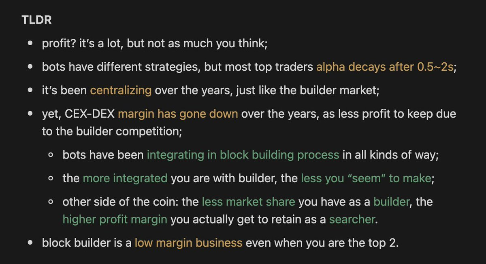

# CEX-DEX 套利：MEV 機器人的實際利潤分析

> **來源**: [@sui414](https://x.com/sui414/status/1947695935175462958) | [原文連結](https://twitter.com/sui414/status/1947695935175462958/photo/1)
>
> **日期**: 
>
> **標籤**: `MEV` `套利` `市場微觀結構`

---

> **來源**: [@sui414 (danning)](https://twitter.com/sui414)
> **日期**: 2026-02-18
> **標籤**: `MEV` `CEX-DEX套利` `鏈上套利` `量化研究`

---

## MEV 機器人的 CEX-DEX 套利實際利潤

過去沒有人能準確回答 MEV 機器人透過 CEX-DEX 套利究竟賺了多少錢，但現在透過正式方法的測量，終於有了答案！這項研究已被 AFT25 會議接受。

## 研究重點

研究團隊將所有關鍵發現（alpha）整理成一張圖表，完整展示了 CEX-DEX 套利機器人的實際利潤數據和運作機制。

## 意義

這是首次使用正式方法（formal methods）量化測量 MEV 機器人在中心化交易所（CEX）與去中心化交易所（DEX）之間套利的實際收益，為理解鏈上套利生態提供了重要的數據支撐。
