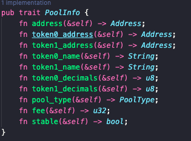

# 套利學習筆記 - 同步池子基礎數據

> **來源**: [@0xmomonifty](https://x.com/0xmomonifty/status/1945760400454439151)
>
> **日期**: 
>
> **標籤**: `套利` `池子同步` `AMM`

---

> **來源**: [@0xmomonifty (0xMomo🕊️)](https://twitter.com/0xmomonifty)
> **標籤**: `arbitrage` `pool-sync` `mev` `amm` `data-infrastructure`

---

## 概述

在套利與 MEV 中，池子的基礎數據是關鍵的起點。我們需要從區塊鏈這個強大的資料庫中把需要用到的各種協議池子的基礎數據拿到手，以便後續路徑以及利潤的計算等。

## 節點的選擇

在後期 BOT 的運行過程中，需要的大部分都是以實時或者最近幾個區塊數據，所以像 ETH、BSC 等 EVM 鏈只需跑 Full 之類的裁剪節點即可。

第一次同步池子需要從早期區塊開始，但是也就最初幾次獲取歷史池子信息，直接使用免費額度的 infura、alchemy 等，同步後用 csv 或者自己喜歡的資料庫存起來，大大可以減少自己的節點性能配置，除非經常需要歷史數據回溯。

## 池子同步

最常見的 AMM 模型 Uni、Pancake v2v3 池子最初同步時保存以下資訊即可：
- 合約地址
- token0 地址、名字、精度
- token1 地址、名字、精度
- 費率

### 同步步驟

1. **獲取池子地址**：先用工廠合約 (factory) 地址和「池子創建事件」的簽名，分批查詢區塊鏈的事件日誌 (logs)
2. **解析事件**：從這些事件中解析出所有池子創建的合約地址
3. **同步詳細資訊**：批量同步每個池子的詳細信息和狀態

工廠合約在各個協議的文檔中可以找到，可以直接 google 搜索如 "pancakeswap doc"，找到 Factory Contract address 就可以看到所有鏈部署的地址。

### 參考實作

方法這裡可以參照大佬寫的：
- [darkforestry/amms-rs](https://github.com/darkforestry/amms-rs)
- [@rnmumu3](https://twitter.com/rnmumu3) 夢哥推薦過的 [Zacholme7/PoolSync](https://github.com/Zacholme7/PoolSync)

## 實作細節

總體來說這部分還算簡單，就是分批次去解析工廠合約創建池子的 Log，與大部分新土狗監控差不多。

之前也有寫過 Four meme 內盤聰明錢監控也是一樣的步驟：不斷 filter 新區塊包含這些地址的 log，如果短時間內交易聰明錢包 >3 就進行 TG 推送。
