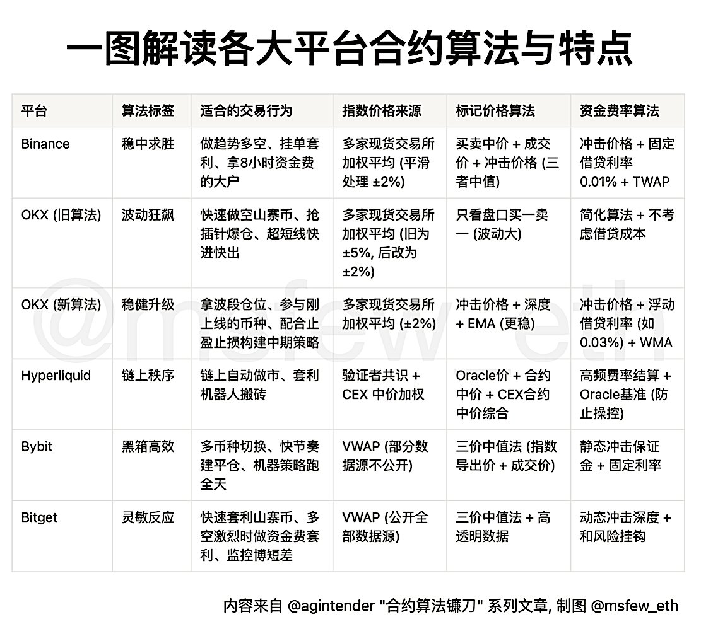

# 各大交易所合約算法對比解析

> **來源**: [@msfew_eth](https://x.com/msfew_eth/status/1944939981098901779) | [原文連結](https://twitter.com/msfew_eth/status/1944939981098901779/photo/1)
>
> **日期**: 
>
> **標籤**: `合約算法` `交易所` `市場微觀結構`

---

> **來源**: [@msfew_eth (msfew)](https://x.com/msfew_eth)
> **日期**: 2026-02-18
> **標籤**: `合約交易` `CEX` `算法機制` `交易所對比`

---

## 概述

本文整理了各大中心化交易所的合約算法設計思路與特點對比,內容來自 @agintender 老師的「合約算法鐮刀」系列精華文章。涵蓋 Binance、OKX、Hyperliquid、Bybit、Bitget 等主流平台的合約機制。

## 各平台合約算法特點

### Binance (幣安)
- 採用資金費率機制平衡多空
- 自動減倉(ADL)系統保護市場
- 分層保證金制度

### OKX (歐易)
- 統一帳戶保證金模式
- 組合保證金降低資金成本
- 風險對沖機制

### Hyperliquid
- 鏈上永續合約
- 去中心化訂單簿
- 透明的資金費率計算

### Bybit
- 雙向持倉模式
- 保險基金機制
- 動態槓桿調整

### Bitget
- 跟單交易功能整合
- 一鍵平倉設計
- 風險限額分級

## 參考資源

原文出處：@agintender 老師的「合約算法鐮刀」系列文章
