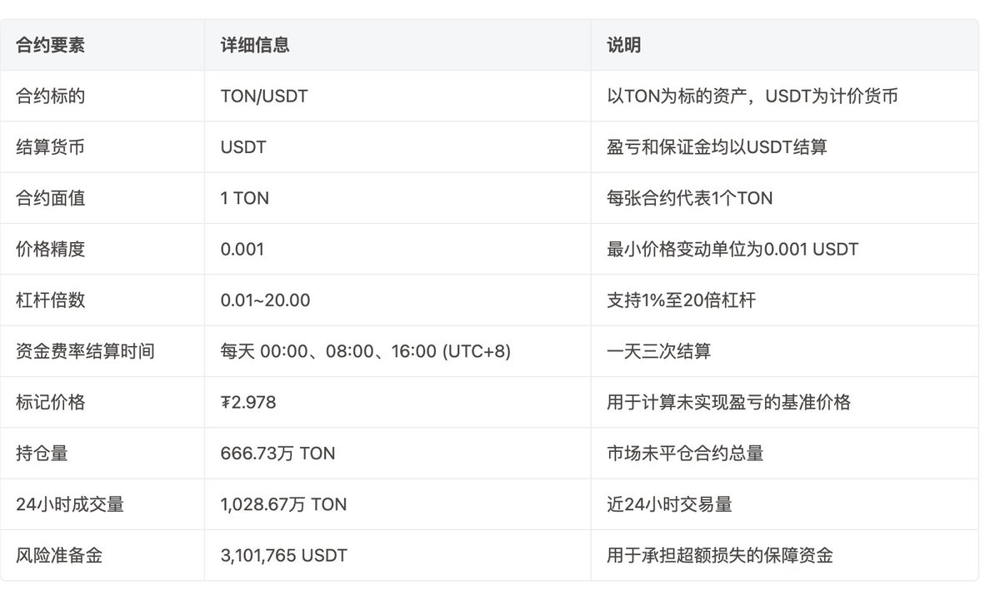

# 永續合約自動減仓機制（ADL）與風險準備金

> **來源**: [@0xLogicLog](https://x.com/0xLogicLog/status/1945132643655541157)
>
> **日期**: 
>
> **標籤**: `自動減倉` `爆仓風險` `訂單簿`

---

> **來源**: [@0xLogicLog (羅格 | Web3安全 & 套利)](https://x.com/0xLogicLog)
> **日期**: 2026-02-18
> **標籤**: `永續合約` `ADL` `自動減倉` `風險準備金` `強平機制`

---

## 核心機制理解

從這裡開始理解了 IM（初始保證金）、MM（維持保證金）、強平爆倉底層操作，風險準備金用途。

## 自動減倉機制（ADL）

交易所還有一個武器，自動減倉機制（ADL, Auto-Deleveraging）。當交易所接管爆倉時,發現自己可能虧錢，那麼選擇轉移風險給盈利用戶，強行平倉盈利較多者。

ADL 是爆倉者的結算義務帶來的風險，讓盈利者承擔。其實也合理，因為盈利了嘛。

## 風險準備金案例

這是一個例子，注意風險準備金，這裡會深入訂單簿的思想。

當 A 平空時會買入合約，那麼標記價格可以以實際為準。但是當 A 的倉位強平時，合約的價格是鎖定的，但是成交的價格是動態的。
