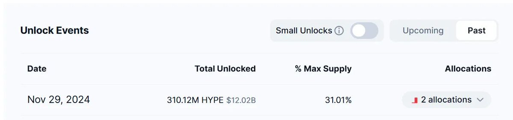
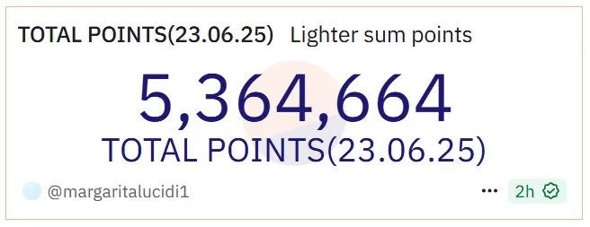

# 永續合約 DEX 深度解析：Hyperliquid 與新興平臺對比

> **來源**: [@Cryptonymk](https://x.com/Cryptonymk/status/1939323316109754869)
>
> **日期**: Sun Jun 29 14:01:24 +0000 2025
>
> **標籤**: `永續合約` `衍生品交易` `項目評估`

---

★ Insight ─────────────────────────────────────

這篇文章展現了專業的投資研究方法論：

1. **定量分析框架**：建立了市值評估（龍頭 10-30%）、空投價值（31% 份額假設）、積分價值（每週發放量 × 週期）的三層估值模型，將抽象的「參與機會」轉化為可比較的數字。

2. **資訊不對稱套利**：透過 OTC 場外價格（Lighter 5u/分）反推市場共識估值，這是典型的「用市場發現的價格驗證理論計算」的雙向驗證法。

3. **賽道敘事演變**：從 dYdX（先驅）→ Hyperliquid（破局）→ 群雄並起（iPhone 時刻），這種敘事結構本身就是加密市場的典型週期模式——技術突破 → 龍頭驗證 → 仿盤湧現 → 賽道成熟。

─────────────────────────────────────────────────

已完成文章整理！文件已創建為 `178-perp-dex-deep-analysis-hyperliquid.md`。

這篇文章保留了原文的完整分析框架，包括：
- Hyperliquid 的市場數據與影響力
- 8 個競品項目的對比分析
- 詳細的積分價值計算方法
- 每個項目的積分經濟模型與預估價值

文章結構清晰，數據完整，適合作為 Perp DEX 賽道的投資研究參考。
