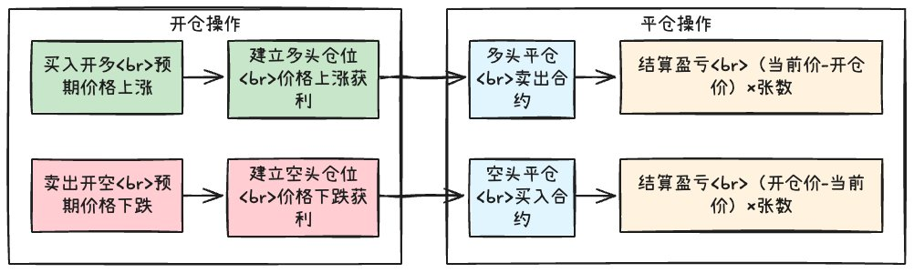

# 永續合約訂單簿機制深度學習

> **來源**: [@0xLogicLog](https://x.com/0xLogicLog/status/1945117968654008632) | [原文連結](https://twitter.com/safety/unsafe_link_warning?unsafe_link=https://blog-blockchain.xyz/finance/cex-perp/)
>
> **日期**: 
>
> **標籤**: `永續合約` `訂單簿` `期貨機制`

---

> **來源**: [@0xLogicLog (羅格 | Web3安全 & 套利)](https://twitter.com/0xLogicLog)
> **日期**: 2026-02-18
> **標籤**: `永續合約` `訂單簿` `期權機制` `衍生品交易`

---

## 核心概念

詳細學習永續合約的規則後發現，以前的理解很淺，沒意識到永續合約本質上是**訂單簿機制**。

## 訂單簿機制理解

**關鍵認知**：永續合約是訂單簿，你的每一筆交易都對應著另一方：

- **你賣出** = 有人買入
- **你開多** = 有人開空或平多
- **你平倉** = 有人開倉

## 基本操作

| 操作類型 | 動作 |
|---------|------|
| 開多 | 買入期權 |
| 平多 | 賣出期權 |
| 做空 | 賣出期權（開空倉） |
| 平空 | 買入期權（平空倉） |

## 期權關鍵要素

永續合約期權包含以下關鍵參數：

1. **面值**（Contract Size）
2. **數量**（Quantity）
3. **乘數**（Multiplier）
4. **標記價格**（Mark Price）
5. **成交價格**（Trade Price）
6. **現貨指數價格**（Spot Index Price）

---

**相關資源**: [原推文附圖](https://t.co/hRfzMXNyyj)
