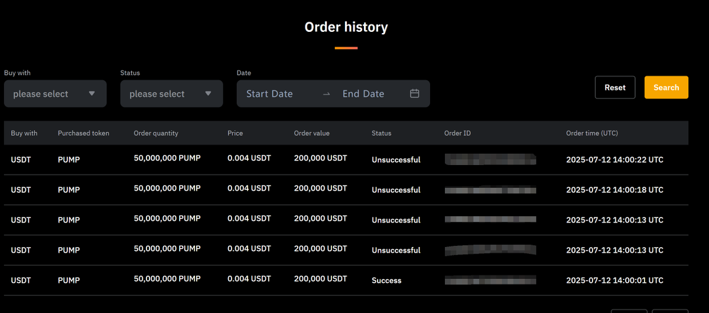

# Pump Fun 公售風雲錄：多交易所套利實戰案例

> **來源**: [@liguagua](https://x.com/liguagua/status/1944974580411707550)
>
> **日期**: 
>
> **標籤**: `公售策略` `多交易所套利` `永續合約交易`

---

> **來源**: [@liguagua (瓜哥)](https://twitter.com/liguagua)
> **日期**: 2026-02-18
> **標籤**: `pump-fun` `公售套利` `多交易所` `期現套利` `盤前交易`

---

## 案例概述

這是一場 Pump Fun 公售的實戰套利案例，參與者（瓜哥）在盤前交易、公售參與、開盤套利等多個階段進行操作，最終獲利 10 萬美元。整個操作涉及 Hyperliquid、幣安、Bybit、Gate、Kraken 等多個交易所，展現了對盤前價格發現、資金費率風險、流動性分佈的深刻理解。

**關鍵數據**：
- 總投入：120 萬美元（80 萬在 Bybit，其餘分散在 Gate、Kraken）
- 總獲利：10 萬美元（約 8.3% ROI）
- 參與比例：資金/身家比例為全網最高

---

## 四個交易階段

### 第 1 階段：Hyperliquid 盤前交易

Hyperliquid 最先開放盤前交易，價格一度拉升至 0.008 美元以上。操作者臨時調動 10 萬美元資金做空，但因不熟悉平台操作，只空到部分倉位，最終在 0.0046 美元被 ADL（自動減倉）。

**階段盈利**：2.2 萬美元

**經驗教訓**：
- 首次使用 Hyperliquid，操作不熟練導致執行效率低
- ADL 風險：高槓桿期貨交易在極端行情下會被強制平倉

---

### 第 2 階段：盤前價格發現與認價

在 Hyperliquid + 幣安 2 天時間內，成交額達數億美元，持倉量約 7000 萬美元（根據 Hyperliquid 持倉量與幣安交易額比例折算）。

**核心判斷**：
- 根據歷史經驗（自 Jupiter 以來），盤前成交額超過 3000 萬美元的項目，盤前價通常會成為現貨開盤價
- 因此認可 0.005 美元為合理估值，將網格空單陸續平倉

這一階段是後續大規模參與公售的決策基礎。

---

### 第 3 階段：大規模參與公售

基於對 0.005 美元估值的認可，決定大力參與公售，準備 120 萬美元資金：
- 80 萬在 Bybit
- 其餘分散在 Gate、Kraken

**市場擔憂與應對**：

| 擔憂點 | 分析 |
|--------|------|
| **鎖倉可能** | 官方推文明確寫明私售與公售籌碼會在結束後 48~72 小時「fully unlocked」，不會鎖倉 |
| **資金費率風險** | 幣安盤前資金費率固定為 0.005%，且在沒有公售的情況下，現貨開盤必須等鏈上籌碼充值完成，屆時其他交易所會同步或已開盤，因此不會有資金費率風險 |

**決策失誤**：
- 誤以為小交易所會先拿到籌碼先開盤，時間較短，因此沒有去鏈上 KYC 存入資金
- 實際上應該在鏈上參與，可獲得更多籌碼

**執行結果**：
- 僅在 Bybit 靠程序搶到 16 萬美元額度（包含朋友 20 萬美元資金，分成 2:8）
- 虛空套保：在 Bybit 未出結果前，於 0.0057 附近套保 80 萬美元
- 價格拉升至 0.007 時，判斷為博弈性逼空（25 億美元流通市值不合理），預期 48 小時內現貨開盤，因此在成本價附近平倉

**階段盈利**：6.8 萬美元

**核心邏輯**：
- 出於對程序的自信，提前虛空套保（在未確定中籤前做空）
- 對流通市值有清晰判斷：25 億美元市值不可持續，短期內會開盤釋放拋壓

---

### 第 4 階段：開盤套利

現貨開盤後，出現多個可套利的價差：
1. 鏈上與交易所合約價差
2. 交易所內現貨與合約價差
3. Hyperliquid 合約與其他交易所價差

隨手捕捉這些套利機會，獲得額外收益。

**補充操作**：
- ENA 本季已獲得的積分，以及預估未來積分，在 0.35 附近完全套保

---

## 策略總結

| 階段 | 主要操作 | 盈利 |
|------|----------|------|
| **階段 1** | Hyperliquid 盤前做空 | 2.2 萬美元 |
| **階段 2** | 認價 0.005，平倉網格空單 | - |
| **階段 3** | 大規模參與公售 + 虛空套保 | 6.8 萬美元 |
| **階段 4** | 開盤套利（鏈上/交易所/合約價差） | 約 1 萬美元 |
| **總計** | | **10 萬美元** |

---

## 關鍵經驗

### 1. 盤前價格發現的歷史規律
- 成交額超過 3000 萬美元的盤前市場，通常能準確反映現貨開盤價
- 這一規律自 Jupiter 以來持續有效

### 2. 資金費率風險的精確計算
- 幣安盤前固定費率 0.005%
- 現貨開盤時間取決於鏈上籌碼充值速度
- 多交易所同步開盤會抵消資金費率風險

### 3. 虛空套保的時機與風險
- 在未確定中籤前做空鎖定利潤，需要對程序執行有極高信心
- 需準確判斷博弈性逼空與真實需求的區別

### 4. 流通市值的合理性判斷
- 25 億美元流通市值在 48 小時內不可持續
- 現貨開盤會釋放大量拋壓，價格回歸理性

### 5. 多交易所佈局的重要性
- 在 Bybit、Gate、Kraken 分散資金，提高中籤概率
- 開盤後可捕捉跨交易所、跨市場（鏈上/CEX、現貨/合約）價差

---

## 反思

> 「瓜哥，以及身邊的圈子，都是沒有鏈上基因的，唉。」

這句話揭示了一個關鍵失誤：**沒有在鏈上參與公售**。如果提前在鏈上 KYC 並存入資金，可能獲得更多籌碼，收益會更高。這也反映了 CEX 交易者與鏈上原生用戶在信息與執行速度上的差距。
