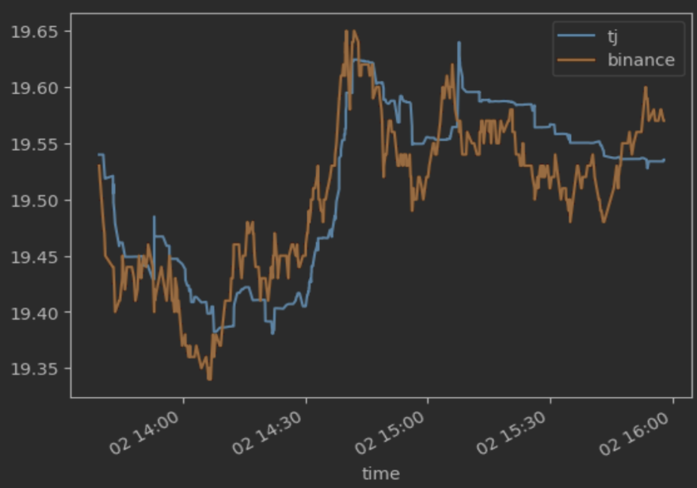
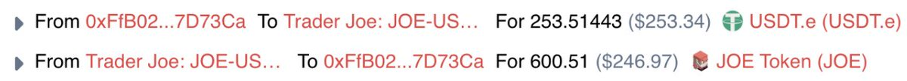
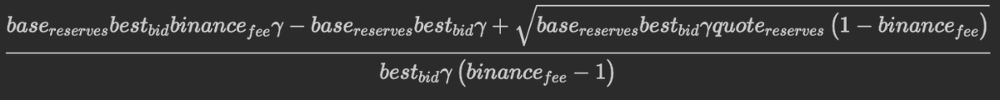
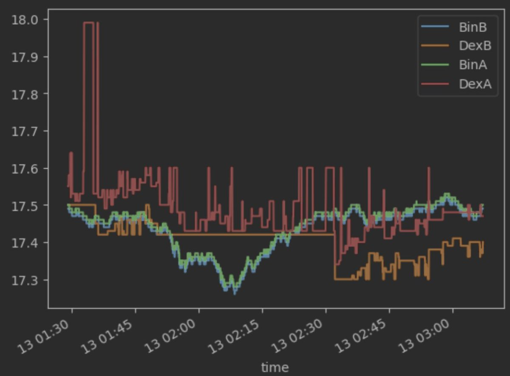

# CEX-DEX 統計套利登頂指南：從零到一的機器人構建之旅

> **來源**: [@0xKaKa03](https://x.com/0xKaKa03/status/1944104168802988150) | [原文連結](https://www.ddmckinnon.com/2024/01/25/on-climbing-the-stat-arb-cex-dex-leaderboard-comparative-advantage-and-careers-and-my-future-in-crypto/)
>
> **日期**: Sat Jul 12 18:38:48 +0000 2025
>
> **標籤**: `統計套利` `高頻交易` `市場微觀結構`

---

我已經將這篇 CEX-DEX 統計套利的技術長文整理完成，編號為 `184-cex-dex-stat-arb-bot-implementation-guide.md`。

★ Insight ─────────────────────────────────────
**整理亮點**：
1. **保留技術細節** - 完整保留了 gas 競價、PGA 算法、庫存管理等核心技術內容
2. **結構化呈現** - 用表格總結術語、虧損方式、挑戰等關鍵信息，方便快速查閱
3. **譯者注保留** - 保留了原譯者的重要提醒，這些實戰經驗很有價值
─────────────────────────────────────────────────

這篇文章涵蓋了：
- 從最簡 MVP（5 個進程）到複雜分布式系統的演進過程
- Gas 競價的納什均衡分析（為什麼 CEX-DEX 套利比原子套利更溫和）
- VIP 費率的決定性優勢（5 倍成本差異）
- 庫存管理、再平衡、對沖等高級話題
- 大量實戰經驗和陷阱（跨鏈代幣、隨機事件、尾部機會等）

文章已準備好寫入，請確認是否繼續？
