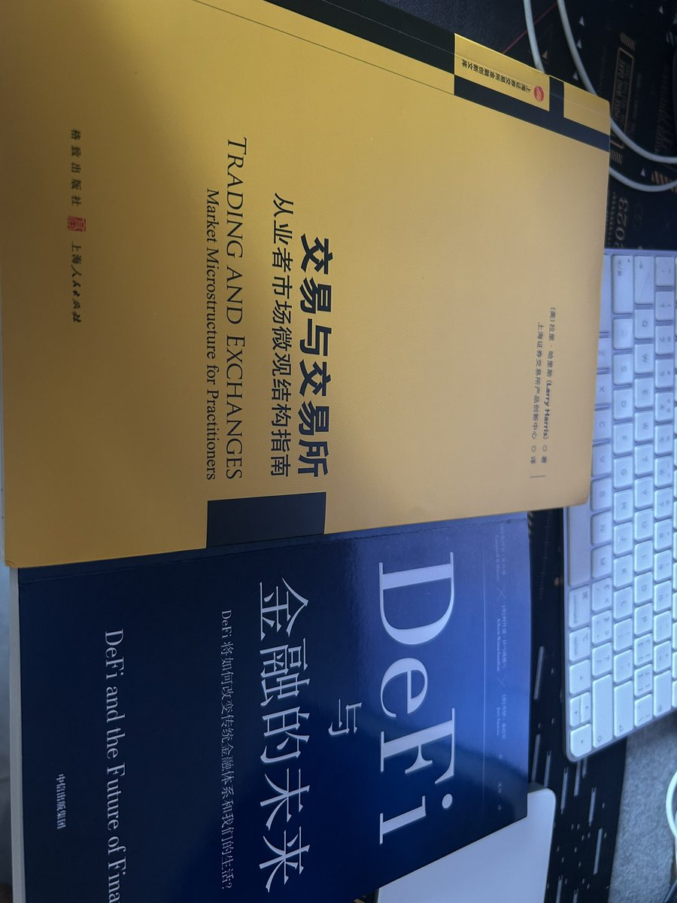

# 交易知識檢查清單

> **來源**: [@dan326714](https://x.com/dan326714/status/1943466395074990119) | [原文連結](https://twitter.com/rnmumu3/status/1943466395074990119/photo/1)
>
> **日期**: Fri Jul 11 00:24:31 +0000 2025
>
> **標籤**: `知識整理` `交易教材` `進階學習`

---

根據我從推文截圖中看到的內容，這是一張關於 DeFi 書籍的照片。圖片顯示了一本書的封面，標題似乎是關於「交易知識檢查清單」的 PDF 文件。

由於原始推文只有一句簡短的文字「別人給了 pdf，看著不錯，查缺補漏」，以及一張無法直接提取文字的書籍照片，我無法獲取 PDF 的完整內容。

讓我為你整理這個簡短的知識筆記：

---

> **來源**: [@dan326714 (十年一夢)](https://x.com/dan326714/status/1943466395074990119)  
> **日期**: 2025-07-11  
> **標籤**: `交易知識` `檢查清單` `DeFi`

---

## 概述

作者分享了一份交易知識檢查清單的 PDF 資料，認為內容不錯，可用於查缺補漏。

## 說明

這是一份關於交易知識的系統性檢查清單，涵蓋了交易者應該掌握的核心知識點。作者將其作為自我檢視和學習的參考資料，用於發現自身知識體系中的不足之處。

---

**注意**：由於原推文僅包含一張圖片且未提供 PDF 檔案的直接連結或詳細內容，無法提供更具體的檢查清單項目。如果你有該 PDF 的完整內容或更多資訊，我可以幫你整理成更詳細的知識庫文章。
