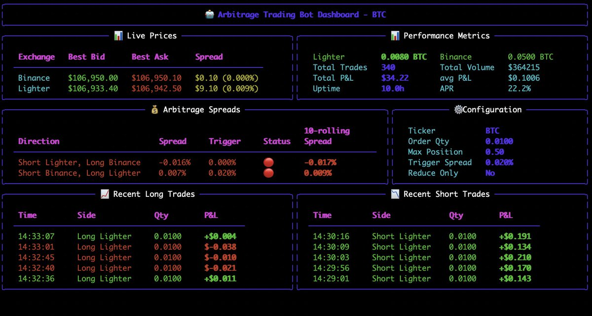
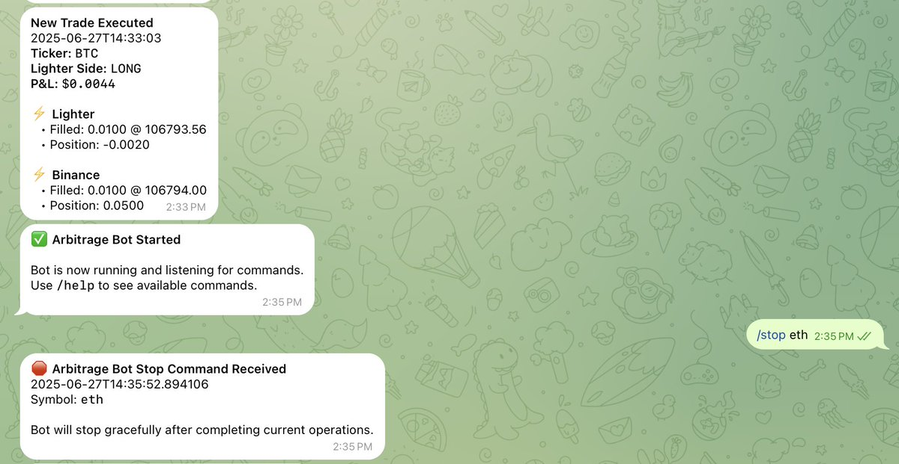

# Lighter 平台跨交易所套利機器人實踐 - 22% APR 收益分享

> **來源**: [@yourQuantGuy](https://x.com/yourQuantGuy/status/1938588008736862435)
>
> **日期**: Fri Jun 27 13:19:33 +0000 2025
>
> **標籤**: `套利策略` `量化交易` `Lighter`

---

> **來源**: [@yourQuantGuy (Your Quant Guy)](https://twitter.com/yourQuantGuy)  
> **標籤**: `套利交易` `Lighter` `跨交易所套利` `量化交易` `收益分享`

---

## 策略概述

最近在 Lighter 上進行跨交易所套利實驗，代碼已穩定運行近一週，策略持續調整中，主要目標是找到下單量和每單盈利率的平衡點。

**核心策略**：利用交易所之間的價差，在一邊開多、另一邊開空，等待價格收敛後平倉獲利。

### 為何能在 Lighter 上套利？

在一般情況下，散戶很難進行跨交易所套利，尤其是 ETH 和 BTC 這類流動性好、滑點低的幣種，主要原因是手續費壓縮了套利空間。

**Lighter 的優勢**：
- Lighter 沒有手續費
- Binance 的 USDC 合約 maker 也不收手續費
- 兩邊都免手續費，大幅擴大套利空間，讓非專業選手也能參與

---

## 本週開發進展

### 1. 可視化 Dashboard
增加了 dashboard 方便追蹤交易狀況（圖1）。

### 2. Telegram Bot 推送系統
- 每筆交易都會收到推送通知
- 支援發送命令終止交易程式
- 方便外出時處理突發狀況（圖2）

### 3. 動態參數調整
將交易策略從固定參數改為根據市場情況變化的動態參數，有利於抓住每個可套利機會。

### 4. Order Book 數據收集
抓取了近一週的 order book 數據，週末將研究其他幣種的套利可能性。

---

## 實測數據

### 收益表現
- **運行時間**：10 小時
- **APR**：約 22%
- **保證金**：兩邊交易所共 13 萬美元
- **備註**：APR 計算已包含兩邊保證金，為真實 APR

### 交易量
- **交易幣種**：ETH + BTC
- **日交易量**：約 150 萬美元（兩邊合計）
- **週交易量**：估算約 1000 萬美元（未完整運行一週，僅為估算值）

### Lighter 積分
目前尚未完整運行一週，暫無參考意義的數據。據悉 taker 積分會比 maker 少，尤其是頻繁開關倉的情況。

**計劃**：下週二 Lighter 分發積分後會第一時間分享數據。

---

## 社群討論邀請

希望正在參與 Lighter 的朋友分享：
- 交易習慣
- 交易量
- 獲得的積分

大家可以一起歸納總結規律。

---

## 下一步計劃

策略和代碼已調整完善，穩定運行幾天後將**加大槓桿正式開跑**。

- **目前槓桿**：1.5x
- **加槓桿後**：利潤空間還很大
