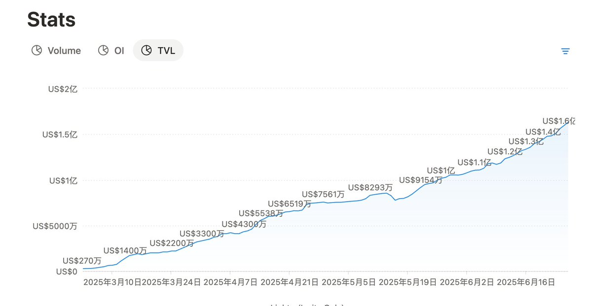
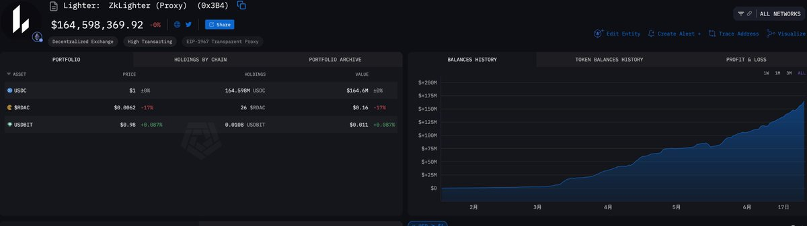
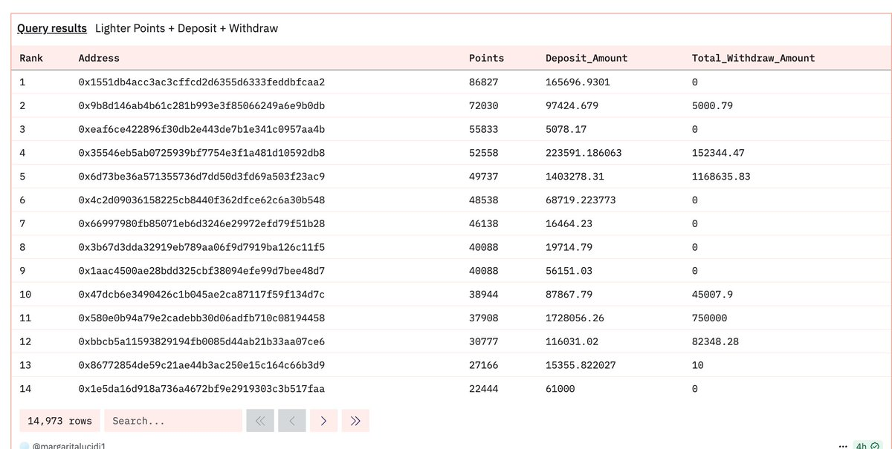
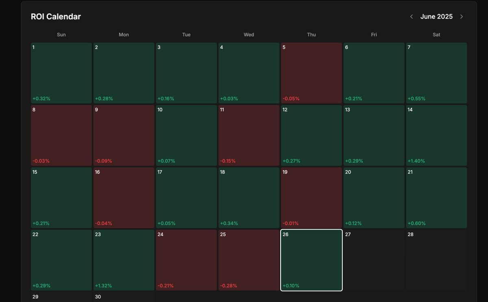
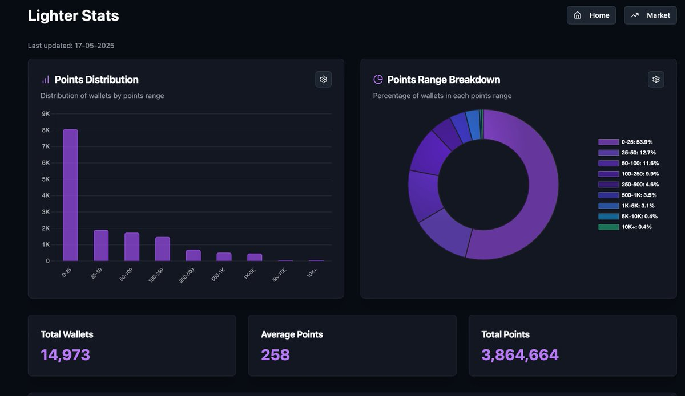
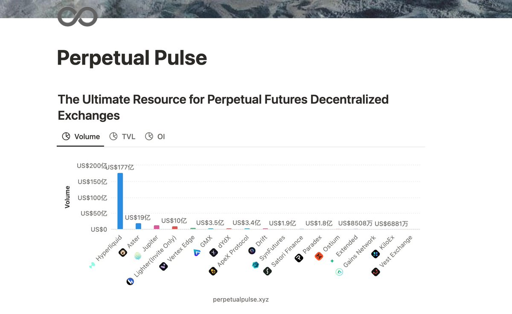
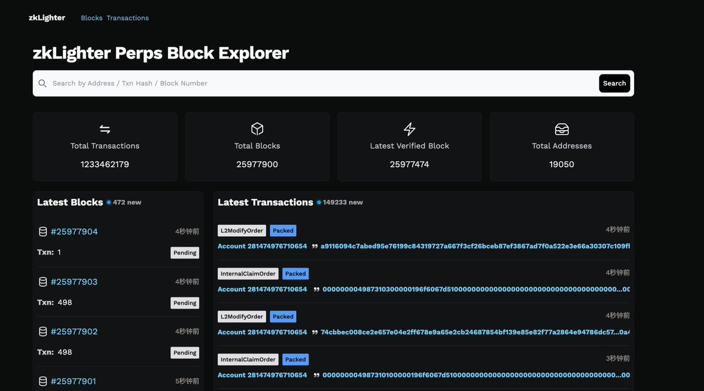

# Lighter 套利工具與數據分析完全指南

> **來源**: [@c_dylanber](https://x.com/c_dylanber/status/1938128614979211291) | [原文連結](https://dune.com/margaritalucidi1/lighterxyz)
>
> **日期**: 
>
> **標籤**: `套利` `Lighter` `量化交易`

---

## Lighter 工具與數據分析資源集合

本文整理了 Lighter 平台的實用工具與數據分析資源，這些工具可以幫助用戶從宏觀和微觀層面深入了解 Lighter 的表現，優化交易策略。

### 1. Lighter 詳細 Dune 數據分析

**連結**：https://dune.com/0xtria/lighter

**作者**：@0xTria

**核心功能**：

- **資金流動追蹤**：包含平台每日流入/流出數據，可以直觀展示用戶的存款和提現動態
- **盈虧估算**：根據存取款的趨勢，可以推斷哪些錢包表現優異（如盈利率高的錢包）
- **策略參考**：透過分析優質錢包找到值得參考的操作策略

### 2. Lighter 的 Volume、OI、TVL 詳細變化圖表

**連結**：https://www.perpetualpulse.xyz/

**核心功能**：

- 了解市場活躍程度，觀察特定時期用戶活躍度是否與行情波動相關
- 追蹤 Lighter 的成長性，分析資金流入趨勢

### 3. ARKM 的 TVL 專業統計

**連結**：https://platform.arkhamintelligence.com/

**核心功能**：

- **TVL 組成結構分析**：精確到具體每個錢包的鎖倉金額
- **用戶畫像分析**：可以篩選 TVL 最大的錢包，掌握主力資金的動態（例如是否存在巨額提現等）
- **大戶行為追蹤**：適合對主力資金動向感興趣的用戶

### 4. LLP 詳細數據追蹤（盈虧細節）

**連結**：https://dune.com/queries/4562044

**核心功能**：

- **每日盈虧追蹤**：精確顯示每天 LLP 的盈亏表現
- **長期收益分析**：了解 LLP 的實際長期收益和每日波動
- **用戶行為分析**：可結合策略分析背後的用戶行為

### 5. Lighter OTC 平台

**平台**：@LighterOTC

**用途**：

- 僅適合觀察場外對 Lighter 積分的反應
- ⚠️ **風險提示**：非官方平台，務必注意安全，謹慎使用

---

## Lighter 社群工具大集合

由於 Lighter 還處於內測階段，很多數據尚未對外全面披露（例如 DefiLlama 上並沒有 Lighter 的完整數據）。以下是 Lighter 社群開發者製作的優秀工具：

### 1️⃣ Lighter Stats

**作者**：@0xTria

**網址**：https://lighterstats.xyz/

**核心功能**：

- **完整排行榜**：提供每週完整排名情況，包括所有用戶的積分排名（解決官方排行榜只能查看前幾名的痛點）
- **積分分布統計**：
  - 不同積分段的錢包數量分布
  - 總錢包數、平均分數
  - 每週分發總積分等詳細統計數據
- **易用性**：工具詳細且簡單易上手，適合想要深度了解排行榜分布的用戶

⚠️ **小缺點**：數據庫更新頻率稍微滯後，可能不是完全即時，但不影響參考價值

### 2️⃣ Perpetual Pulse (Notion 數據工具)

**作者**：@hansolar21（Lighter 官方大佬）

**網址**：https://www.perpetualpulse.xyz/

**核心功能**：

- **核心數據同步**：每天同步和展示以下數據：
  - Volume（交易量）
  - TVL（總鎖倉量）
  - OI（未平倉量）
- **跨平台對比**：提供與其他交易所的對比柱狀圖，條理清晰、簡單直觀
- **適用對象**：觀察平台整體數據和表現的利器，非常適合數據分析師

### 3️⃣ 跨平台套利工具

**作者**：@0xLoris

**網址**：https://www.fundingrate.io/

**核心功能**：

- **套利機會識別**：不僅適用於 Lighter，也適用於其他 DEX 和 CEX 的套利機會
- **清晰指引**：直接告訴你：
  - 在哪個交易所買入什麼幣種
  - 在哪個平台賣出更有利可圖
- **簡單表格呈現**：適合想要尋找資金費率套利的用戶

### 4️⃣ Lighter 官方 Scan

**網址**：https://scan.lighter.xyz/

**核心功能**：

- **交易細節查詢**：支援按照地址查看交易數據
- **策略研究**：可以研究其他用戶的策略
- **自定義工具開發**：可以用來構建自己的定制工具，或者用來復盤，調整策略

---

## 重要提醒：交易數據權重和積分說明

關於 Lighter 的積分算法，有以下重點需要注意：

- **Volume 權重極低**：Lighter 的積分算法對秒開秒關的交易行為幾乎沒有權重
- **真正的關鍵因素**：
  - OI（未平倉量）
  - 倉位持續時間
- **策略建議**：交易量本身對積分貢獻很小，持倉時長和未平倉量才是獲得積分的關鍵

---

## 總結

Lighter 的生態正在不斷完善，社群開發者提供的工具也在逐步豐富。這些工具和數據平台能夠幫助用戶：

- 從宏觀層面了解 Lighter 的整體表現（TVL、Volume、每日流量等）
- 從微觀層面優化策略（資金流動、LLP 盈虧、錢包行為分析等）
- 識別套利機會，追蹤主力資金動態
- 深入理解積分機制，優化積分獲取策略
