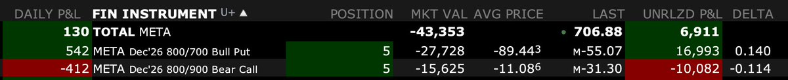

# Iron Condor 超低風險套利：META 期權結構分析

> **來源**: [@yourQuantGuy](https://x.com/yourQuantGuy/status/1937711158070223297)
>
> **日期**: Wed Jun 25 03:15:15 +0000 2025
>
> **標籤**: `期權套利` `Iron Condor` `Portfolio Margin`

---

## Iron Condor 結構分析

有朋友覺得這不是套利，而是在賭波動，所以我來詳細解釋一下，為什麼這是超低風險套利，而絕不是在賭方向或波動：

### 1. 拆單建倉不是為了方向判斷，而是成交機制所限

這筆 iron condor 分成了 bull put spread 和 bear call spread 兩部分，是因為如果打成一單，市場不會成交這種「穩賺不賠」的結構。所以我將它拆開，但是在幾乎同時下單，確保風險對沖。

### 2. 保底收益不是來自波動，而是結構錯價

先下單 bull put spread 收到 $8,944 權利金，在成交 bear call spread 之前如果 META 漲了我們賺；即使 META 在 1 分鐘內跌到歸零，最多也虧 $10,000 - $8,944 = $1,056。

而這 $8,944 權利金我直接拿去買美債，假設 4.5% 利率、持有 2.5 年（24 年 7 月下單的，26 年 12 月到期的期權），到期能拿回 ~$1,000 利息，幾乎剛好覆蓋極端情況下的虧損。這意味著在還沒做 bear call spread 前，這單已經保本。所以在下單 bull put spread 之後，不管市場怎麼波動，賣 bear call spread 的收入就是純利潤。

### 3. 零成本 Margin

賣期權用到的 margin 是不收利息的，而我平時就不用 margin，所以完全是零成本的。

### 4. 風險

唯一可能的風險，是 META 暴跌後導致 deep ITM，被提前行權。這本身不會造成損失，因為只是把同價值的期權換成了股票，但需要提前關倉，過程中出現輕微滑點。這是我能想到的全部風險。

只要先下單 bull put spread，那麼這筆交易就完全不會因為市場波動而造成虧損，唯一的風險只是當 META 暴跌後被提前行權後關倉的滑點，這能算是超低風險套利了吧？

---

## 套利案例：META Dec '26 Iron Condor

套利的思維就像一種病毒，一旦入腦，看到什麼都忍不住想想有沒有無風險或低風險的機會。分享一下去年在美股上做過最完美的一筆套利：

### 期權結構

標的是 META Dec '26 的一個 iron condor 結構：

- **Long 700 put + Short 800 put**：這邊是一個 bull put spread，每套收入 $8,944
- **Short 800 call + Long 900 call**：這邊是一個 bear call spread，每套收入 $1,108

也就是說，整套組合一共收入 $10,052。

### 到期損益分析

這個期權結構到期時的表現是這樣的：

1. 如果 META 到期價格低於 700，bull put spread 虧 $10,000，bear call spread 歸零，總體虧損 $10,000 - $10,052 = 盈利 $52
2. 如果 META 高於 900，到期時 bear call spread 虧 $10,000，bull put spread 歸零，最終也是盈利 $52
3. 如果 META 在 700-800 或 800-900 區間內，由於總保費已收入超過 $10,000，最終也是盈利 $52
4. 如果 META 在 800 附近收盤，兩邊全部歸零，拿滿整個 $10,052 收益

### Portfolio Margin 優勢

另外，因為這是在 portfolio margin account 裡做的，所以幾乎沒有資金成本。

### 美債增益策略

把收到的 $10,052 拿去買美債（假設年化收益率 5%），兩年（到期在 Dec '26）能額外賺約 $1,000+ 的無風險利息，5 個組合就是 $5,000+。

如果 META 到期剛好在 $800 附近，兩邊期權都不被執行，一次性收滿 $10,052，5 個組合共 $50,260。

### 總結

所以這是一筆**最低收益 $5,000，最高收益 $50,260 的保本套利**。
