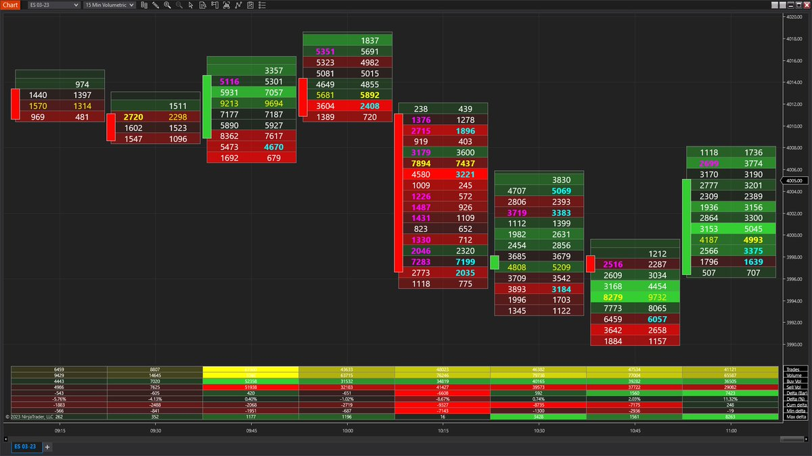

# 訂單流與資訊優勢：預測市場中的交易策略

> **來源**: [@buckyandlucky](https://x.com/buckyandlucky/status/1935725464448123299) | [原文連結](https://twitter.com/buckyandlucky/status/1935725464448123299/photo/1)
>
> **日期**: 
>
> **標籤**: `訂單流` `盤口微觀結構` `資訊優勢`

---

> **來源**: [@buckyandlucky (ThinkInBinaryOption)](https://x.com/buckyandlucky)
> **日期**: 2026-02-18
> **標籤**: `訂單流` `資訊優勢` `預測市場` `交易策略` `盤口分析`

---

## 訂單流的資訊不對稱

在預測市場中，主動吃單交易者更可能擁有資訊優勢，以至於願意付出買賣價差快速進入持倉。相反的，掛單方通常不知道市場流動方向而把限價單放在訂單簿上。

## 交易策略

如果能夠確定訂單流，就可以加入擁有資訊優勢的一方，在相同方向上進入交易。
