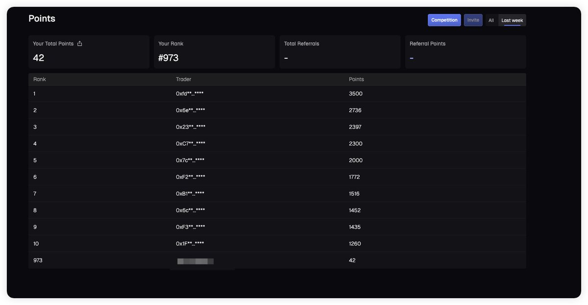
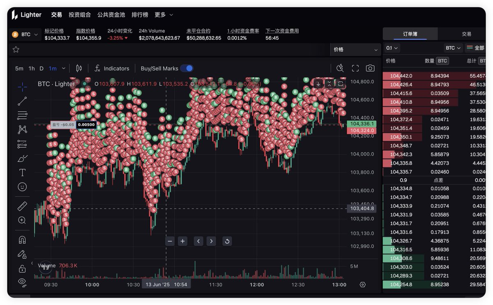
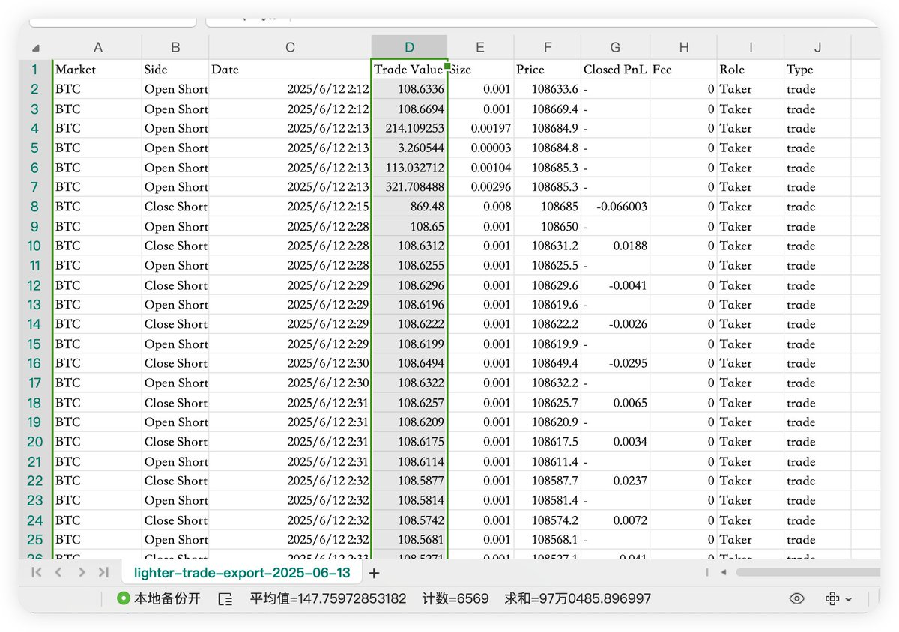

# Lighter 高頻交易策略原理解析：75U 本金日交易量 100 萬 U

> **來源**: [@Boywus](https://x.com/Boywus/status/1935179072642134324)
>
> **日期**: Wed Jun 18 03:33:39 +0000 2025
>
> **標籤**: `高頻交易` `延遲套利` `訂單簿微觀結構`

---

## 策略原理解析

在上週 Lighter 給了我 42 積分，全服 973 名，交易記錄導出只能看到前 21000 條，算不出總交易量，用戶體驗的確不怎麼樣，6 天預估就是在 600 萬 U。

不知道積分是不是線性的，不然我是不是放 7500U，這個號能拿上週第一？

### 跨所交易核心原理

跨所交易其實永遠的核心就是跟著外面的大交易所們形成的公平價來下單，一般表現成兩種模式：

**1. 跨所對沖（流動性複製）**

比如你在 Binance 開一個做市商帳號，手續費假定為 maker -0.005%，而 Lighter 的手續費是 0。在 Binance 下只做 maker 單，在 Lighter 直接下 taker 單，用 Binance 的負手續費填補 Lighter 的盤口差。

在 Binance 掛買 5 賣 5，如果瞬間被成交了，說明有大能量衝擊，Lighter 那邊會更慢，你下單還可以吃到不錯的收益，允許庫存堆積就可以衍生成做市商流派。

**2. 單所延遲套利**

根據 Binance 的 orderbook 變化和 trades 的情況來在 Lighter 下單，常用的簡單做法有：
- 加權公平價
- 交易速度加速度因子
- 衝擊成本反轉因子

## 交易速度加速度因子策略

這次我用的就是「交易速度加速度因子」：

計算單位時間（如 3 秒、5 秒）成交筆數，記錄成交筆數變化率，當成交筆數暴增，意味著後續波動率上升，可能出現大幅度行情。

**核心邏輯**：單位時間內成交筆數急劇增加，代表交易行為加速，通常預示即將出現劇烈價格波動或突破。

再輔助一些單位時間的交易量判斷，由於 Lighter 的 0 手續費機制，可以使得這個策略在開單後，只要價格往期望方向波動一點點，都可以實現盈利。

所以最後結果會表現為：低本金但是有超高交易量，並且在短期趨勢下能有一定的盈利。

## 策略限制

但是世界上沒有這麼好的事情，當 Lighter 發現我 100% taker 訂單簿後，開始給我加延遲了，所以目前已經無法既盈利還高頻刷量了，但是仍然可以作為一個刷積分的策略。

## 優化方向

1. **跨所對沖模式**：如果使用「跨所對沖」模式，Lighter 的限制會少一些，所以接下來將會走這條路繼續測試
2. **降頻優化**：「單所延遲套利」降低頻率，篩選只做動能強勁的點，把交易額降下來，可以使得帳號盈利空間更大，但是 taker 率仍然過高，有被繼續制裁的風險

## 為什麼公開原理

高頻交易的原理其實一直在小圈子交流，有很多前輩都走在前面，各自的「生產環境最佳實踐」才是最關鍵的。原理 + 高性能編程，只是入場券，做微觀結構交易，還要經常面對玄學時刻，對於想走這條路的人，我也只能幫到這裡。

最後，不賣軟件，幫我點讚和關注就行了，後期等 Lighter 更開放了，會開源一些簡單的腳本。

## 實測結果

用 75U 本金交易了一天，刷了 100 萬 U 交易額，還賺了 5U。昨天在 Lighter 上開了一個測試腳本，然後就出門玩去了，今天醒來打開帳戶一看，竟然還賺了 5U，獨屬於我們高頻交易的玄學時刻。
