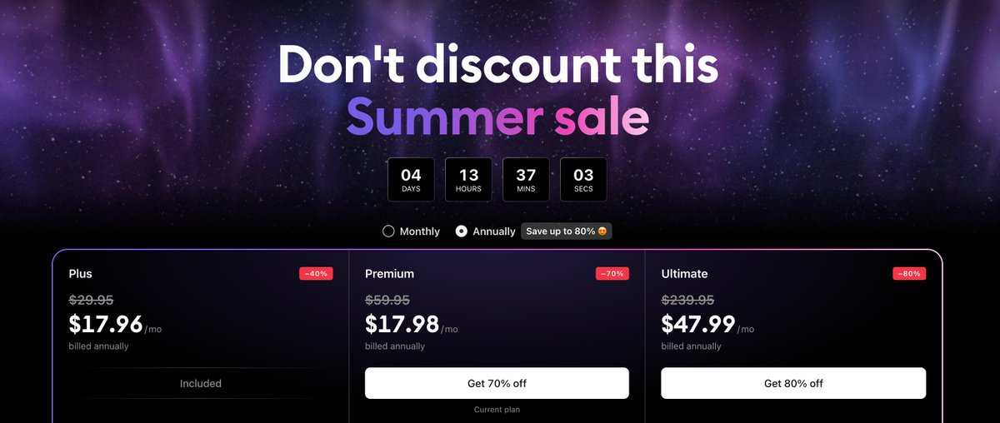

# TradingView Webhook 與 Echobell 整合價格預警教學

> **來源**: [@OKxiaohai](https://x.com/OKxiaohai/status/1932824857919828177) | [原文連結](https://www.tradingview.com/pricing/?share_your_love=haicongliao)
>
> **日期**: Wed Jun 11 15:38:50 +0000 2025
>
> **標籤**: `價格預警` `交易工具` `Webhook 通知`

---

這兩張圖片都是 X Spaces 的截圖，不是教學步驟的圖片。看來原推文中應該還有其他圖片包含詳細的操作步驟，但目前只能從推文文字內容來整理。

根據推文內容，這是一篇關於使用 TradingView Webhook 與 Echobell App 實現幣價預警的簡短教學。讓我基於現有資訊為你整理成知識庫文章：

---

> **來源**: [@OKxiaohai (阿小小海)](https://x.com/OKxiaohai)  
> **日期**: 2025 年（推測）  
> **標籤**: `TradingView` `Webhook` `價格預警` `Echobell` `風險管理`

---

## 使用場景

如果你經常使用借貸或套保策略，肯定需要各種價格和匯率的通知預警。過去可以使用 AICoin 的電話提醒功能，能在睡覺或外出時被有效提醒，但該功能已不再對外開放。

現在可以使用 TradingView 的 Webhook 功能結合 Echobell App 來實現同樣的效果，只需要 3 個步驟即可完成設定。

## 工具介紹

### TradingView
世界上最好的圖表工具，沒有之一。時常會有大促活動，價格比平時最多便宜 80%，甚至比黑五還便宜。

**推薦連結**: https://t.co/MINd4kLz1U

### Echobell
手機 App，用於接收 Webhook 通知並發送本地提醒。

**下載連結**: https://t.co/BohECOHS5P

## 設定步驟

（原推文提到「3 步帶你實現」，但因推文連結已失效，詳細步驟圖文未能取得。基本流程應為：）

1. **在 Echobell App 中設定接收端點**  
   - 下載並安裝 Echobell App
   - 在 App 中創建 Webhook 接收端點，獲取 Webhook URL

2. **在 TradingView 中創建價格預警**  
   - 在 TradingView 圖表上設定價格警報
   - 在警報設定中勾選「Webhook」選項
   - 填入從 Echobell 獲得的 Webhook URL

3. **測試與調整**  
   - 設定一個測試價格觸發警報
   - 確認 Echobell 能正常接收並發送手機通知
   - 根據需要調整通知音效和震動模式

## TradingView 方案比較

TradingView 提供多個付費方案，主要差異在於：

| 方案 | 月費（年繳） | 圖表數量 | 指標數量 | 價格警報 | 技術警報 | 觀察清單警報 |
|------|-------------|----------|----------|----------|----------|--------------|
| Essential | $12.95 | 2 圖/頁籤 | 5/圖 | 20 個 | 20 個 | 0 個 |
| Plus | $28.29 | 4 圖/頁籤 | 10/圖 | 100 個 | 100 個 | 0 個 |
| Premium | $56.49 | 8 圖/頁籤 | 25/圖 | 400 個 | 400 個 | 2 個 |
| Ultimate | $199.95 | 16 圖/頁籤 | 50/圖 | 1,000 個 | 1,000 個 | 15 個 |

所有付費方案都支援 Webhook 通知功能。

## 優勢

- **可靠性高**：TradingView 作為專業圖表平台，價格數據準確可靠
- **靈活性強**：可設定複雜的技術指標觸發條件
- **通知即時**：Webhook 觸發後立即推送到手機
- **跨平台支援**：TradingView 支援網頁、桌面、行動裝置全平台同步

## 注意事項

- TradingView 需要付費方案才能使用 Webhook 功能（Essential 以上方案即可）
- Echobell 需保持後台運行才能接收通知
- 建議設定合理的價格警報範圍，避免頻繁誤觸發
- 對於重要的借貸倉位，建議設定多個價格警報層級（例如：警告線、危險線、清算線）
