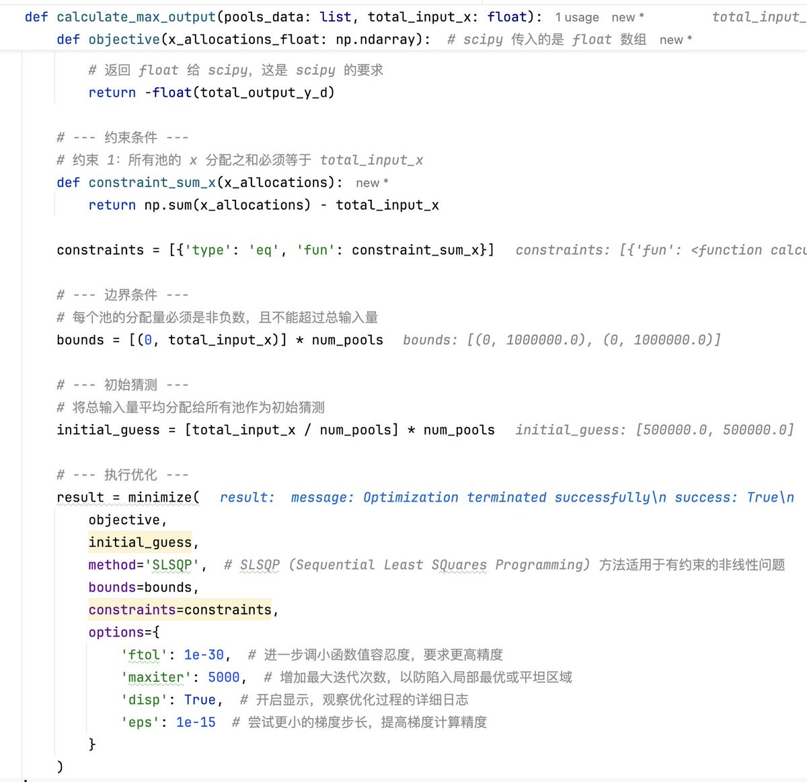

# DEX 報價低效與套利機會：無人區的價差空間

> **來源**: [@lnkybtc](https://x.com/lnkybtc/status/1931054681629065489)
>
> **日期**: Fri Jun 06 18:24:48 +0000 2025
>
> **標籤**: `DEX套利` `盤口微觀結構` `流動性不足`

---

> **來源**: [@lnkybtc (秋田散人 Mr.Akita)](https://twitter.com/lnkybtc)  
> **標籤**: `DEX` `套利` `orderbook` `價差` `市場微觀結構`

---

## 觀察紀錄

和預期的一樣，這個 DEX 名下所有 pool 的報價都沒人在監聽，因為有一定技術門檻。今天幣價波動一下子打亂了價格錨，到處都是利潤空間。

**套利機會**：
- 可以直接搬磚
- 也可以建倉等待價差回歸

喜歡這種在無人區鏟土的感覺。

## 技術背景

從昨天手擼 xy=k（恆定乘積做市商公式），到今天手擼最優 order routing（最優路由演算法），發現某個交易所把一個後端 API 能做的事，全部放到前端來計算。

**技術門檻觀察**：
- 報價取得需要前端自行計算 AMM 公式
- 需要實作最優路由演算法
- 這種設計導致幾乎沒有套利者競爭

感覺這個神奇的交易所除了我應該沒這麼多閒人來套利了，連拿個報價都這麼費勁。
