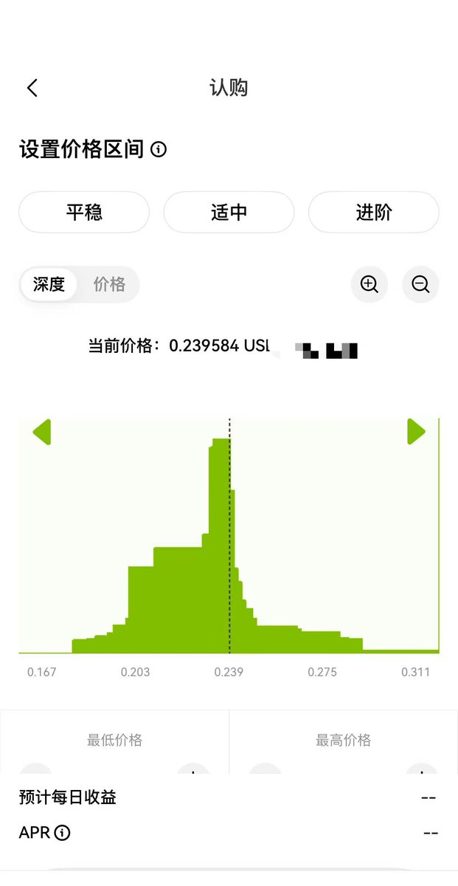

# 跨所價格操控策略：DEX-CEX 聯動套利技巧

> **來源**: [@Boywus](https://x.com/Boywus/status/1930997584212140042)
>
> **日期**: Fri Jun 06 14:37:54 +0000 2025
>
> **標籤**: `價格操控` `跨所套利` `做市商`

---

> **來源**: [@Boywus](https://twitter.com/Boywus)  
> **日期**: 2026-02-18  
> **標籤**: `跨所套利` `價格操控` `DEX-CEX` `做市商` `市場操縱`

---

## 策略概述

正如我原先說的，這個策略還一直有效，GATE 這次的事件，花 5000U 能盈利幾十萬 U 沒問題。

應該是有人在做這個策略變種，實際賺錢的人 GATE 是很容易查出來的，但是這次 GATE 自己也大賺特賺，就完全沒動力了。

KUCOIN 替代了鏈上交易所的角色，在上面做賣盤假象，然後瞬間發力，讓 GATE 做市商跟進價格，最後整體拉盤，最後導致了大清算。

相當於是豪紳的錢如數奉還，老百姓的錢三七分帳，但是你要是敢賺官方做市商的錢，那你就提不了現。

## 最簡單的跨所價格操控策略

本文僅分享策略核心理念，目前在部分小交易所上仍然有效，收益率根據品種選擇在幾倍到幾十倍之間均有，實操中可能被交易所視為「操縱市場」，請自行評判風險。

### 基礎要求

1. 選擇一個做市商實力不是很強的交易所
2. 選擇一個合約品種，只在該所或者其他小所上市，無現貨
3. 該幣種使用 UNISWAP-V3、PANCAKE-V3 或者項目方自己 FORK 的類 V3 池子
4. V3 的池子中 TICK 分布過於不均勻；假設價格突破 0.239 後，後面基本上沒什麼量阻擋你拉盤
5. 由於小交易所的小幣種做市商的指數價格主要來自鏈上價格，且時間加權度較低
6. 準備好幾個鏈上錢包和多個交易所帳號

### 操作步驟

1. **在交易所上緩慢吸籌合約開多**，可以根據市場 OI 量來確定，一般總量不要超過 5%
2. **在鏈上自己在 0.24-0.27 之間加上池子**，製造賣盤堅挺假象，迷惑交易所內的做市商
3. **交易所掛平倉單和開空單**
4. **瞬間撤掉池子**，用多個地址在鏈上進行分筆大額買入，製造利好假象，吸引掃鏈玩家一起進場
5. **這個時候交易所盈利頗豐**，但是鏈上多個地址持有較多的現貨，進行賣出砸盤

### 核心要點

1. 收益來自於低價吸籌的做多
2. 開空單是為了平衡鏈上砸盤的成本
3. 為了防止項目方和大戶借你出場，整體操作不能太久
4. 交易所和交易品種的選擇最重要
5. 實際上你賺的錢大部分來自做市商；對頂級交易所無效
6. 趕快提現

---

覺得有幫助的話，你的點贊關注是我分享的動力。
