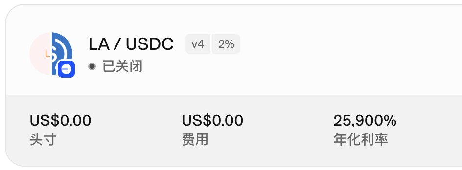
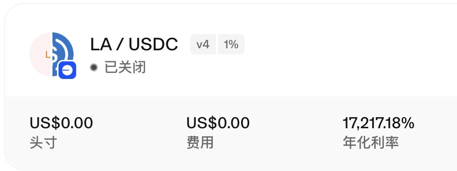

# LA 代幣套利機會分析 - 多鏈流動性割裂的套利策略

> **來源**: [@0xanonnnn](https://x.com/0xanonnnn/status/1930464832681324917)
>
> **日期**: 
>
> **標籤**: `套利` `多鏈部署` `流動性挖礦`

---

> **來源**: [@0xanonnnn (QQㄋㄟㄋㄟ甜到咩噗的Yankee)](https://x.com/0xanonnnn)
> **日期**: 2026-02-18
> **標籤**: `套利` `多鏈` `LA代幣` `流動性` `CEX-DEX套利`

---

## 背景分析

雖然我不知道 @lagrangedev 是幹嘛的（退出擼毛圈很久了 lol），但項目方展現出極強的操盤能力，這其中也蘊含著巨大的套利機會。

## 套利機會形成原因

1. **空投數量少且分散**：單地址平均 36 $LA
2. **KYC 繁瑣且需要成本**：部分大擼子放棄領取（朋友反饋有幾萬多地址的大擼子放棄 KYC）
3. **多鏈部署分散籌碼**：$LA 多鏈部署，進一步分散了籌碼分佈；CEX 充值僅支援 ETH 鏈，大部分空投黨選擇 BASE、ARB 等 L2 領取空投
4. **項目方不在鏈上加池子**：開盤時只有 BSC 上有大池子（BN Alpha 空投），不開放跨鏈前端

上述原因導致各鏈流動性割裂，由於只有第三方小池子，價格也很割裂，與 CEX 形成了較大價差。

## 套利策略執行

我執行的套利策略，主要是做些思路分享，拋磚引玉：

### 策略一：BSC → Bybit 套利

開盤第一時間看到 Bybit（5 刀）與 BSC（0.4 刀）有巨大價差，所以直接：
- BSC 買入
- L0 跨鏈到 ETH（約 3 分鐘到賬）
- 充值到 Bybit（約 2 分鐘確認）
- 約 2 刀價格砸掉

但沒給我第二次機會套（搬磚很卷）。

### 策略二：Base → Bybit 套利

過了一段時間後，發現 Bybit（0.4 刀）與 Base 鏈（0.3 刀）有價差。Base 鏈只有很小的池子，直接買入不現實，所以：
- 在下方加了單邊流動性接貨
- 結果只接到了部分貨和可觀的手續費
- 接到的貨通過 L0 跨鏈到 ETH（約 20 分鐘確認，L2 確認時間較久）
- 然後充值到 Bybit 砸盤

### 策略三：單邊流動性吃手續費

今天早上起床後，發現 $LA 一直拉盤，但是鏈上還是沒有大池子，所以繼續在下方加單邊流動性吃手續費。uni-v4 顯示可觀的 APY（下圖是我已經關閉的部分歷史倉位），只不過需要一直調整 LP，但由於是單邊上漲，所以 U 本位純賺。

## 事後復盤

另一個機會應該是配合 uni-v4 在 0.3～0.4 加少量流動性吃手續費，因為昨晚的價格基本在這個區間震蕩，而 LA/USDC 和 LA/ETH 的有效流動性不超過 2k 刀，但是截止我睡覺前短短幾個小時，兩個池子產生了幾十萬刀的交易量，按照 1% 的 fee level，也是一筆可觀的收入了。

## 總結

總之項目方真的很會玩：
- 交給 CEX 的籌碼不多
- 給擼毛黨的籌碼也不多
- 20% 的流通大部分在自己手裡
- 鏈上不加池子
- 配合 CB、Bithumb 的上幣公告
- 只需要做市商在 CEX 拉盤即可

二級做空選手可能不喜歡，但對於我這種套利黨來說非常友好，這種隱藏巨大不對稱資訊的機會，只要多思考就能賺到錢。🤣
