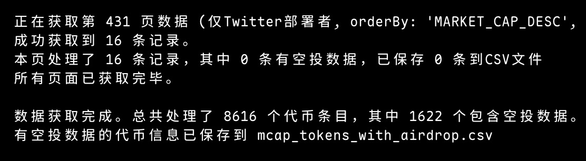
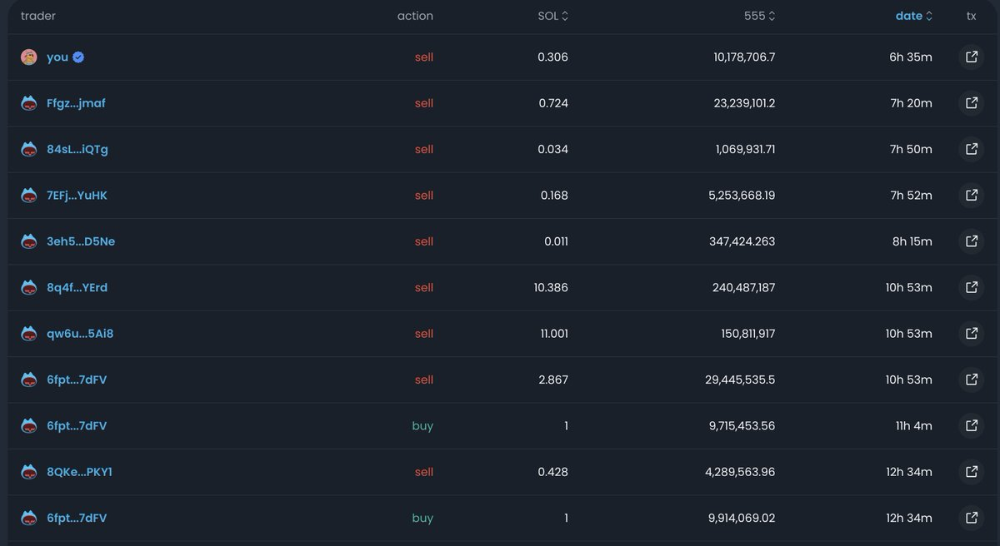
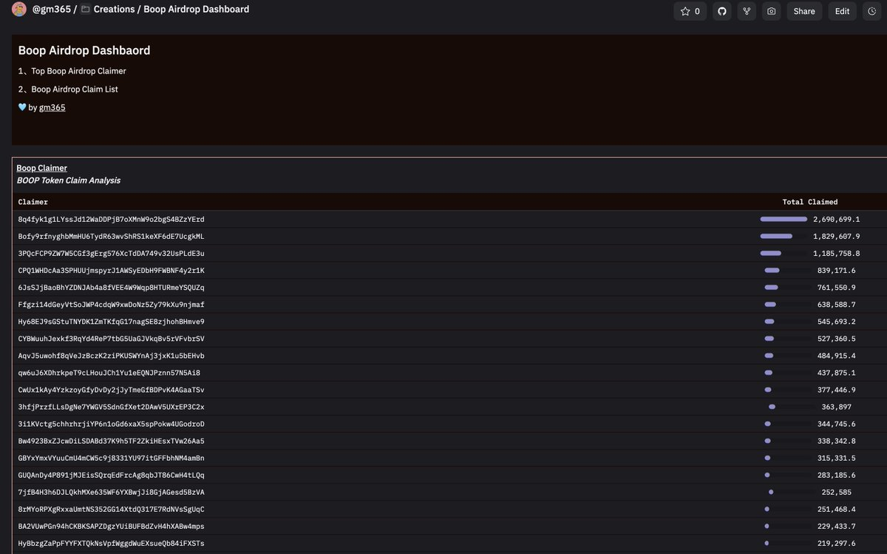

# BOOP 空投套利的獨木橋：市場微觀結構與搶跑優勢

> **來源**: [@gm365](https://x.com/gm365/status/1930544011888210404)
>
> **日期**: 
>
> **標籤**: `套利競爭` `時機優勢` `鏈上數據分析`

---

> **來源**: [@gm365 (gm365)](https://twitter.com/gm365)
> **日期**: 2025-01-XX
> **標籤**: `BOOP` `空投套利` `市場微結構` `搶跑` `鏈上分析`

---

## 套利的獨木橋

這兩天研究了下 BOOP 空投的「套利」。如果你沒聽過 BOOP，可以跳過這篇。

一番研究實操下來，發現如此狹小的賽道，竟然真的擠不下兩個套利地址。

比如每次發現一個稍微有利潤空間的標的，前排赫然都有一個地址，而且人家早幾天前都過來霸佔好了位置。

如果這時候你也擠上去，那很好，空投雖然有你的份兒，但卻給人家提供了寶貴的退出流動性，簡直得不償失。

## 數據分析與發現

以至於我痛下狠心，抓取了全部代幣數據，一通分析下來，但什麼有價值的資訊都沒能額外獲取到。

不僅如此，我發現起碼有兩個地址 100% 是腳本自動操作，因為一旦過了快照時間，立馬賣出。

不但如此,更蹊蹺的是，按照官方 API 接口顯示的時間，明明還沒快照，他們倆提前半分鐘就賣了。

## 魔鬼在細節中

不明所以的我細緻研究了一番，發現了端倪。

原來官方接口給出的時間，比實際代幣部署的時間要晚，不知道是故意還是內部程式誤差。

**魔鬼都在細節中。**

同行們對時機的把握已經分秒必爭了，這還怎麼競爭？

## Dune 鏈上追蹤

氣不過的我，吭哧吭哧寫了個 Dune SQL 來看看這幫傢伙到底是領了多少空投。

前排地址果然有我發現的那位套利大佬，顯示已經領取了上百萬枚空投的代幣，按照過去平均價格算，起碼是十萬刀以上的收益。

很好，很棒，很強大。

## Web3 的迷人之處

雖然整體下來，真沒賺到什麼收益，但這個過程依然十分有趣。

Web3 最迷人的地方就在於：

**一切透明、上鏈。**

只要有一雙善於發現的眼睛，和一點耐心，你總會發現一些特別的機會。

只不過，下次要早點。
