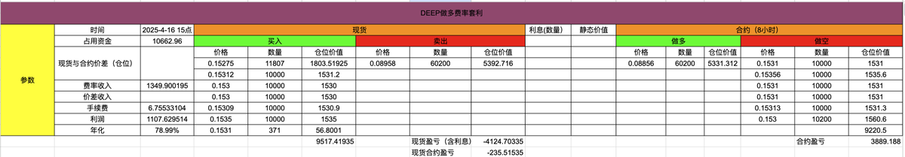

# 套利部位管理實踐：48 天平倉心路歷程

> **來源**: [@LeonLytic](https://x.com/LeonLytic/status/1929953658508333206)
>
> **日期**: 
>
> **標籤**: `套利策略` `部位管理` `交易心態`

---

> **來源**: [@LeonLytic (Leon Lytic)](https://x.com/LeonLytic)
> **日期**: 2026-02-18
> **標籤**: `套利` `部位管理` `平倉策略` `交易心理`

---

## 平倉經歷總結

從開倉到結束總共經歷了 48 天。期間其實有過很好的平倉機會，中間曾出現過最佳的退出時機——價差回歸。

## 未即時平倉的原因

當時因為懈怠沒有進行平倉操作，主要考量是：
- 檢視費率後發現其實還是有利潤的
- 平倉時為了最大化縮小價差損失，或者為了賺到價差，通常需要花費時間
- 掛單取消循環往復十多次的過程過於繁瑣，導致更加懶惰

## 結果

好在最終結果是自己滿意的。
