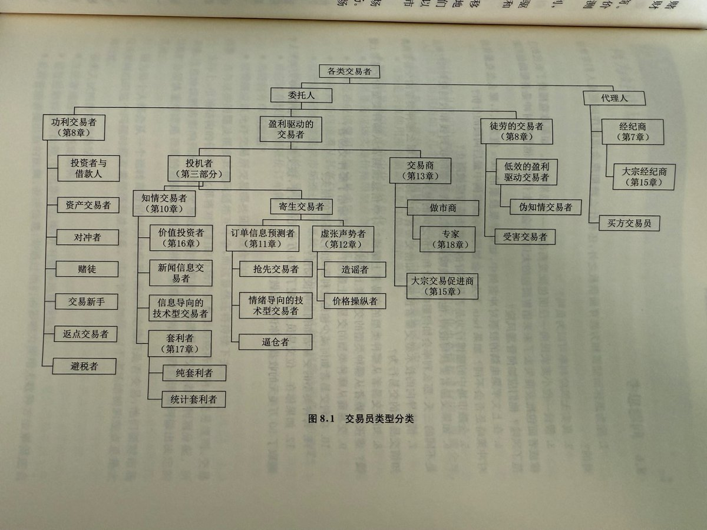

# 交易者類型與市場微觀結構

> **來源**: [@wong_ssh](https://x.com/wong_ssh/status/1929387161377505670) | [原文連結](https://twitter.com/wong_ssh/status/1929387161377505670/photo/1)
>
> **日期**: Mon Jun 02 03:58:40 +0000 2025
>
> **標籤**: `交易者分類` `流動性提供` `市場機制`

---

> **來源**: [@wong_ssh (WongSSH)](https://twitter.com/wong_ssh)  
> **日期**: 2026-02-18  
> **標籤**: `市場微觀結構` `交易者類型` `流動性` `做市商`

---

《交易與交易所》一書中的圖 8.1 非常具有啟發性。該圖展示了市場內所有交易者的類型，並在每一個類型交易者的專題章節中詳細介紹了：

- 這些交易者對流動性的貢獻
- 交易獲利方式
- 做市商的響應策略

## 核心價值

這個分類框架幫助理解不同類型交易者在市場微觀結構中的角色，以及他們如何影響市場流動性和價格形成機制。
