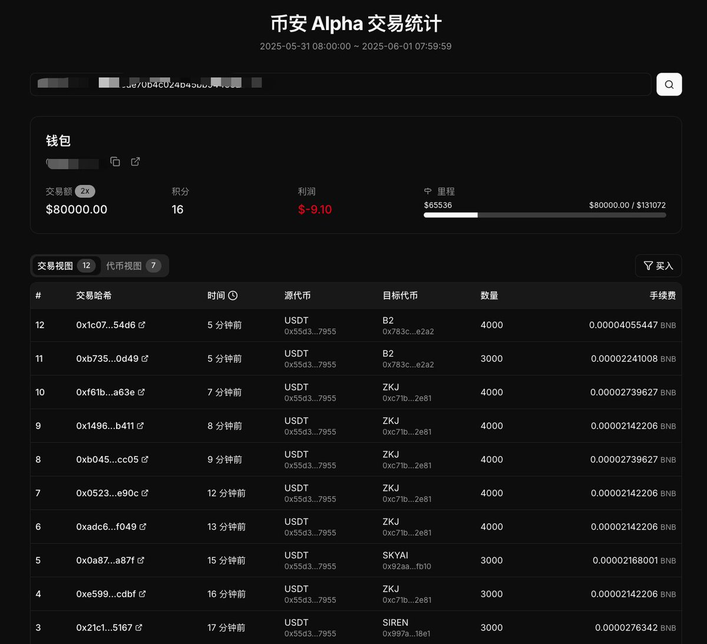
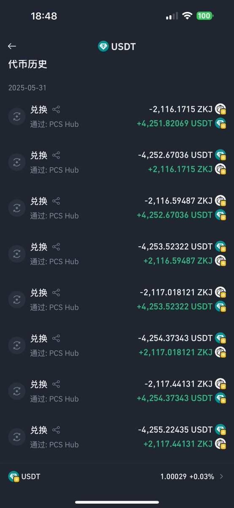
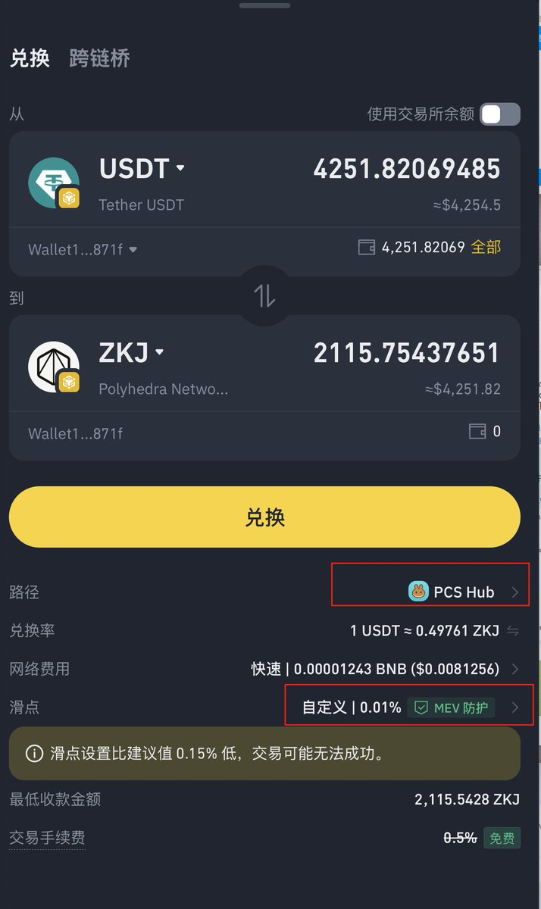

# 幣安 Alpha 刷分磨損優化測試 — 錢包端 vs 交易所端

> **來源**: [@BroLeon](https://x.com/BroLeon/status/1928791868684513447) | [原文連結](https://www.bn-alpha.site/)
>
> **日期**: Sat May 31 12:33:11 +0000 2025
>
> **標籤**: `Alpha 刷分` `滑點優化` `交易對分析`

---

> **來源**: [@BroLeon](https://twitter.com/BroLeon)
> **日期**: 2025-12-06
> **標籤**: `binance-alpha` `slippage` `arbitrage` `defi`

---

## 刷 Alpha 積分測試及好用的小工具

今晚花了小 20 刀把錢包端的 Alpha Pair 都測了一遍，參數參考了傑尼的策略。

目前看貌似從錢包端比從交易所端是磨損要小一些，主要原因是交易所的 Alpha 入口不能手動設定低於 1% 的滑點和指定路由。

## 各交易對實測數據

交易對上看 $ZKJ 還是王者，能容納 5000 刀 0.01% 的滑點，一個來回 1 刀左右的磨損。其次是 $B2 3000 刀一個來回成本能控制在 0.6 刀。

$Siren 和 $Skyai 4000 往返的成本都達到了 3 刀+，有點肉疼。

最近慢慢量起來了一點的 $Koge，4000 刀實測 0.8，但看了一下之前的線，是有過爆砸插針的，庄家不了解風格還是先不刷了。

## 推薦工具

這裡給大家推薦一個專門針對錢包端刷 Alpha 的小工具，是 @holazz1208 開發的。你只需要把自己的幣安錢包地址複製進去，就可以很清晰的看到自己交易額，已經刷了多少分，還需要刷多少獲得更多分數，以及哪個 Pair 買了多少。

但美中不足的是「利潤」欄目數字不準確，我手動計算了一下成本是超過 20 刀了，網頁顯示才 5 刀。

傳送門：https://t.co/H8Zp2xUifm

覺得好用可以給作者 follow 一下，點個讚，鼓勵他把工具完善的更好。

## 補充：Meta8Mate 的實測經驗

最近改用幣安 @binancezh 錢包端的 Alpha 進行刷分操作，每 4200U 大概磨損 1U 左右，一天刷 16K，磨損大概 3.4U，確實比直接用交易平台端的 Alpha 操作磨損更少一些。一般兌換界面我設置的滑點是 0.01%，路徑選擇 PCS HUB。

這個磨損我感覺可以接受了，或者大家有什麼更好的磨損低的方式對比一下麼？

這裡吐槽一下，每次我改完交易設置，下次再進，又會變成默認 0.15%，或者路徑變成 1inch/liquidMesh，有時候手快就確認，似乎磨損更高了（不知道是不是我的心理作用）。

提個建議，能不能把這個兌換界面的默認操作保持一下，不要每次自動重置呢。

## 工具資訊

- **工具名稱**: Binance Alpha 幣安 Alpha 交易統計
- **開發者**: @holazz1208
- **功能**: 統計錢包地址的交易額、積分、各 Pair 交易量
- **統計時間範圍**: 2025-12-05 08:00:00 ~ 2025-12-06 07:59:59
