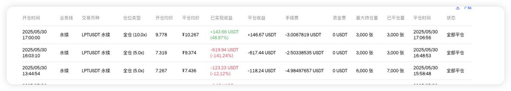
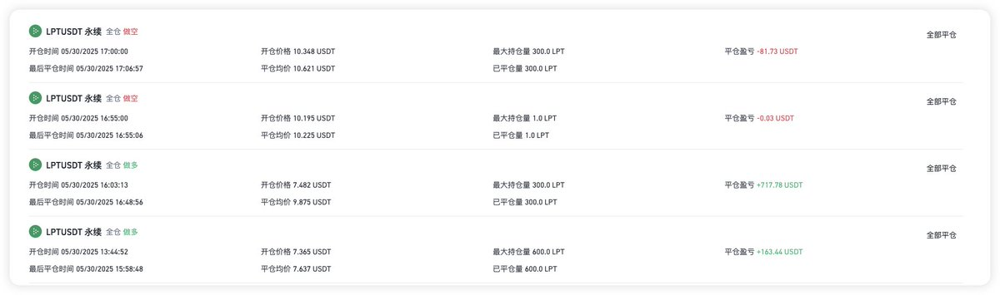
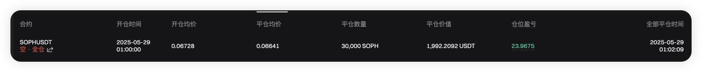
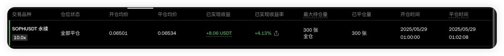

# OKX-幣安套利策略：LPT 低風險交易案例

> **來源**: [@Boywus](https://x.com/Boywus/status/1928385334758477907)
>
> **日期**: Fri May 30 09:37:46 +0000 2025
>
> **標籤**: `套利` `低風險交易` `交易策略`

---

> **來源**: [@Boywus](https://twitter.com/Boywus)
> **日期**: 2026-02-18
> **標籤**: `套利` `OKX` `幣安` `LPT` `低風險交易`

---

## 核心策略概述

套利人追求的都是低風險的交易，其實原理非常簡單。今天的 OKX 搞了個小插曲，下篇套利文章將會是原理解析公開分享，條件也很簡單：只要你有 BINANCE 和 OKX 的帳戶就可以了。

## 今日實戰案例：$LPT

今天完成了每個號 200U 的收益，已經很滿足了。和那些梭哈做多暴富的人比不得，大資金就喜歡沉澱。

### 測試帳號收益

- **本金**：600U
- **收益**：30U
- **模式**：事後模式的豬腳飯套利

可惜開頭吃海底撈去了，沒吃到事前的收益，吃個安慰收益算了，好好睡覺。

## 操作心得

認真對待每次賺小錢的機會，明天再反思為什麼資費會持續了。感興趣的人多的話，下次文章講這個策略，重點是事前交易的收益。

---

**注意**：如果理解能力強一些，你甚至可以直接倒推出操作邏輯。不要給我打錢，只要記得給我點讚關注就行。
