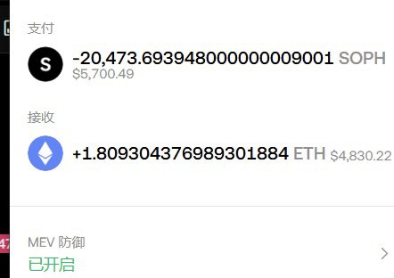

# Soph Alpha 空投搬磚套利機會分析

> **來源**: [@canhua1023](https://x.com/canhua1023/status/1927727844467319271)
>
> **日期**: Wed May 28 14:05:08 +0000 2025
>
> **標籤**: `套利` `空投` `多鏈交易`

---

> **來源**: [@canhua1023 (东之伊甸丶)](https://x.com/canhua1023)
> **日期**: 2025-02-18
> **標籤**: `套利` `Alpha空投` `幣安Alpha` `SOPH` `BSC`

---

## 核心機會總結

今晚 $SOPH 的搬磚套利出現了三波黃金機會，最終利潤可達 2 萬美元，搬得多的可以賺到 3 萬美元以上，是 Alpha 空投外的額外豬腳飯。

## 第一波：Soph 鏈與 BSC 價差套利

**市場狀況**：
- 大部分流動性集中在 Soph 鏈上
- 領空投的人也在 Soph 鏈上，導致 Soph 鏈持續被砸盤
- Soph 鏈價格比 BSC 上低很多

**操作策略**：
- 在 Soph 鏈上買入，等待拉盤
- Alpha 空投慣例是 100 美元左右的豬腳飯
- 鏈上長時間維持在 0.07 美元左右
- **這一波是可以無腦買入的時間**

## 第二波：跨鏈價差 + CEX 開盤預期

**價格差異**：
- BSC 上：0.088 美元
- Soph 鏈上：0.074 美元

**操作策略**：
- 直接在 Soph 鏈買入
- 等待 OKX 或幣安（BN）開盤

**意外驚喜**：
- 鏈上直接拉到 0.13 美元

## 最後關門階段：高波動 T+0 套利

**市場特徵**：
- 只給進不給出（單向流動性）
- 鏈上波動巨大

**操作策略**：
- 反覆做 T（高拋低吸）

## 收益數據

- 個人最終利潤：2 萬美元
- 搬磚量大的：3 萬美元以上
- 性質：Alpha 空投外的額外收益
