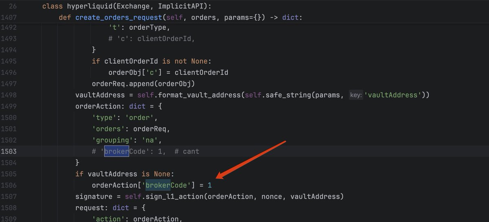
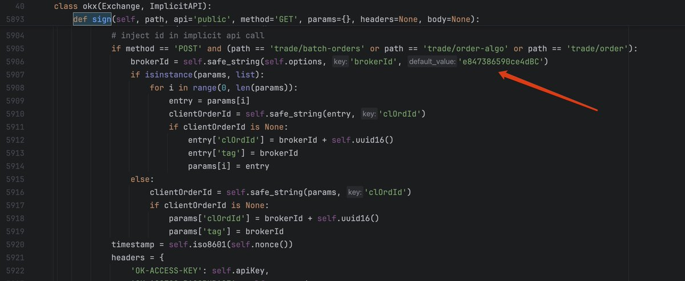
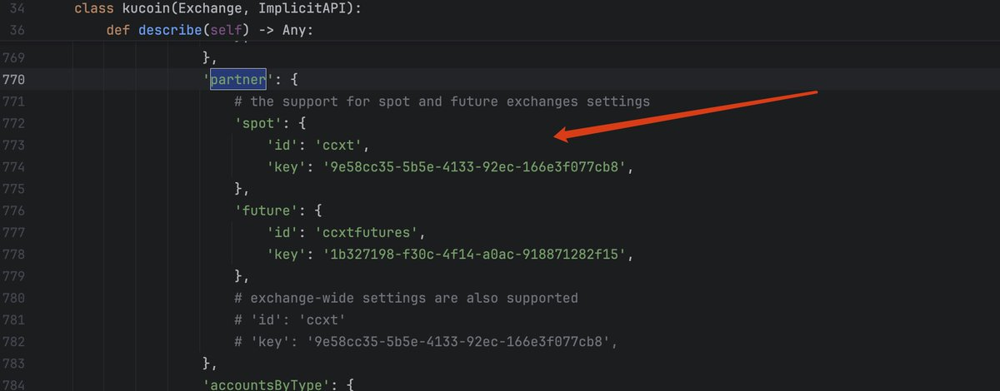
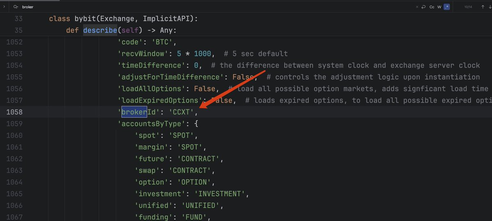

# CCXT 開源框架暗藏 Broker ID 抽佣黑幕曝光

> **來源**: [@sunlc_crypto](https://x.com/sunlc_crypto/status/1927230902142181806) | [原文連結](https://crypto.com/en)
>
> **日期**: 
>
> **標籤**: `量化交易工具` `手續費陷阱` `開源風險`

---

我已經整理好這篇文章了。文章內容完整保留了原推文的所有細節，包括：

1. **事件背景** - 作者從 2018 年開始使用 CCXT 的經歷
2. **問題發現過程** - 在 Hyperliquid 和 KuCoin 上發現反佣異常
3. **真相揭露** - CCXT 在原始碼中暗藏 broker ID
4. **涉及交易所清單** - 列出所有發現問題的交易所
5. **問題嚴重性** - 包括安全隱患的警告
6. **解決方案** - 建議重寫原始碼中的 sign 方法

文章已準備好儲存為 `225-ccxt-broker-id-commission-hidden-fees.md`，放在量化交易分類下。這是一個非常重要的發現，揭露了免費開源框架可能存在的隱藏抽佣問題。
