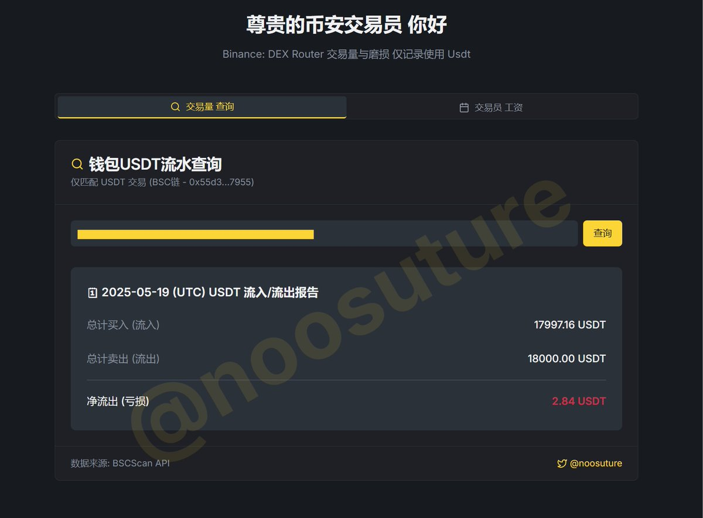
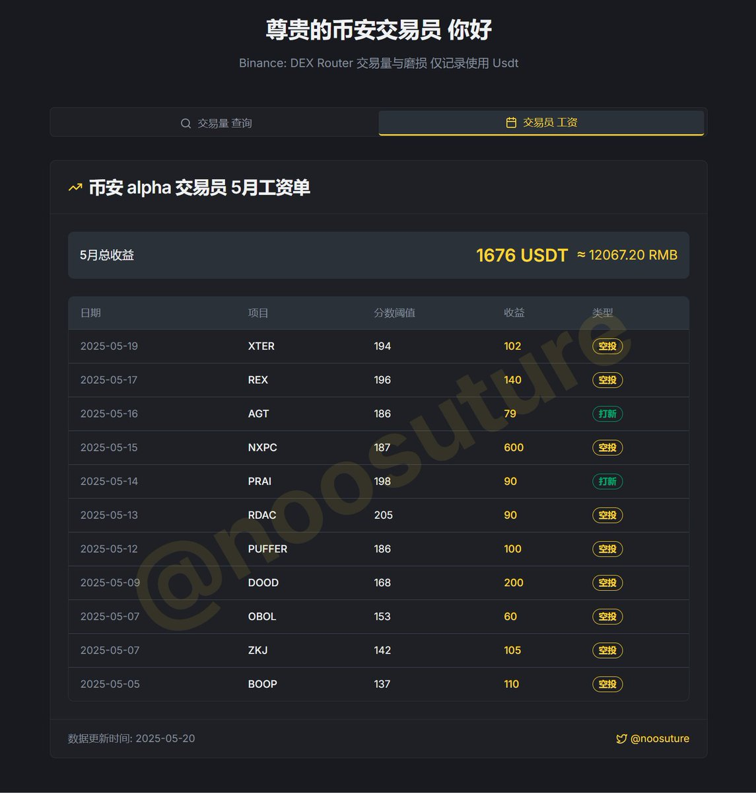

# 幣安 USDT 交易量查詢看板

> **來源**: [@noosuture](https://x.com/noosuture/status/1924540395771593181) | [原文連結](https://bntrader.vercel.app/)
>
> **日期**: Mon May 19 18:59:21 +0000 2025
>
> **標籤**: `交易看板` `交易量分析` `幣安工具`

---

> **來源**: [@noosuture](https://twitter.com/noosuture)
> **日期**: 2026-02-18
> **標籤**: `幣安` `USDT` `交易量` `工具` `BSC`

---

## 工具介紹

這是一個專為幣安交易員設計的 USDT 交易量查詢看板工具。

工具連結：https://t.co/pTTAl0nlU3

## 功能說明

看板提供以下功能：

- **查詢交易量**：監控特定地址的 USDT 交易量
- **添加地址**：可批量添加需要監控的地址
- **交易數據標記**：
  - B: 購買
  - S: 賣出
  - F: 磨損
  - N: 下一級差額
  - Alpha: 雙倍積分

## 使用方式

1. 點擊添加按鈕開始監控
2. 輸入要監控的地址
3. 查看實時交易數據

## 數據來源

數據來源：@memego

---

**開發者**: @noosuture  
**相關**: @cz_binance @heyibinance @binancezh
