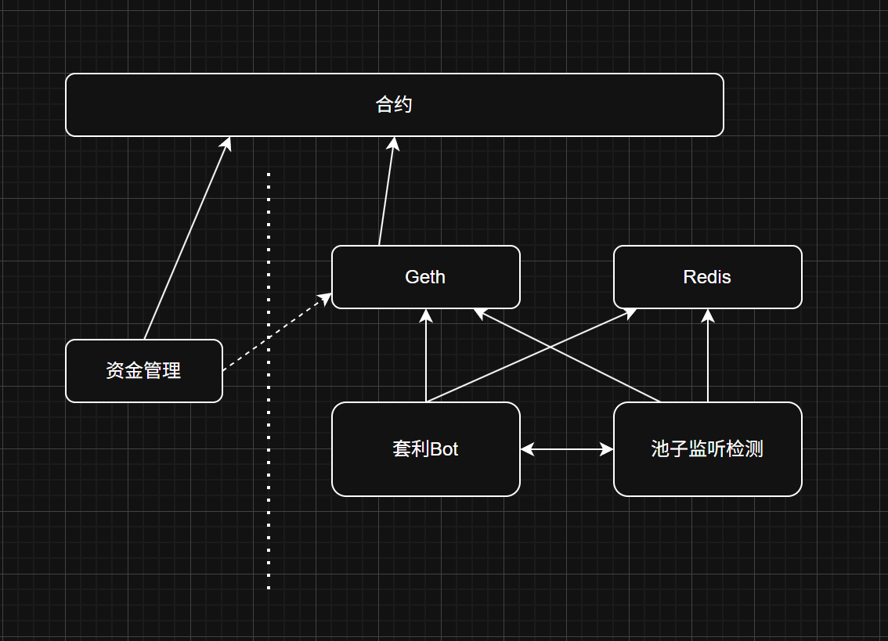

# BSC 套利機器人架構分享：一天 200 BNB 毛利實戰

> **來源**: [@lofy22479013](https://x.com/lofy22479013/status/1925379650190287081) | [原文連結](https://twitter.com/lofy22479013/status/1925379650190287081/photo/1)
>
> **日期**: 
>
> **標籤**: `套利機器人` `BSC` `資金管理`

---

> **來源**: [@lofy22479013 (搬磚小工)](https://twitter.com/lofy22479013)
> **日期**: 2026-02-18
> **標籤**: `BSC` `套利` `機器人` `量化交易` `架構設計`

---

## 實戰數據

昨天是 #BSC #套利 真猛，一天跑了近 200 BNB 毛利（利潤+上貢），要是不上貢那得多爽，難怪前些年那些大佬直接自由了。

## Bot 架構組成

我現在 Bot 的組成，隨手畫的，僅供參考：

### 1. 資金管理
- 負責管理合約和錢包餘額
- 風險控制
- 使用技術：Go

### 2. 套利 Bot
- 負責搜索套利路徑
- 使用技術：Go

### 3. 池子監聽
- 負責監聽新池子
- 代幣稅率計算
- 使用技術：TypeScript

