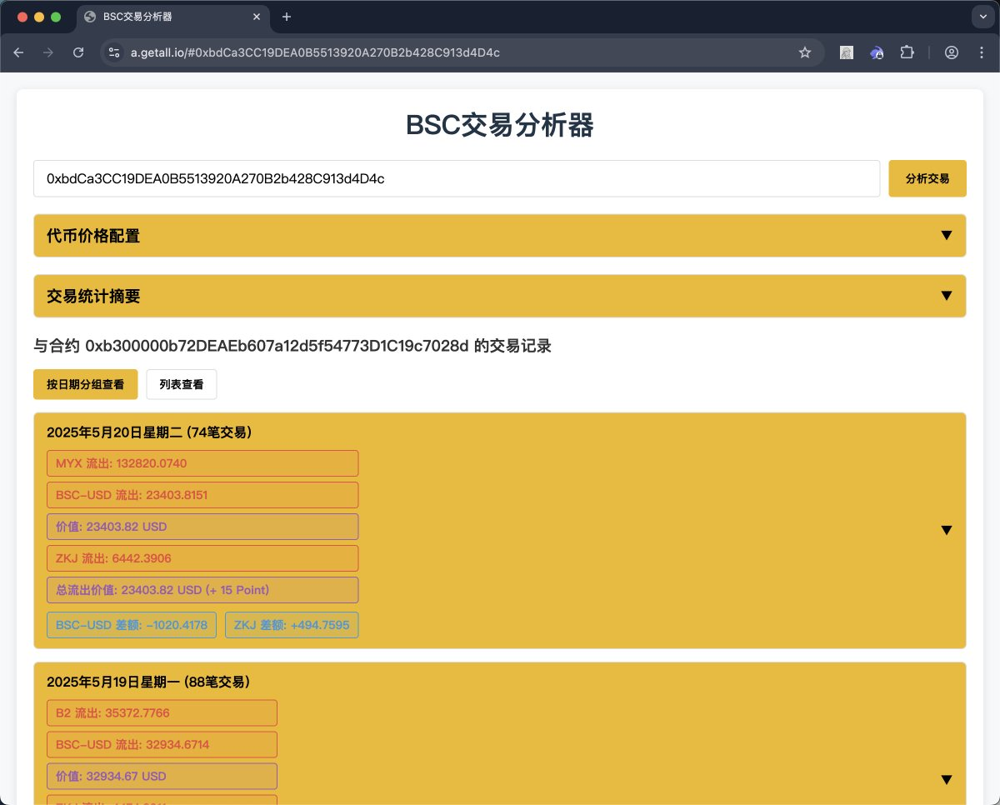
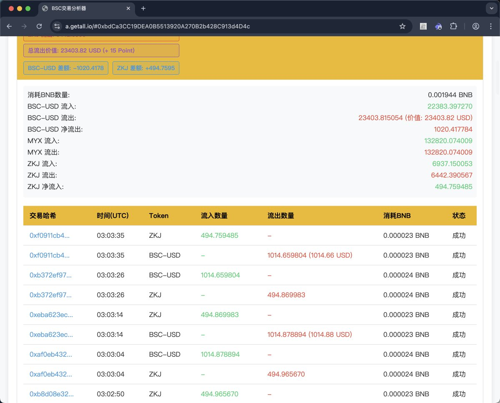
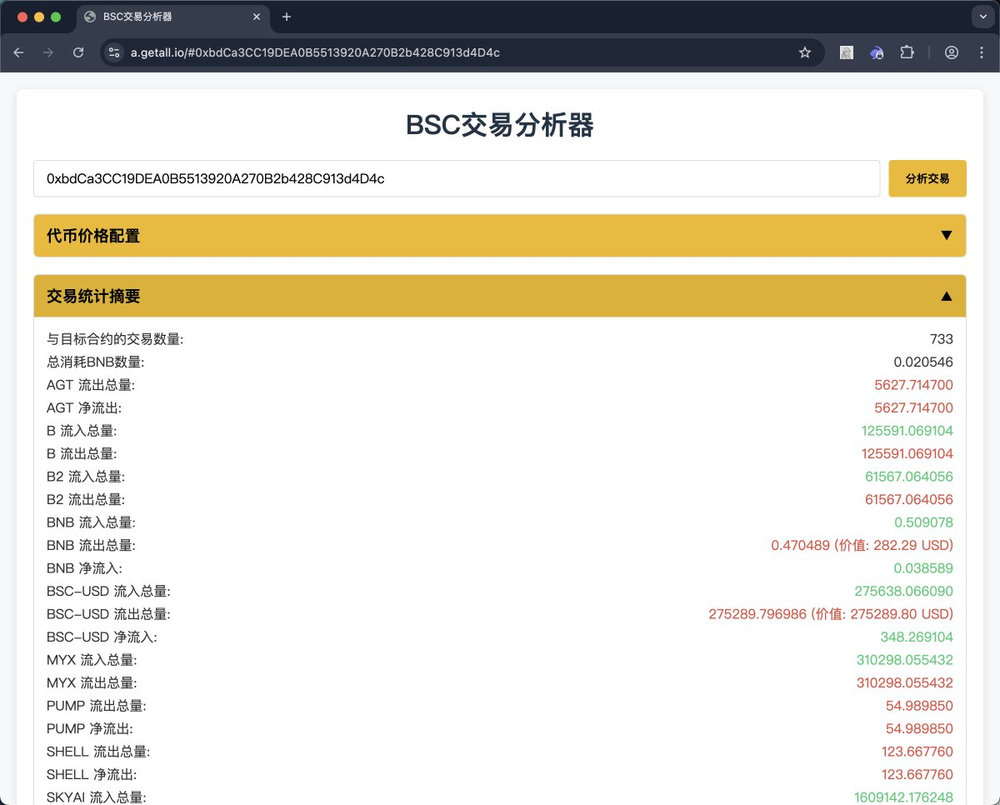

# BSC Alpha.DOG 交易分析工具 — 多帳戶管理與績效追蹤

> **來源**: [@zhengqiangli](https://x.com/zhengqiangli/status/1924904723964166660) | [原文連結](https://a.getall.io/)
>
> **日期**: 
>
> **標籤**: `交易分析` `BSC鏈上交易` `多帳戶管理`

---





> **來源**: [@zhengqiangli (Dr. LI 🔶 BNB)](https://twitter.com/zhengqiangli)
> **日期**: 2026-02-18
> **標籤**: `幣安Alpha` `BSC` `交易分析工具` `Alpha.DOG` `績效追蹤`

---

## 工具介紹

Alpha.DOG 是專為幣安 Alpha 交易員設計的 BSC 交易分析工具，提供每日積分查看和交易損耗追蹤功能。新版本支援批量地址管理和備註功能。

## 使用方式

### 多帳戶管理

可以透過直接在網址後綴加上 BSC 地址的方式，快速訪問指定帳號的數據：

```
https://alpha.dog/{你的BSC地址}
```

範例（僅供參考）：
```
https://alpha.dog/0xb300000b72DEAEb607a12d5f54773D1C19c7028d
```

### 使用前置條件

使用工具前需要先關注 Twitter 帳號 [@zhengqiangli](https://twitter.com/zhengqiangli)，關注後工具將在 3 秒後可用。

## 功能特色

### 核心功能

- **多地址管理**：批量管理多個 BSC 地址
- **交易分析**：詳細分析與目標合約的交易記錄
- **代幣價格配置**：支援 JSON 格式配置代幣價格

### 交易統計

工具提供以下交易統計資訊：

| 統計項目 | 說明 |
|---------|------|
| 交易數量 | 與目標合約的交易次數 |
| BNB 消耗 | 總消耗的 BNB 數量 |
| 流出價值 | 以 USD 計價的總流出價值 |
| 交易記錄 | 詳細的交易哈希、時間、代幣流入流出、狀態 |

### 代幣價格設定

支援兩種格式的 JSON 配置：

```json
{"代幣地址":"價格"}
```

或

```json
{"代幣符號":"價格"}
```

預設範例：
```json
{"USDC":"1","BNB":"600","BSC-USD":"1"}
```

### API 整合

需要配置 BSCScan API Key 以獲取交易數據。

### 檢視模式

提供兩種檢視方式：
- **按日期分組查看**：依日期整理交易記錄
- **列表查看**：以列表形式顯示所有交易

## 版本說明

目前提供新舊兩個版本：
- **新版**：支援批量地址管理和備註功能（建議使用）
- **舊版**：方便導出數據使用，但建議盡快遷移至新版本
