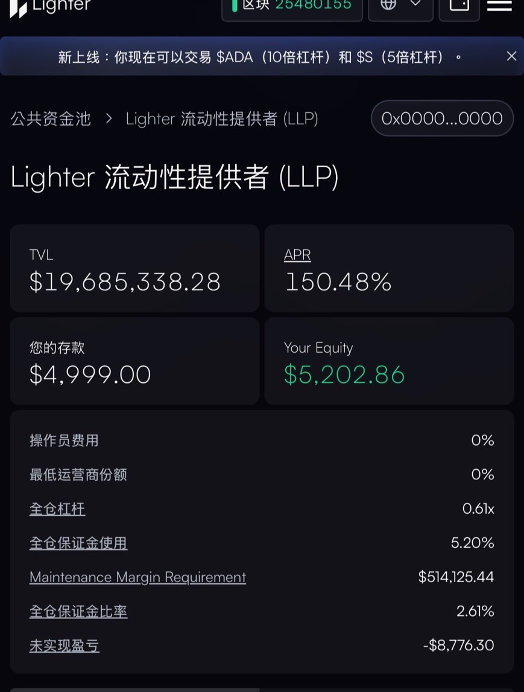
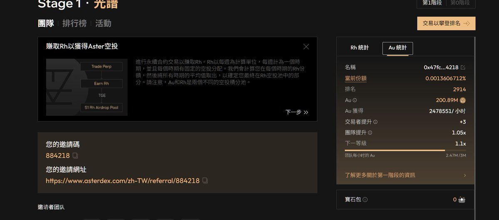
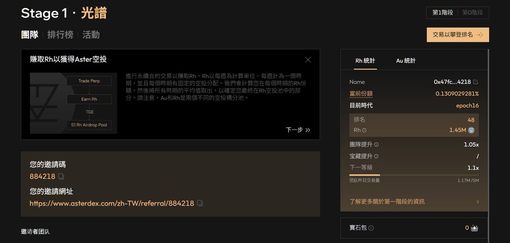

# Aster + Lighter 互刷組合策略：穩定累積空投積分

> **來源**: [@ivan01681108](https://x.com/ivan01681108/status/1924149035075866907) | [原文連結](https://www.asterdex.com/zh-TW/trade/pro/futures/BTCUSDT?ref=579C58)
>
> **日期**: Sun May 18 17:04:13 +0000 2025
>
> **標籤**: `互刷策略` `空投farming` `風險管理`

---

> **來源**: [@ivan01681108 (ivan453.eth)](https://x.com/ivan01681108)
> **日期**: 2026-02-18
> **標籤**: `Aster` `Lighter` `空投策略` `互刷組隊` `DeFi`

---

## 策略概述

最近開始玩 Aster + Lighter 的互刷組合，這套操作目前感覺蠻舒服的，有點像牛市裡的定存機槍塔，穩穩嚕分數。

目前兩邊加起來互刷了超過 100 萬美金的交易量，整體磨損大約在 $500 左右，控風險來說算蠻可接受的。

只要之後其中一邊的空投有回本,另一邊幾乎就能當成白嫖在玩。

## Aster 操作方式

### 兩種主要玩法

1. **當車尾掛隊互刷**
   - 靠交易量賺 Rh 分數

2. **放資產進去存**
   - 累積 AU 分數，這部分是最穩定的一塊

### AU 分數：保本的質押玩法

- 放了約 $70,000 的 USDT（沒放 BNB）
- 鑄了 asUSDF 配上高倍率慢慢累積積分

### Rh 分數：刷交易量

- 邀請朋友一起組隊，越多人互開越有加成
- 這兩個分數是分開獨立計算的，策略上可以分開處理
- 現在已經有不少人開始搶佔位置當車頭

### 平台特色

- 操作界面蠻乾淨的
- Pro 模式比較專業，有完整的 K 線與深度圖
- 交易費率也比一般 DEX 低很多

## Lighter 操作方式

### LP 存款特性

- 年化乍看之下很高
- 本質上是和散戶對做、吃客損模式
- 因此放比較少錢，重點是刷交易量、搶分數

### 操作重點

- 搭配 OI 倍數（本金×槓桿）高一點
- 每週還有快照結算
- 預期空投比較高

### 邀請機制

目前都是邀請制，要等手上有邀請碼才能放上來

## 總結策略

| 平台 | 定位 | 操作方式 | 重點 |
|------|------|----------|------|
| Aster | 主要車頭 | 刷 Rh + 存 AU | 保本+穩定累積 |
| Lighter | 輔助車尾 | 小資金掛單衝分 | 拼權重 |

### 核心組合

- 兩邊都邀請朋友互刷、綁推薦碼
- 形成車隊加成
- 在目前這種鏈上流動性重新洗牌的時間點，不管你要衝榜還是躺分，其實都還有機會

---

**參考連結**:
- Aster 邀請連結: [https://t.co/QN0g0GaWn7](https://t.co/QN0g0GaWn7)
- Lighter 目前為邀請制
