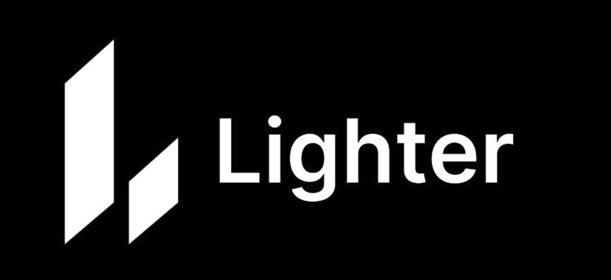

# Lighter 入門指南：積分獲取與套利策略

> **來源**: [@c_dylanber](https://x.com/c_dylanber/status/1924051627960582318) | [原文連結](https://t.me/lighter_cn)
>
> **日期**: Sun May 18 10:37:09 +0000 2025
>
> **標籤**: `永續期貨` `積分獲取` `套利策略`

---

> **來源**: [@c_dylanber (诺诺Dylan)](https://twitter.com/c_dylanber)
> **日期**: 2026-02-18
> **標籤**: `Lighter` `空投` `積分獲取` `套利策略` `永續合約`

---

## 平台介紹

Lighter 是基於 ZK L2 技術的去中心化永續期貨交易平台，支援訂單簿交易，提供類似中心化交易所的精確價格設定和交易體驗。

## 參與門檻：邀請碼獲取

目前 Lighter 還處於**內測階段**，沒有邀請碼就無法參與活動。以下是兩種官方渠道獲取邀請碼的方法：

### 方法一：Discord 開票
找 @cryptoyaos 開票要邀請碼，等他看到就會回覆你。

### 方法二：加入中文 Telegram 群
- Telegram 群組：https://t.me/lighter_cn
- 直接找 @HassnHh30961 Roger 即可

## 積分發放規則

- Lighter 會**每週二隨機時間點進行快照**
- 中國時間**週三凌晨 2:30 左右**發放上一週的積分

## 積分快速上手攻略

### 核心策略

| 策略 | 說明 |
|------|------|
| 優選小幣種 | 盡量選擇 BTC、ETH、SOL 之外的小幣種開單，往往積分更高 |
| 提高 OI 值 | 本金 × 槓桿倍數要盡量高，權重才會大 |
| 嘗試爆倉 | 爆倉能獲得更多積分，但需注意強平費為倉位的 1%，要合理控制小額單嘗試 |

### 注意事項

- 強平費為倉位的 **1%**
- 需合理控制小額單嘗試爆倉策略

## 策略更新

作者會**每週三**根據當週的積分分配情況做總結，分享最新的最優策略。
